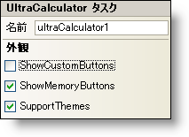

////

|metadata|
{
    "name": "wincalculator-smart-tag",
    "controlName": ["WinCalculator"],
    "tags": ["Styling"],
    "guid": "{295918D5-31B9-4CFA-8A76-9CE0F60F5F71}",  
    "buildFlags": [],
    "createdOn": "2005-09-11T00:00:00Z"
}
|metadata|
////

= WinCalculator スマート タグ

Visual Studio 2005（.NET Framework 2.0）では、それぞれの {ProductName} コントロール/コンポーネントが固有のスマート タグを備えています。 コントロール/コンポーネントを単に選択すると、Smart Tag のアンカーが表示されます。このアンカーをクリックするとポップアップ パネルが表示され、そこからコントロール/コンポーネントの最もよく使用するプロパティや設定にすばやく簡単にアクセスできます。

WinCalculator スマート タグには、以下のセクションと共にコントロールの名前が含まれます。

* Appearance -- コントロールの外観やルック アンド フィールに関連する一般的なタスクがあります。

各セクションの項目（たとえば、フィールド、ドロップダウン リスト、チェックボックス）およびプロパティ グリッドの項目の対応するプロパティの説明については以下を参照してください。

[options="header", cols="a,a,a"]
|====
|外観|説明|対応するプロパティ

|カスタム ボタンの表示
|このチェックボックスを選択すると、カスタマイズ可能な 6 つの追加ボタンが表示されます。
| link:{ApiPlatform}win.ultrawineditors{ApiVersion}~infragistics.win.ultrawineditors.ultrawincalc.ultracalculator~showcustombuttons.html[ShowCustomButtons]

|メモリ ボタンの表示
|このチェックボックスを選択すると、メモリ ボタン（メモリ クリア、メモリ呼び出し、メモリ保存、メモリ加算など）が表示されます。
| link:{ApiPlatform}win.ultrawineditors{ApiVersion}~infragistics.win.ultrawineditors.ultrawincalc.ultracalculator~showmemorybuttons.html[ShowMemoryButtons]

|テーマのサポート
|このチェックボックスを選択すると、Microsoft の基本的な OS テーマ（Windows クラシック テーマまたは Windows XP テーマ）がサポートされます。
| link:{ApiPlatform}win{ApiVersion}~infragistics.win.ultracontrolbase~supportthemes.html[SupportThemes]

|====