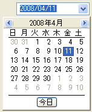

////

|metadata|
{
    "name": "wincalendarcombo-about-wincalendarcombo",
    "controlName": ["WinCalendarCombo"],
    "tags": ["Getting Started"],
    "guid": "{048E2252-1851-4675-926A-AE31CE40F462}",  
    "buildFlags": [],
    "createdOn": "0001-01-01T00:00:00Z"
}
|metadata|
////

= WinCalendarCombo について

WinCalendarCombo は、エディタ インタフェースに選択した日付を返すドロップダウン カレンダーを提供する Windows Forms コントロールです。

* 外観のサポート - アルファ ブレンディング、グラデーション、画像などを含み、外観が完全にサポートされます。
* スピン ボタン機能 -- 値を増やすスピン ボタンを完全にサポートします。
* カスタマイズ可能なヘッダ -- ドロップダウン リストの先頭に表示されるヘッダをカスタマイズする機能です。
* WinSchedule 機能 -- WinCalendarInfo と WinCalendarLook を利用します。

