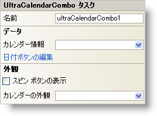

////

|metadata|
{
    "name": "wincalendarcombo-smart-tag",
    "controlName": ["WinCalendarCombo"],
    "tags": ["Getting Started","How Do I"],
    "guid": "{8B6AAB12-5136-472A-932C-0DF7109A5BE0}",  
    "buildFlags": [],
    "createdOn": "0001-01-01T00:00:00Z"
}
|metadata|
////

= WinCalendarCombo スマート タグ

Visual Studio 2005（.NET Framework 2.0）では、それぞれの {ProductName} コントロール/コンポーネントが固有のスマート タグを備えています。 コントロール/コンポーネントを単に選択すると、Smart Tag のアンカーが表示されます。このアンカーをクリックするとポップアップ パネルが表示され、そこからコントロール/コンポーネントの最もよく使用するプロパティや設定にすばやく簡単にアクセスできます。

WinCalendarCombo スマート タグには、以下のセクションと共にコントロールの名前が含まれます。

* 外観 -- コントロールの外観やルック アンド フィールに関連する一般的なタスクがあります。
* データ -- コントロールが使用している基になるデータ（データ ソースやデータ メンバなど）を参照します。

各セクションの項目（たとえば、フィールド、ドロップダウン リスト、チェックボックス）およびプロパティ グリッドの項目の対応するプロパティの説明については以下を参照してください。

[options="header", cols="a,a,a"]
|====
|外観|説明|対応するプロパティ

|スピン ボタンの表示
|このチェックボックスを選択すると、2 つの小さい上下矢印がコントロールの右に表示されます。ユーザーはこれらのボタンを使用して日付を増減できます。
| link:{ApiPlatform}win.ultrawinschedule{ApiVersion}~infragistics.win.ultrawinschedule.ultracalendarcombo~spinbuttonsvisible.html[SpinButtonsVisible]

|カレンダーの外観
|ドロップダウンをクリックすると、フォーム上にある使用可能なすべての WinCalendarLook コントロールが表示されます。
| link:{ApiPlatform}win.ultrawinschedule{ApiVersion}~infragistics.win.ultrawinschedule.ultraschedulecontrolbase~calendarlook.html[CalendarLook]

|====

[options="header", cols="a,a,a"]
|====
|データ|説明|対応するプロパティ

|カレンダー情報
|ドロップダウンをクリックすると、フォーム上にある使用可能なすべての WinCalendarInfo コントロールが表示されます。
| link:{ApiPlatform}win.ultrawinschedule{ApiVersion}~infragistics.win.ultrawinschedule.ultraschedulecontrolbase~calendarinfo.html[CalendarInfo]

|日付ボタンの編集
|WinCalendarCombo のドロップダウン カレンダーには下部に"今日"というボタンがあります。これは日付ボタンで、[日付ボタンの編集] をクリックして変更できます。[日付ボタンの編集] をクリックすると、DateButton コレクション エディタが開きます。ここでカレンダーにボタンを追加することもできます。
| link:{ApiPlatform}win.ultrawinschedule{ApiVersion}~infragistics.win.ultrawinschedule.ultracalendarcombo~datebuttons.html[DateButtons]

|====