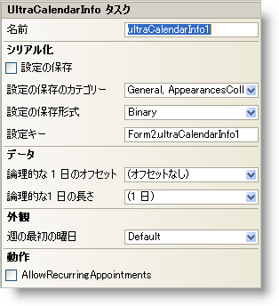

////

|metadata|
{
    "name": "wincalendarinfo-smart-tag",
    "controlName": ["WinCalendarInfo"],
    "tags": ["Getting Started"],
    "guid": "{2085150C-1DC1-4DD3-8654-38ABF3B7A6D5}",  
    "buildFlags": [],
    "createdOn": "0001-01-01T00:00:00Z"
}
|metadata|
////

= WinCalendarInfo スマート タグ

Visual Studio 2005（.NET Framework 2.0）では、それぞれの {ProductName} コントロール/コンポーネントが固有のスマート タグを備えています。 コントロール/コンポーネントを単に選択すると、Smart Tag のアンカーが表示されます。このアンカーをクリックするとポップアップ パネルが表示され、そこからコントロール/コンポーネントの最もよく使用するプロパティや設定にすばやく簡単にアクセスできます。

WinCalendarInfo スマート タグには、コンポーネントの名前と次のセクションがあります。

* 外観 -- コントロールの外観やルック アンド フィールに関連する一般的なタスクがあります。
* 動作 -- フォーム上でのコントロールの動作を制御するプロパティに簡単にアクセスできます。
* データ -- コントロールが使用している基になるデータ（データ ソースやデータ メンバなど）を参照します。
* シリアル化 -- IPersistComponentSettings インタフェースで使用されるプロパティにすばやくアクセスできます。

各セクションの項目（たとえば、フィールド、ドロップダウン リスト、チェックボックス）およびプロパティ グリッドの項目の対応するプロパティの説明については以下を参照してください。

[options="header", cols="a,a,a"]
|====
|外観|説明|対応するプロパティ

|週の最初の曜日
|週の最初の曜日をドロップダウンから選択します。デフォルト値は現在のシステム設定です。
| link:{ApiPlatform}win.ultrawinschedule{ApiVersion}~infragistics.win.ultrawinschedule.ultracalendarinfo~firstdayofweek.html[FirstDayOfWeek]

|====

[options="header", cols="a,a,a"]
|====
|動作|説明|対応するプロパティ

|繰り返し予定 

を許可
|繰り返し予定とは、特定のパターン（毎日、毎週、毎月、隔週金曜日など）に基づいて繰り返される予定のことです。このチェックボックスを選択すると、繰り返し予定が許可されます。
| link:{ApiPlatform}win.ultrawinschedule{ApiVersion}~infragistics.win.ultrawinschedule.ultracalendarinfo~allowrecurringappointments.html[AllowRecurringAppointments]

|====

[options="header", cols="a,a,a"]
|====
|データ|説明|対応するプロパティ

|論理的な1 日の長さ
|ドロップダウン矢印をクリックすると、上に時間が表示されたスライダ バーが表示されます。スライダ バーを動かして 1 日の長さを指定します。1 日の長さに設定可能な範囲は 1 分以上 24 時間以下です。キーボードから時間と分を入力することもできます。
| link:{ApiPlatform}win.ultrawinschedule{ApiVersion}~infragistics.win.ultrawinschedule.ultracalendarinfo~logicaldayduration.html[LogicalDayDuration]

|論理的な 1 日のオフセット
|1 日は通常、午前 0 時 0 分に始まります。ただしアプリケーションによっては、午前 0 時 0 分以外の時刻を 1 日の始まりと見なす方がよい場合があります。ここではこの時刻を設定できます。オフセットに設定可能な範囲は -23 時間 59 分以上 23 時間 59 分以下です。
| link:{ApiPlatform}win.ultrawinschedule{ApiVersion}~infragistics.win.ultrawinschedule.ultracalendarinfo~logicaldayoffset.html[LogicalDayOffset]

|====

[options="header", cols="a,a,a"]
|====
|シリアル化|説明|対応するプロパティ

|設定の保存
|このチェックボックスを選択すると、コンポーネントのプロパティ設定がアプリケーションの設定と共に自動的にロード/保存されます。
| link:{ApiPlatform}win.ultrawinschedule{ApiVersion}~infragistics.win.ultrawinschedule.ultracalendarinfo~savesettings.html[SaveSettings]

|設定の保存形式
|コンポーネントの設定をバイナリ形式と XML 形式のどちらで保存するかを選択します。
| link:{ApiPlatform}win.ultrawinschedule{ApiVersion}~infragistics.win.ultrawinschedule.ultracalendarinfo~savesettingsformat.html[SaveSettingsFormat]

|設定の保存のカテゴリー
|カレンダーのどのカテゴリを保存するかを選択します。ドロップダウン リストをクリックすると、横にチェックボックスが付いたカテゴリーのリストが表示されます。チェックボックスを選択してその特定のカテゴリーに保存します。その情報を保存したくない場合にはチェックボックスの選択を解除します。
| link:{ApiPlatform}win.ultrawinschedule{ApiVersion}~infragistics.win.ultrawinschedule.ultracalendarinfo~savesettingscategories.html[SaveSettingsCategories]

|設定キー
|ロード/保存する設定値を一意に識別するための設定キーを指定できます。デフォルトで Visual Studio 2005 は、格納側のフォーム/コントロールの名前とコンポーネントの名前に基づいて設定キーの値が設定されます。
| link:{ApiPlatform}win.ultrawinschedule{ApiVersion}~infragistics.win.ultrawinschedule.ultracalendarinfo~settingskey.html[SettingsKey]

|====