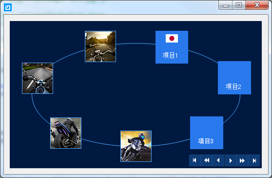
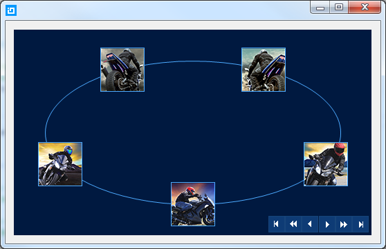

////

|metadata|
{
    "name": "wincarousel-adding-carousel-items-in-code",
    "controlName": [],
    "tags": [],
    "guid": "334c9e9c-eaa3-4981-8a8d-54b27a872c35",  
    "buildFlags": [],
    "createdOn": "2014-09-12T22:23:12.363674Z"
}
|metadata|
////

= コードでのカルーセル項目の追加

== トピックの概要

=== 目的

このトピックでは、コードビハインドを使用して  link:{ApiPlatform}win.ultrawincarousel{ApiVersion}~infragistics.win.ultrawincarousel.ultracarousel_members.html[UltraCarousel] 項目を追加する方法を紹介します。

=== このトピックの内容

このトピックは、以下のセクションで構成されます。

* <<_Ref397444704,概要>>

** <<_Ref397444711,概要>>
** <<_Ref397444829,アプリケーションの要件>>
** <<_Ref397444836,UltraCarousel コントロールの追加>>
** <<_Ref397444844,項目の追加>>
** <<_Ref397444852,データのバインド>>
** <<_Ref397444861,サンプル テスト データ>>

* <<_Ref381022312,関連コンテンツ>>

[[_Ref397444704]]
== 概要

[[_Ref397444711]]

=== 概要

このトピックでは、UltraCarousel コントロールを追加する方法、およびコードでコントロールのプロパティにより構成する方法を学習します。コントロールには、項目に表示する文字列または画像のコレクションのバインドに使用できる link:{ApiPlatform}win.ultrawincarousel{ApiVersion}~infragistics.win.ultrawincarousel.ultracarousel~datasource.html[DataSource] プロパティがあります。

.注:
[NOTE]
====
画像が項目内のテキスト用のスペースに収まるじサイズの場合、各項目はテキスト、画像、または両方を表示できます。
====

[[_Ref397444829]]

=== アプリケーションの要件

1. _Infragistics WinForms 2014 Volume 2_   またはそれ以降のバージョンをインストールします。

2.Visual Studio 2010 またはそれ以降のバージョンを使用して、新しい Windows Forms アプリケーションを開始します。

[[_Ref397444836]]

=== UltraCarousel コントロールの追加

以下のコード例では、UltraCarousel コントロールのインスタンスを作成する方法とそれをフォームに追加する方法を紹介します。コントロールはデフォルトで、項目を追加する前またはデータにバインドする前に、項目パスおよびスクロール ボタンとともに表示されます。

*C# の場合:*

[source,csharp]
----
UltraCarousel carousel1 = new UltraCarousel();
this.Controls.Add(carousel1);
----

*Visual Basic の場合:*

[source,vb]
----
Dim carousel1 As New UltraCarousel()
Me.Controls.Add(carousel1)
----

[[_Ref397444844]]

=== 項目の追加

UltraCarousel コントロールの項目は、データ オブジェクトのビジュアル表現です。項目は、パス上で四角形のタイルとして表示されます。 link:{ApiPlatform}win.ultrawincarousel{ApiVersion}~infragistics.win.ultrawincarousel.carouselpath~itemslots.html[ItemSlots] プロパティは、パス上に表示する項目数を指定します ( _Default=5_  )。各項目のデフォルト サイズは 64×64 (ピクセル単位) です。

以下のコード例では、カルーセル項目を手動で追加する方法、および画像付き項目の外観を設定する方法を紹介します。

*C# の場合:*

[source,csharp]
----
for (int i = 0; i < 5; i++)
{
    CarouselItem item = new CarouselItem();
    item.Settings.Appearance.Image = GetImage(string.Format("motorcycle{0}.png", i + 1));
    carousel1.Items.Add(item);
}
----

*Visual Basic の場合:*

[source,vb]
----
For i As Integer = 0 To 4
      Dim item As New CarouselItem()
      item.Settings.Appearance.Image = GetImage(String.Format("motorcycle{0}.png", i + 1))
      carousel1.Items.Add(item)
Next
----

[[_Ref397444852]]

=== データのバインド

UltraCarousel コントロールは手動で項目を追加するだけでなく、データのバインドもサポートしています。

.注:
[NOTE]
====
カルーセル項目がデータにバインドされている場合、項目の追加や更新はできません。
====

このコードでは、コントロールの link:{ApiPlatform}win.ultrawincarousel{ApiVersion}~infragistics.win.ultrawincarousel.ultracarousel~datasource.html[DataSource] プロパティを使用してコントロールをデータにバインドする方法を紹介します。

*C# の場合:*

[source,csharp]
----
carousel1.DataSource = new TestData();
----

*Visual Basic の場合:*

[source,vb]
----
carousel1.DataSource = New TestData()
----

[[_Ref397444861]]

=== サンプル テスト データ

データ バインディングで使用するテスト データです。このテスト データ モデル では、いくつかの画像をプロジェクトに追加し、`ビルド アクション`を  _Embedded Resources_   に設定します。

*C# の場合:*

[source,csharp]
----
public class TestData : List<TestDataItem>
{
    public TestData()
    {
        for (int i = 0; i < 5; i++)
        {
            Add(new TestDataItem { Item = "Item", img = Images.GetImage(string.Format("motorcycle{0}.png", i + 1)) });
        }
    }
}
public class TestDataItem
{
    public string Item { get; set; }
    public Image img { get; set; }
}
public class Images
{
    public static Image GetImage(string imageName)
    {
        var type = typeof(Form1);
        var resName = string.Format("{0}", imageName);
        var stream = type.Module.Assembly.GetManifestResourceStream(type, resName);
        return null == stream ? null : Image.FromStream(stream);
    }
}
----

*Visual Basic の場合:*

[source,vb]
----
Public Class TestData
      Inherits List(Of TestDataItem)
      Public Sub New()
            For i As Integer = 0 To 4
                  Add(New TestDataItem() With { _
                        .Item = "Item", _
                        .img = Images.GetImage(String.Format("motorcycle{0}.png", i + 1)) _
                  })
            Next
      End Sub
End Class
Public Class TestDataItem
      Public Property Item() As String
            Get
                  Return m_Item
            End Get
            Set
                  m_Item = Value
            End Set
      End Property
      Private m_Item As String
      Public Property img() As Image
            Get
                  Return m_img
            End Get
            Set
                  m_img = Value
            End Set
      End Property
      Private m_img As Image
End Class
Public Class Images
      Public Shared Function GetImage(imageName As String) As Image
            Dim type = GetType(Form1)
            Dim resName = String.Format("{0}", imageName)
            Dim stream = type.[Module].Assembly.GetManifestResourceStream(type, resName)
            Return If(stream Is Nothing, Nothing, Image.FromStream(stream))
      End Function
End Class
----

[[_Ref381022312]]
== 関連コンテンツ

=== トピック

このトピックの追加情報については、以下のトピックも合わせてご参照ください。

[options="header", cols="a,a"]
|====
|トピック|目的

| link:wincarousel-adding-carousel-items-using-the-designer.html[デザイナーを使用したカルーセル項目の追加]
|このトピックでは、コントロールのデザイン時のインターフェイスを使用して UltraCarousel 項目を追加および構成する方法を紹介します。

| link:wincarousel-binding-data-to-carousel-in-code.html[コードでのデータのカルーセルへのバインド]
|このトピックでは、コードビハインドでデータを UltraCarousel にバインドする方法を紹介します。

| link:wincarousel-binding-data-to-carousel-using-the-designer.html[デザイナーを使用したカルーセルへのデータのバインド]
|このトピックでは、デザイン時にデータ ソースをセットアップする方法、およびそれを UltraCarousel コントロールにバインドする方法を手順とともに紹介します。

| link:wincarousel-save-load-carousel-layout.html[カルーセル構成の保存と読み込み]
|このトピックでは、コントロールがデータにバインドされていない場合に、カルーセル項目を含む UltraCarousel レイアウトを保存する方法と読み込む方法を紹介します。バインドされている場合、保存されたレイアウトを読み込んだ後でコントロールを再度バインドする必要があります。

|====