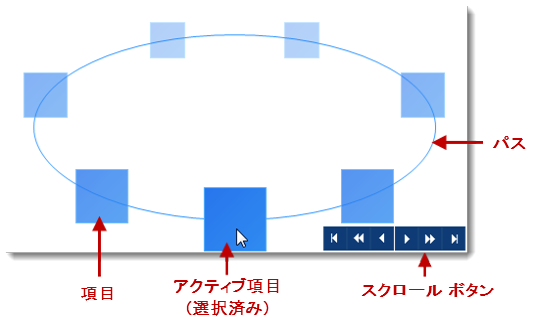
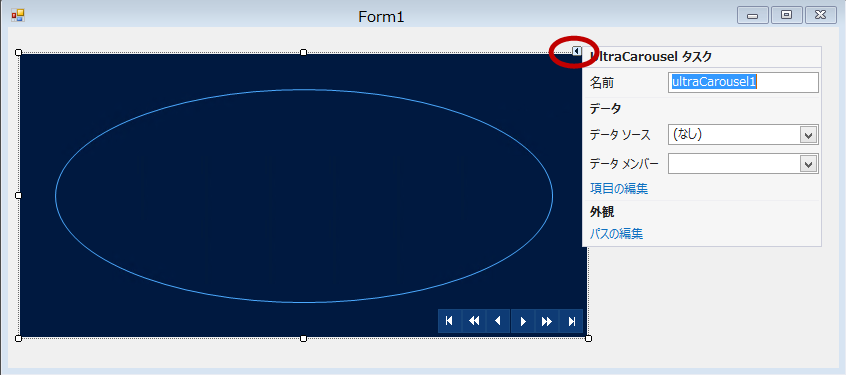
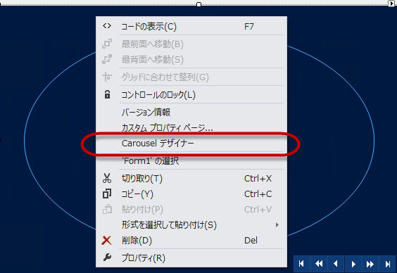
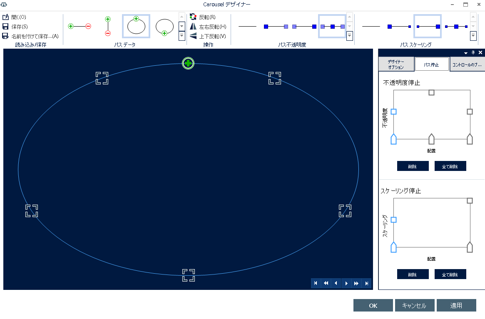
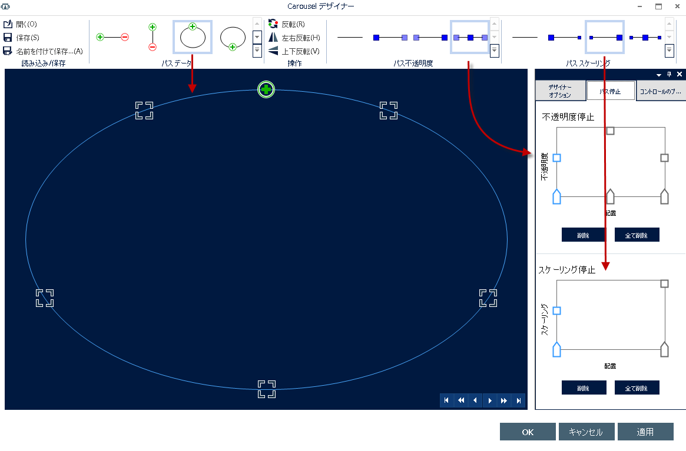
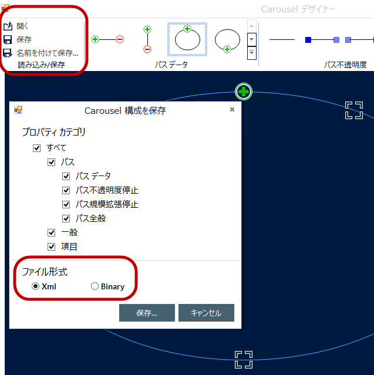
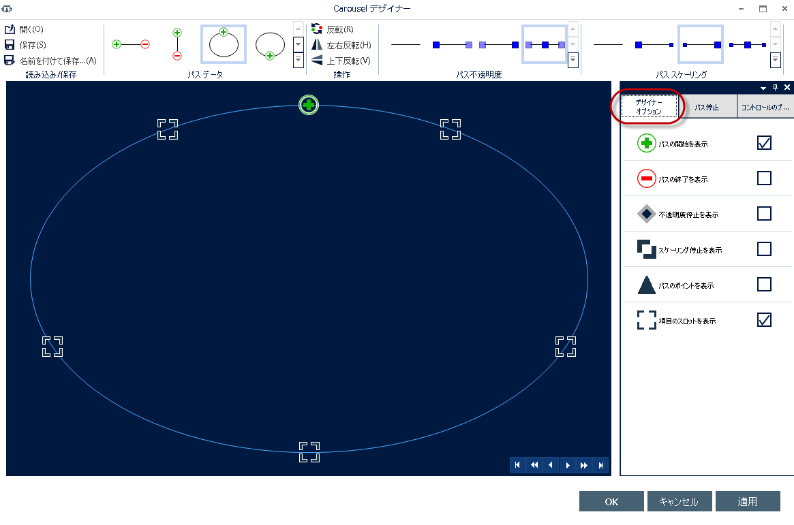
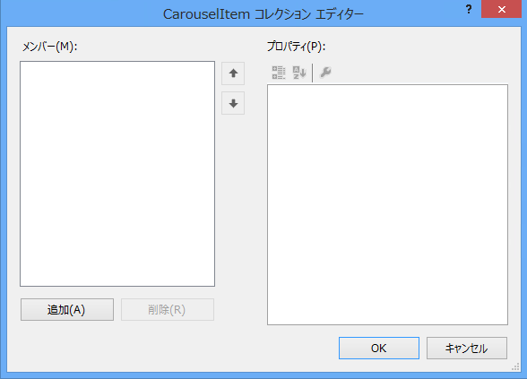
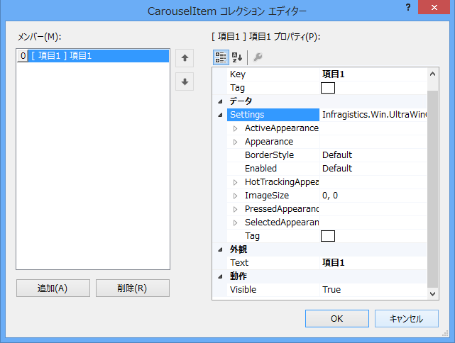
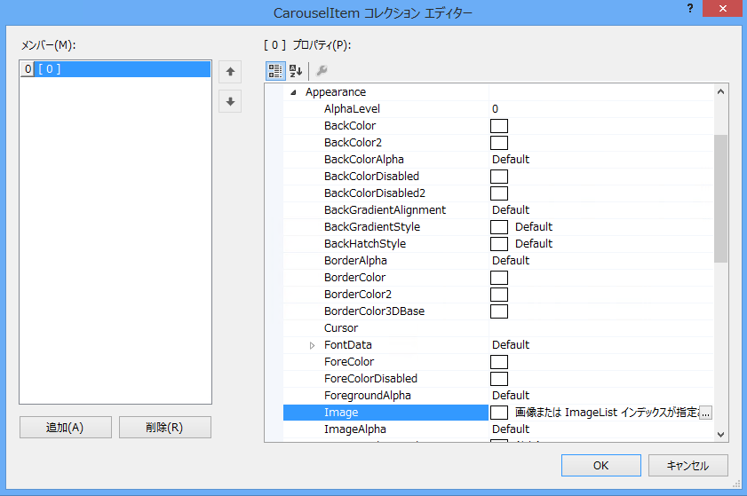

////
|metadata|
{
    "name": "wincarousel-adding-carousel-items-using-the-designer",
    "controlName": [],
    "tags": [],
    "guid": "9becaadd-037e-43ca-9630-92ec983627e1",
    "buildFlags": [],
    "createdOn": "2014-09-12T22:11:09.4642173Z"
}
|metadata|
////

= デザイナーを使用したカルーセル項目の追加

このトピックでは、コントロールのデザイン時のインターフェイスを使用して link:{ApiPlatform}win.ultrawincarousel{ApiVersion}~infragistics.win.ultrawincarousel.ultracarousel_members.html[UltraCarousel] 項目を追加および構成する方法を紹介します。

toc::[]

== 概要

このトピックでは、UltraCarousel コントロールを追加する方法と、コントロールのデザイン時のインターフェイスにより構成する方法を学習します。カルーセル コントロールの主要コンポーネントは、`パス`、`項目`、`スクロール ボタン`です。

== アプリケーションの要件

. _Infragistics WinForms 2014 Volume 2_   またはそれ以降のバージョンをインストールします。

. Visual Studio 2010 またはそれ以降のバージョンを使用して、新しい Windows Forms アプリケーションを開始します。

== UltraCarousel コントロールの追加

Visual Studio ツールボックス領域からフォーム上に UltraCarousel コントロールをドラッグ アンド ドロップします。コントロールはデフォルトで、デフォルト項目パスとナビゲーション ボタンを表示します。

image::images/Adding_Carousel_Items_Using_the_Designer_2.png[]

== スマート タグ

UltraCarousel コントロールには、オプションの初期プロパティ設定としてスマート タグがあります。

コントロールの表面をクリックして、コントロールの右上すみにあるスマート タグ インジケーター (矢印) を有効にしてください。スマート タグはドロップダウン タスク リストで構成されています。このリストには、[名前] およびデザイン時にカスタマイズするための [外観] プロパティと [データ] プロパティの 2 つのセクションが含まれます。

== カルーセル デザイナー

カルーセル デザイナーを開くには、コントロールの表面を`右クリック`し、[Carousel デザイナー ] を選択します。カルーセル デザイナーを開くもう 1 つの方法は、スマート タグ ドロップダウンで [ *パスの編集*] リンクを使用します。この方法は次のセクションで説明します。

== パスの追加

パスはコントロール上の連続する経路で、カルーセル項目が描画されます。事前定義されたさまざまなタイプのパスを構成に使用できます。UltraCarousel デザイン時のインターフェイスは、このパス プロパティを操作する便利な方法を提供します。

[UltraCarousel タスク] ダイアログの外観セクションで [*パスの編集* ] をクリックすると、デザイナーが開きます。

デザイナー ウィンドウには 3 つのセクションがあります (以下のスクリーンショット参照)。これらのセクションには、項目パス構成に使用できる事前定義されたテンプレート (*パス データ* 、*パス不透明度* 、*パス スケーリング* ) があります。

マウスを [*パス データ*] アイコン上に移動するだけで、コントロールの事前定義されたパス テンプレートをプレビューできます。アイコンをクリックすると、アイコンのテンプレートが選択されます。

同様に、[*不透明度停止*] ウィンドウとその下の [*スケーリング停止*] ウィンドウで、不透明度とスケーリングの停止位置をプレビューできます。

次のスクリーンショットに示すように、以下を選択します。

*  *パス データ* では、アイコンをクリックする、またはドロップダウンを使用して、_EllipsTop_  を選択します。
*  *パス透明度* では、_FadeFromMiddle_ を選択します。
*  *パス スケーリング* では、_Growing_ を選択します。

オプションで、デザイナー ビューの [コントロール プロパティ]  タブを使用して追加構成を適用できます。デフォルト項目サイズ 64×64 (ピクセル単位)、項目スロット数 (5 項目に対して 5 スロットの割り当て)、パスのカラーが構成できます。

.注:
[NOTE]
====
UltraCarousel コントロールは、`ItemSlots` プロパティ ( _Default=5_  ) で定義された数の項目を描画します。
====

* 実際の項目数が項目スロット数より少ない場合、パスにブランクのスロットが表示されます。
* 実際の項目数が項目スロット数より多い場合、割り当てられるスロットがない余分な項目は描画されません。

オプションで、構成を XML ファイルまたはバイナリ ファイルとして保存し、アプリケーションで読み込むことができます。デザイナーで既存の (以前に保存した) 構成ファイルを開き、それを新しいプロジェクトに対して再使用することができます。

[デザイナー オプション] タブ (後述) により、パス グリフを表示できます。これは、パス上の装飾的な記号であり、停止ポイントを示します。

.注:
[NOTE]
====
グリフは、デザイン時にパス上の開始/終了ポイントおよび停止ポイントを視覚化しますが、コントロールには描画されません。
====

== 項目の追加

UltraCarousel コントロールの項目は、データ オブジェクトのビジュアル表現です。項目は、デザイナーを使用して追加する、またはコードで追加することができ、データ ソースにバインドすることもできます。以下のスクリーンショットは、デザイン時のインターフェイスを使用して項目を追加する方法を示します。

コントロール上のスマート タグをクリックし、[項目の編集] を選択します。項目エディターで最初の項目を追加します。

最初の項目を追加すると、項目の名前を示す  *Text*  プロパティが表示されます。 *Settings*  オブジェクトは、以下のスクリーンショットに示した  _Appearance_   プロパティなど、構成のための多数のプロパティを公開しています。

_Settings_   オブジェクト、 _Appearance_   オブジェクトの順に展開し、 _Image_   プロパティに移動します。

省略記号 (`…`) をクリックするとダイアログウィンドウが開きます。そのウィンドウで、Image プロパティ用の既存のイメージをインポートします。[OK]  をクリックして設定を適用し、この手順を繰り返して、さらに 4 つの項目を追加します。

5 つの項目を追加した後、デザイナーでカルーセルは以下のスクリーンショットのようになります。アプリケーションを実行し、結果を検証します。

image::images/Adding_Carousel_Items_Using_the_Designer_13.png[]

== 関連コンテンツ

このトピックの追加情報については、以下のトピックも合わせてご参照ください。

* link:wincarousel-adding-carousel-items-in-code.html[コードでのカルーセル項目の追加] -- このトピックでは、コードビハインドを使用して UltraCarousel 項目を追加する方法を紹介します。

* link:wincarousel-binding-data-to-carousel-in-code.html[コードでのデータのカルーセルへのバインド] -- このトピックでは、コードビハインドでデータを UltraCarousel にバインドする方法を紹介します。

* link:wincarousel-binding-data-to-carousel-using-the-designer.html[デザイナーを使用したカルーセルへのデータのバインド] -- このトピックでは、デザイン時にデータ ソースをセットアップする方法、およびそれを UltraCarousel コントロールにバインドする方法を手順とともに紹介します。

* link:wincarousel-save-load-carousel-layout.html[カルーセル構成の保存と読み込み] -- このトピックでは、コントロールがデータにバインドされていない場合に、カルーセル項目を含む UltraCarousel レイアウトを保存する方法と読み込む方法を紹介します。バインドされている場合、保存されたレイアウトを読み込んだ後でコントロールを再度バインドする必要があります。