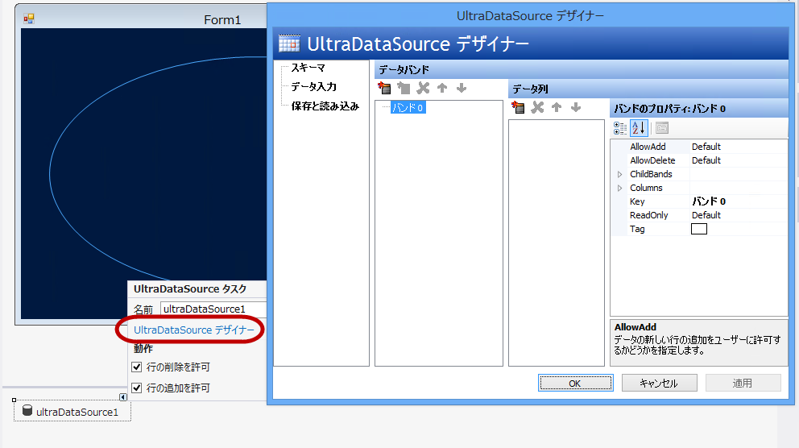
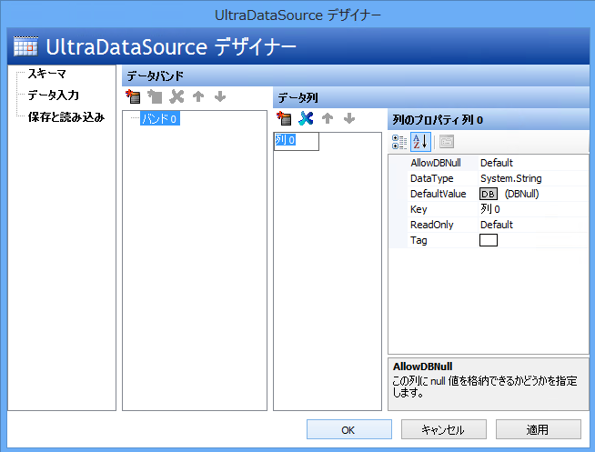
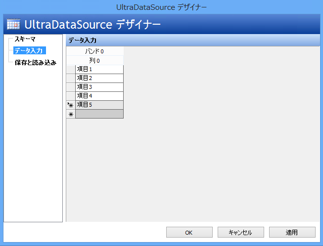
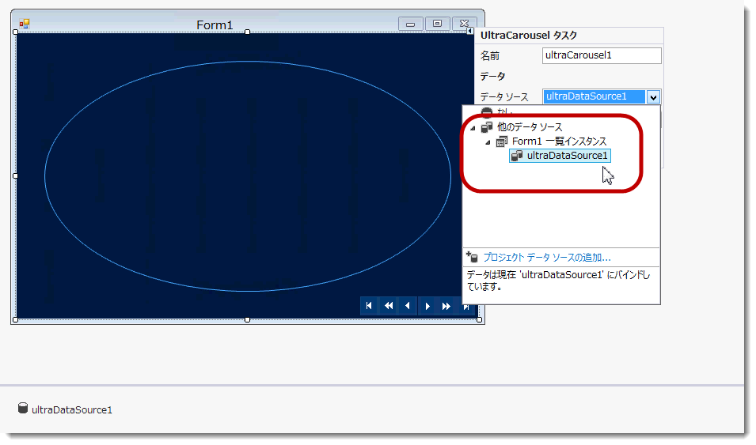
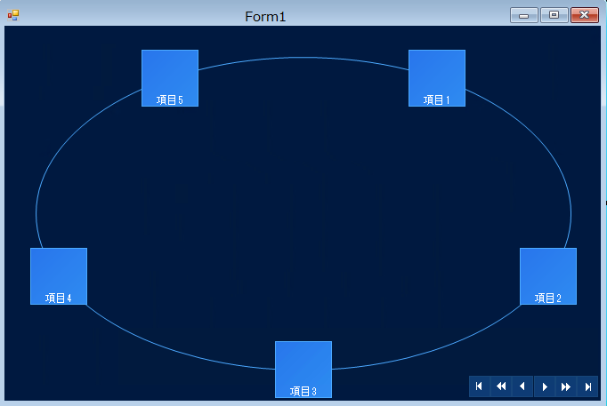

////
|metadata|
{
    "name": "wincarousel-binding-data-to-carousel-using-the-designer",
    "controlName": [],
    "tags": [],
    "guid": "1b9c875c-7447-44c1-b333-ca71f3615993",
    "buildFlags": [],
    "createdOn": "2014-09-12T22:51:36.7510957Z"
}
|metadata|
////

= デザイナーを使用したカルーセルへのデータのバインド

== トピックの概要

=== 目的

このトピックでは、デザイン時にデータ ソースをセットアップする方法、およびそれを link:{ApiPlatform}win.ultrawincarousel{ApiVersion}~infragistics.win.ultrawincarousel.ultracarousel_members.html[UltraCarousel] コントロールにバインドする方法を手順とともに紹介します。

=== このトピックの内容

このトピックは、以下のセクションで構成されます。

* <<_Ref397457597,概要>>

** <<_Ref397457606,概要>>
** <<_Ref397457617,アプリケーションの要件>>
** <<_Ref398742490,データ ソースの構成>>

* <<_Ref381022312,関連コンテンツ>>

[[_Ref397457597]]
== 概要

=== 概要

このトピックでは、デザイン時にデータ ソースを構成する方法を学習します。これは、コントロールの  _DataSource_   プロパティを使用して  _UltraCarousel_   コントロールにデータをバインドするために設定します。

[[_Ref397457617]]

=== アプリケーションの要件

1.Infragistics WinForms 2014 Volume 2 またはそれ以降のバージョンをインストールします。

2.Visual Studio 2010 またはそれ以降のバージョンを使用して、新しい Windows Forms アプリケーションを開始します。

[[_Ref397457625]]

=== データ ソースの構成

1.Visual Studio ツールボックス領域からフォーム上に  _UltraCarousel_   コントロールをドラッグ アンド ドロップします。またはコード内でコントロールを作成する場合は、以下のアセンブリ参照を追加します。

* {ApiPlatform}Shared
* {ApiPlatform}Win.UltraWinCarousel
* {ApiPlatform}Win

2.ツールボックス領域からフォーム上に Infragistics  _UltraDataSource_   コンポーネントをドラッグ アンド ドロップします。

3._UltraDataSource_   コンポーネントのスマートタグを使用し、「 _UltraDataSourceDesigner_  」オプションを選択します。このオプションは、デザイナー ダイアログを開きます。

[start=4]
4. *DataColumns*  セクションの一番左のアイコンをクリックして、そのセクションに列を追加します。

[start=5]
5. *データ入力* を選択し、列に数行 (項目用) を追加します。次に OK をクリックして、デザイナー ダイアログを閉じます。

[start=6]
6. _UltraCarousel_   コントロールで、スマートタグを使用してコントロールのタスクリストをドロップダウンし、 _UltraDataSource_   オブジェクトに対して「データ ソース」プロパティを設定します。

この時点で、コントロールはデザイン時のカルーセル項目としてデータ コレクションを表示します。

アプリケーションを実行し、結果を検証します。

[[_Ref381022312]]
== 関連コンテンツ

=== トピック

このトピックの追加情報については、以下のトピックも合わせてご参照ください。

[options="header", cols="a,a"]
|====
|トピック|目的

| link:wincarousel-binding-data-to-carousel-in-code.html[コードでのデータのカルーセルへのバインド]
|このトピックでは、コードビハインドでデータを UltraCarousel にバインドする方法を紹介します。

| link:wincarousel-adding-carousel-items-in-code.html[コードでのカルーセル項目の追加]
|このトピックでは、コードビハインドを使用して UltraCarousel 項目を追加する方法を紹介します。

| link:wincarousel-adding-carousel-items-using-the-designer.html[デザイナーを使用したカルーセル項目の追加]
|このトピックでは、コントロールのデザイン時のインターフェイスを使用して UltraCarousel 項目を追加および構成する方法を紹介します。

| link:wincarousel-save-load-carousel-layout.html[カルーセル構成の保存と読み込み]
|このトピックでは、コントロールがデータにバインドされていない場合に、カルーセル項目を含む UltraCarousel レイアウトを保存する方法と読み込む方法を紹介します。バインドされている場合、保存されたレイアウトを読み込んだ後でコントロールを再度バインドする必要があります。

|====