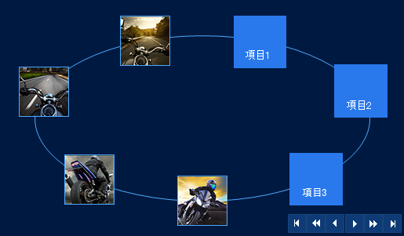

////

|metadata|
{
    "name": "wincarousel",
    "controlName": [],
    "tags": [],
    "guid": "e0b60e04-7081-477a-a29e-46a44727845b",  
    "buildFlags": [],
    "createdOn": "2014-09-12T20:36:07.8341913Z"
}
|metadata|
////

= WinCarousel

=== 概要

このセクションは、{ProductName}® の link:{ApiPlatform}win.ultrawincarousel{ApiVersion}~infragistics.win.ultrawincarousel.ultracarousel_members.html[UltraCarousel] コントロールについてのトピックを含みます。

UltraCarousel は、事前定義されたパスに沿った長方形タイルの形で、項目のリストを表示するナビゲート コントロールです。各項目は、テキストまたは画像を表示できます。

=== トピック

[options="header", cols="a,a"]
|====
|トピック|目的

| link:wincarousel-using-wincarousel.html[WinCarousel の使用]
|このグループのトピックでは、WinCarousel コントロールを Visual Studio デザイナー インターフェイスとコードを使用して作成および設定する方法の手順を含めて紹介します。

| link:wincarousel-events.html[WinCarousel イベント]
|このトピックでは、WinCarousel コントロールで一般的に使用されるイベントの概要を説明します。

| link:wincarousel-properties.html[WinCarousel プロパティ]
|このトピックでは、WinCarousel コントロールのプロパティのリストと一般的に使用されるオブジェクトを示します。

|====