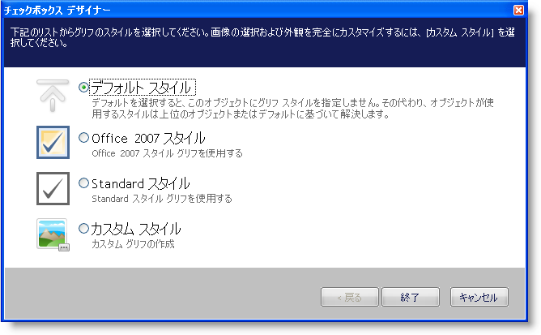
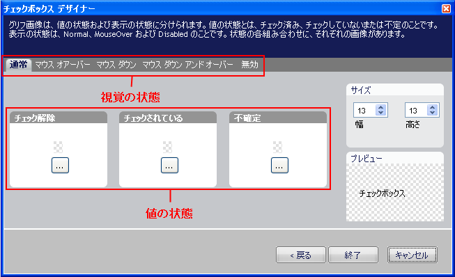

////

|metadata|
{
    "name": "wincheckeditor-creating-a-custom-style-for-wincheckeditor",
    "controlName": ["WinCheckEditor"],
    "tags": ["Styling"],
    "guid": "{6F867BFB-C37F-46DE-BA3B-016A61703875}",  
    "buildFlags": [],
    "createdOn": "0001-01-01T00:00:00Z"
}
|metadata|
////

= WinCheckEditor のカスタム スタイルの作成

== 始める前に

WinCheckEditor の GlyphInfo オブジェクトを使用して、ルック アンド フィールを馴染みのあるオペレーティング システムのテーマ化されたスタイルまたは最新の Microsoft® Office® 2007 スタイルに変更できます。ただし、{ProductName} の 2008 Volume 2 リリースでは、WinCheckEditor が存在できる各状態のカスタム画像を追加することができます。Check Box Designer を使用してこれらのカスタム画像を設定できます。

== 達成すること

Check Box Designer を使用して WinCheckEditor のカスタム スタイルを作成する方法を学習します。

== 次の手順を実行します

[start=1]
. *WinCheckEditor をフォームに追加します。*

.. 新しいまたは既存の Windows Forms プロジェクトでは、Visual Studio® ツールボックスで UltraCheckEditor コントロールを見つけてダブルクリックします。WinCheckEditor がフォームに追加されます。
.. WinCheckEditor が選択された状態で、プロパティ ウィンドウで GlyphInfo プロパティを指定し、このウィンドウの右の省略記号ボタンをクリックします。Check Box Designer が表示されます。

[start=2]
. *WinCheckEditor の通常の状態にカスタム画像を設定します* 。

.. デフォルトでは、Default Style が選択されます。カスタム スタイルを選択すると、WinCheckEditor の状態のそれぞれに個別の画像を設定できます。
.. [次へ] をクリックして、先に進みます。Check Box Designer は、タブ付きインタフェースを表示し、各視覚状態に 3 つの値状態の画像を設定できます。

.. チェック解除グループ ボックスで省略記号（...）ボタンをクリックします。ポップアップが表示します。
.. ポップアップ メニューで [ファイルからロード] をクリックします。[ファイルを開く] ダイアログ ボックスが表示します。
.. WinCheckEditor の通常、チェック解除状態で使用したい特定の画像を指定します。このトピックでは、以下の画像を使用します。画像を見つけたら、[開く] をクリックして画像を設定します。
.. チェック グループ ボックスで省略記号（...）ボタンをクリックします。ポップアップが表示します。
.. ポップアップ メニューで [ファイルからロード] をクリックします。[ファイルを開く] ダイアログ ボックスが表示します。
.. WinCheckEditor の通常、チェック状態で使用したい特定の画像を指定します。このトピックでは、以下の画像を使用します。画像を見つけたら、[開く] をクリックして画像を設定します。チェックおよびチェック解除状態がこれで設定されます。

[start=3]
. *残りの WinCheckEditor の視覚の状態にカスタム画像を設定します* 。

.. [ノーマル] タブの右の [マウス オーバー] タブをクリックします。
.. チェック解除グループ ボックスで省略記号（...）ボタンをクリックします。ポップアップが表示します。
.. ポップアップ メニューで [コピー元] をクリックします。フライアウト メニューが 5 つの使用可能な視覚状態のそれぞれで表示され、現在の状態が灰色表示されます。
.. フライアウト メニューで [ノーマル] をクリックし、ノーマル、チェック解除状態から同じ画像を使用します。
.. チェック グループ ボックスで省略記号（...）ボタンをクリックします。
.. ポップアップ メニューで [コピー元] をクリックします。
.. フライアウト メニューで [ノーマル] をクリックし、ノーマル、チェック状態から同じ画像を使用します。
.. マウス ダウン、マウス ダウンおよびオーバー、そして無効な視覚状態で b から g を繰り返します。
.. [完了] をクリックします。

[start=4]
. *アプリケーションを実行します。*

チェックボックスにマウスをホバーして画像が変更することを確認します。チェックボックスを選択して画像が変更することも確認します。