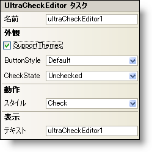

////
|metadata|
{
    "name": "wincheckeditor-smart-tag",
    "controlName": ["WinCheckEditor"],
    "tags": ["Design Environment"],
    "guid": "{37943D71-BBCF-4379-AF5E-41B3CB4CA93C}",
    "buildFlags": [],
    "createdOn": "2005-09-11T00:00:00Z"
}
|metadata|
////

= WinCheckEditor スマート タグ

Visual Studio 2005（.NET Framework 2.0）では、それぞれの {ProductName} コントロール/コンポーネントが固有のスマート タグを備えています。 コントロール/コンポーネントを単に選択すると、Smart Tag のアンカーが表示されます。このアンカーをクリックするとポップアップ パネルが表示され、そこからコントロール/コンポーネントの最もよく使用するプロパティや設定にすばやく簡単にアクセスできます。

WinCheckEditor スマート タグには、以下のセクションと共にコントロールの名前が含まれます。

* 外観 -- コントロールの外観やルック アンド フィールに関連する一般的なタスクがあります。
* 動作 -- フォーム上でのコントロールの動作を制御するプロパティに簡単にアクセスできます。

各セクションの項目（たとえば、フィールド、ドロップダウン リスト、チェックボックス）およびプロパティ グリッドの項目の対応するプロパティの説明については以下を参照してください。

[options="header", cols="a,a,a"]
|====
|外観|説明|対応するプロパティ

|テーマのサポート
|このチェックボックスを選択すると、Microsoft の基本的な OS テーマ（Windows クラシック テーマまたは Windows XP テーマ）がサポートされます。
| pick:[win-forms="link:{ApiPlatform}win{ApiVersion}~infragistics.win.ultracontrolbase~supportthemes.html[SupportThemes]"]

|ボタンのスタイル
|チェックボックスの外観を希望どおりにするために、広範なスタイルから選択します。ただし、SupportThemes プロパティが True に設定されている場合はボタン スタイルを変更できません。
| pick:[win-forms="link:{ApiPlatform}win.ultrawineditors~infragistics.win.ultrawineditors.ultratoggleeditorbase~buttonstyle.html[ButtonStyle]"]

|チェック状態
|チェックボックスが選択、選択解除、未定のいずれであるかを指定します。
| pick:[win-forms="link:{ApiPlatform}win.ultrawineditors~infragistics.win.ultrawineditors.ultratoggleeditorbase~checkstate.html[CheckState]"]

|テキスト
|チェックボックスの横に表示するテキストです。
| pick:[win-forms="link:{ApiPlatform}win.ultrawineditors~infragistics.win.ultrawineditors.ultratoggleeditorbase~text.html[Text]"]

|====

[options="header", cols="a,a,a"]
|====
|動作|説明|対応するプロパティ

|スタイル
|WinCheckEditor のスタイルをチェックボックスまたはボタンのどちらかに変更します。ボタンは押し下げられた状態になることで、「選択されている」状態を示します。
| pick:[win-forms="link:{ApiPlatform}win.ultrawineditors~infragistics.win.ultrawineditors.ultratoggleeditorbase~style.html[Style]"]

|====