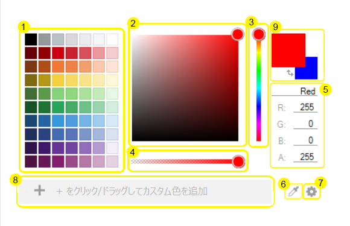

= WinColorPalette について

WinColorPalette を使用して、RGB、HSL または CMYK 形式で指定された任意の色コンポーネントの値で色をプレビューして選択します。スタンドアロン コントロールとして使用可能な WinColorPalette は WinColorPicker
のエクスペリエンスを更に向上します。また、link:{ApiPlatform}win.ultrawineditors{ApiVersion}~infragistics.win.ultrawineditors.ultracolorpicker~style.html[UltraColorPicker.Style] を ColorPalette に設定することでドロップダウンとして使用することもできます。

link:winschedule.html[WinSchedule] コントロールおよび link:wincalendarinfo.html[WinCalendarInfo] と同様に WinColorPalette も設定とデータ (WinColorPalette で作成されたカスタム色を含めて) を制御する link:winpaletteinfo.html[WinPaletteInfo] オブジェクトに依存します。また、フォームのすべての WinColorPalette
および WinColorPicker コントロールの
link:{ApiPlatform}win.ultrawineditors{ApiVersion}~infragistics.win.ultrawineditors.ultracolorpicker~paletteinfo.html[PaletteInfo] プロパティを同一の WinPaltteInfo オブジェクトに設定することによってすべてのコントロールを同期します。

WinColorPalette
コンポーネントには、ユーザが必要とする色の定義をサポートする機能が多数備わっています。その多くは、WinColorPalette
の
link:{ApiPlatform}win{ApiVersion}~infragistics.win.ultracolorpalette.ultrapaletteinfo.html[WinPaletteInfo] オブジェクトで非表示にできます。以下では WinColorPalette の構成を表すダイアグラムを示しています。

WinColorPalette の構成については以下のリンクを参照してください:

. グリッド パレット -- 作業をすぐに開始できる定義済みの色を提供します。その行および列はコードで設定することができます。
. 連続パレット -- グラデーションで色合いの遷移を示し、選択した色の微調整をサポートします。
. 色合いスライダー -- ROYGBIV スペクトルから色合いの選択オプションを提供します。
. アルファ スライダー -- 透明度を定義する色のアルファ コンポーネントを設定します。
. 色コンポーネント -- 選択されている色を構成する値。WinColorPalette
のグラフィックスで作成されたされた値をプレビュー、またはテキストボックスに直接値を入力して、設定をカラー
プレビュー ボックスに反映させます。最上位のテキストボックスは現在の色の名前を示します。色を作成するときは 16 進数で表示されます。また、色の名前を入力して色を選択することもできます。例えば、blue または aqua、など。
. カラー グラバー -- 画面上の色の選択を可能にします。カラー グラバーを選択して長押すると、カーソル下で個別のピクセルを見せる拡大鏡が表示されます。必要な色の上に拡大鏡をドラッグして、WinColorPalette で色を選択します。
. オプション ボタン -- コンポーネントが定義されるスタイルを選択します。オプションには RGB、HSL
または CMYK があります。
. カスタム色ボックス -- ユーザー設定の色を保存します。[+] ボタンをクリックして、またはグリッド パレットから色をドラッグしてカスタム色ボックスに追加します。色を削除するためにカスタム色ボックスからドラッグします。
. カラー プレビュー ボックス -- 現在選択されている色のプレビューを表示します。link:{ApiPlatform}win{ApiVersion}~infragistics.win.ultracolorpalette.ultrapaletteinfo~showsecondarycolor.html[UltraPaletteInfo.ShowSecondaryColor]
を使用して二次色の表示も可能です。True の場合、一次色と二次色を切り替えるためのボタンを
link:{ApiPlatform}win{ApiVersion}~infragistics.win.ultracolorpalette.ultrapaletteinfo~showswapbutton.html[UltraPaletteInfo.ShowSwapButton] で設定し表示します。

このツールで選択できる色のオプションを拡大します。選択されている色/二次色は、link:{ApiPlatform}win{ApiVersion}~infragistics.win.ultracolorpalette.ultracolorpalette~color.html[UltraColorPalette.Color]
および
link:{ApiPlatform}win{ApiVersion}~infragistics.win.ultracolorpalette.ultracolorpalette~secondarycolor.html[UltraColorPalette.SecondaryColor] でアクセスできます。