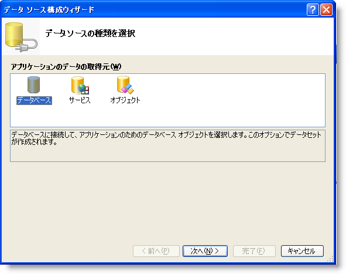
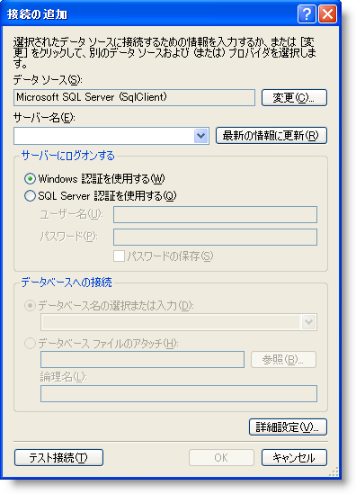
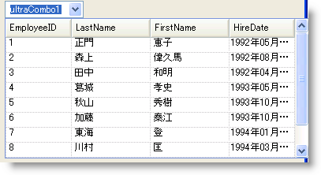

////

|metadata|
{
    "name": "wincombo-binding-wincombo-to-a-data-table",
    "controlName": ["WinCombo"],
    "tags": ["Data Binding"],
    "guid": "{9DD143E5-85FA-4FFE-937D-D4C3EE8E604B}",  
    "buildFlags": [],
    "createdOn": "2009-07-12T15:50:49Z"
}
|metadata|
////

= WinCombo をデータ テーブルにバインド

== 始める前に

WinCombo™ コントロールは Windows Forms コントロールで、DataSource プロパティと DataMember プロパティを使用して完全なデータ バインドのサポートを提供します。

== 達成すること

WinCombo を Northwind データベースの Employees データ テーブルにバインドする方法を学習します。

== 以下の手順を実行します。

1. ultraCombo をフォームにドラッグ アンド ドロップします。

2. WinCombo コントロールのスマートタグをクリックして、DataSource メンバーのドロップダウン ボタンをクリックします。

3. ドロップダウン リストから [プロジェクト データソースを追加] を選択すると、[データ ソース構成] ウィザードが表示します。

4. [データ ソース構成] ウィザードで、[データベース] を選択し [次へ] をクリックします。

5. [データ接続を選択] ダイアログで、[新しい接続] ボタンをクリックして接続文字列を構成します。 [接続の追加] ダイアログが表示します。

6. 使用しているサーバー（この場合は .\SQLEXPRESS）にサーバー名を指定します。 データベースを Northwind に設定します。

7. [OK] をクリックします。 [データ接続を選択] ダイアログに戻ります。

8. [次へ] をクリックします。

9. Tables を選択し、以下を実行します。

[start=1]
. ドロップダウン リストから Employees テーブルを選択します。
[start=2]
. Employees ドロップダウン リストから、これらの列を表示するために EmployeeID、LastName、FirstName、および HireDate 列を選択します。

10. [完了] ボタンをクリックして構成ウィザードを閉じます。 employeesBindingSource オブジェクトが作成され、Northwind データベースから Employees データを取得するように WinCombo が設定されます。

11. アプリケーションを実行します。 WinCombo は Employees テーブルにバインドしてデータを表示します。

