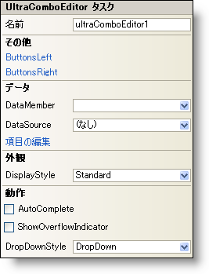

////

|metadata|
{
    "name": "wincomboeditor-smart-tag",
    "controlName": ["WinComboEditor"],
    "tags": ["Summaries"],
    "guid": "{0580F150-40DA-4324-8F07-920A31B2230F}",  
    "buildFlags": [],
    "createdOn": "2005-09-11T00:00:00Z"
}
|metadata|
////

= WinComboEditor スマート タグ

Visual Studio 2005（.NET Framework 2.0）では、それぞれの {ProductName} コントロール/コンポーネントが固有のスマート タグを備えています。 コントロール/コンポーネントを単に選択すると、Smart Tag のアンカーが表示されます。このアンカーをクリックするとポップアップ パネルが表示され、そこからコントロール/コンポーネントの最もよく使用するプロパティや設定にすばやく簡単にアクセスできます。

WinComboEditor スマート タグには、コントロールの名前と次のセクションがあります。

* 外観 -- コントロールの外観やルック アンド フィールに関連する一般的なタスクがあります。
* 動作 -- フォーム上でのコントロールの動作を制御するプロパティに簡単にアクセスできます。
* データ -- コントロールが使用している基になるデータ（データ ソースやデータ メンバなど）を参照します。
* その他 -- コントロールの全体的な外観やパフォーマンスを拡張する各種オプションがあります。

各セクションの項目（たとえば、フィールド、ドロップダウン リスト、チェックボックス）およびプロパティ グリッドの項目の対応するプロパティの説明については以下を参照してください。

[options="header", cols="a,a,a"]
|====
|外観|説明|対応するプロパティ

|表示スタイル
|WinComboEditor のスタイルを、Office 2000、Office XP、Office 2003、Visual Studio 2005、Office 2007 に似たスタイルに変更します。
| link:{ApiPlatform}win.ultrawineditors{ApiVersion}~infragistics.win.ultrawineditors.texteditorcontrolbase~displaystyle.html[DisplayStyle]

|====

[options="header", cols="a,a,a"]
|====
|動作|説明|対応するプロパティ

|AutoComplete
|このチェックボックスを選択すると、入力した文字がリストの項目と一致したときにエディタが自動的に更新されます。
| link:{ApiPlatform}win.ultrawineditors{ApiVersion}~infragistics.win.ultrawineditors.ultracomboeditor~autocompletemode.html[AutoCompleteMode]

|オーバーフロー インジケータの表示
|Text プロパティが長すぎてエディタに収まらないときに、テキストの続きがあることを示す 2 つの右矢印の付いた小さなボックスが表示されます。
| link:{ApiPlatform}win.ultrawineditors{ApiVersion}~infragistics.win.ultrawineditors.texteditorcontrolbase~showoverflowindicator.html[ShowOverflowIndicator]

|ドロップダウン スタイル
|WinComboEditor を編集できないようにする場合はドロップダウンから "DropDownList" を選択します。
| link:{ApiPlatform}win.ultrawineditors{ApiVersion}~infragistics.win.ultrawineditors.ultracomboeditor~dropdownstyle.html[DropDownStyle]

|====

[options="header", cols="a,a,a"]
|====
|データ|説明|対応するプロパティ

|データ メンバ
|有効なデータ ソースを選択した後、このドロップダウンから使用可能なすべてのデータ メンバを選択できます。
| link:{ApiPlatform}win.ultrawineditors{ApiVersion}~infragistics.win.ultrawineditors.ultracomboeditor~datamember.html[DataMember]

|データ ソース
|ドロップダウンをクリックすると、プロジェクトで使用可能なすべてのデータ ソースが表示されます。データ ソースがまだ設定されていない場合は、[プロジェクト データ ソースの追加...] を選択してデータ ソースを作成できます。
| link:{ApiPlatform}win.ultrawineditors{ApiVersion}~infragistics.win.ultrawineditors.ultracomboeditor~datasource.html[DataSource]

|項目の編集
|このオプションは、WinComboEditor がデータ ソースにバインドされている場合は使用できません。WinComboEditor がデータ ソースにバインドされていない場合に [項目の編集］ をクリックすると、WinComboEditor の Items コレクションが開きます。ここでドロップダウン ボックスのドロップダウン項目を編集できます。
| link:{ApiPlatform}win.ultrawineditors{ApiVersion}~infragistics.win.ultrawineditors.ultracomboeditor~items.html[Items]

|====

[options="header", cols="a,a,a"]
|====
|その他|説明|対応するプロパティ

|左ボタン
|省略（...）ボタンをクリックすると、ButtonsLeft コレクションが開きます。これはエディタの左側に配置できるカスタム ボタンのコレクションです。
| link:{ApiPlatform}win{ApiVersion}~infragistics.win.ultrawineditors.editorbuttoncontrolbase~buttonsleft.html[ButtonsLeft]

|右ボタン
|省略（...）ボタンをクリックすると、ButtonsRight コレクションが開きます。これはエディタの右側に配置できるカスタム ボタンのコレクションです。
| link:{ApiPlatform}win{ApiVersion}~infragistics.win.ultrawineditors.editorbuttoncontrolbase~buttonsright.html[ButtonsRight]

|====