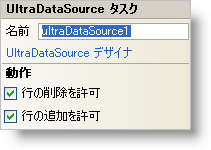

////

|metadata|
{
    "name": "windatasource-smart-tag",
    "controlName": ["WinDataSource"],
    "tags": ["Extending"],
    "guid": "{AA603C45-B11D-4398-BECB-FE52BA15096B}",  
    "buildFlags": [],
    "createdOn": "2005-09-11T00:00:00Z"
}
|metadata|
////

= WinDataSource スマート タグ

Visual Studio 2005（.NET Framework 2.0）では、{ProductName} コントロール/コンポーネントがそれぞれ固有のスマート タグを備えています。コントロールやコンポーネントを選択するだけで、スマート タグのアンカーが表示されます。このアンカーをクリックするとポップアップ パネルが表示され、そこからコントロール/コンポーネントの最もよく使用するプロパティや設定にすばやく簡単にアクセスできます。

WinDataSource スマート タグには、コンポーネントの名前と次のセクションがあります。

* 動作 -- フォーム上でのコントロールの動作を制御するプロパティに簡単にアクセスできます。

各セクションの項目（たとえば、フィールド、ドロップダウン リスト、チェックボックス）およびプロパティ グリッドの項目の対応するプロパティの説明については以下を参照してください。

[options="header", cols="a,a,a"]
|====
|動作|説明|対応するプロパティ

|行の追加を許可
|このチェックボックスを選択すると、ユーザーがデータ ソースに行を追加できます。
| link:{ApiPlatform}win.ultrawindatasource{ApiVersion}~infragistics.win.ultrawindatasource.ultradatasource~allowadd.html[AllowAdd]

|行の削除を許可
|このチェックボックスをを選択すると、ユーザーがデータ ソースから行を削除できます。
| link:{ApiPlatform}win.ultrawindatasource{ApiVersion}~infragistics.win.ultrawindatasource.ultradatasource~allowdelete.html[AllowDelete]

|====