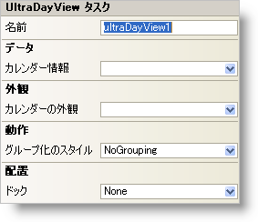

////

|metadata|
{
    "name": "windayview-smart-tag",
    "controlName": ["WinDayView"],
    "tags": ["Getting Started"],
    "guid": "{F7FF13D7-A7C5-4429-8FFF-E77D99413D24}",  
    "buildFlags": [],
    "createdOn": "0001-01-01T00:00:00Z"
}
|metadata|
////

= WinDayView スマート タグ

Visual Studio 2005（.NET Framework 2.0）では、それぞれの {ProductName} コントロール/コンポーネントが固有のスマート タグを備えています。 コントロール/コンポーネントを単に選択すると、Smart Tag のアンカーが表示されます。このアンカーをクリックするとポップアップ パネルが表示され、そこからコントロール/コンポーネントの最もよく使用するプロパティや設定にすばやく簡単にアクセスできます。

WinDayView スマート タグには、以下のセクションと共にコントロールの名前が含まれます。

* 外観 -- コントロールの外観やルック アンド フィールに関連する一般的なタスクがあります。
* 動作 -- フォーム上でのコントロールの動作を制御するプロパティに簡単にアクセスできます。
* データ -- コントロールが使用している基になるデータ（データ ソースやデータ メンバなど）を参照します。
* レイアウト -- コントロールをフォームのどこに、どのように配置するかを指定するプロパティがあります。

各セクションの項目（たとえば、フィールド、ドロップダウン リスト、チェックボックス）およびプロパティ グリッドの項目の対応するプロパティの説明については以下を参照してください。

[options="header", cols="a,a,a"]
|====
|外観|説明|対応するプロパティ

|カレンダーの外観
|ドロップダウンをクリックすると、フォーム上にある使用可能なすべての WinCalendarLook コントロールが表示されます。
| link:{ApiPlatform}win.ultrawinschedule{ApiVersion}~infragistics.win.ultrawinschedule.ultraschedulecontrolbase~calendarlook.html[CalendarLook]

|====

[options="header", cols="a,a,a"]
|====
|動作|説明|対応するプロパティ

|グループ化のスタイル
|グループ化のタイプを、グループ化しない、日付の中でオーナーをグループ化する、オーナーの中で日付をグループ化するの中から選択します。
| link:{ApiPlatform}win.ultrawinschedule{ApiVersion}~infragistics.win.ultrawinschedule.ultradayview~groupingstyle.html[GroupingStyle]

|====

[options="header", cols="a,a,a"]
|====
|データ|説明|対応するプロパティ

|カレンダー情報
|ドロップダウンをクリックすると、フォーム上にある使用可能なすべての WinCalendarInfo コントロールが表示されます。
| link:{ApiPlatform}win.ultrawinschedule{ApiVersion}~infragistics.win.ultrawinschedule.ultraschedulecontrolbase~calendarinfo.html[CalendarInfo]

|====

[options="header", cols="a,a,a"]
|====
|レイアウト|説明|対応するプロパティ

|ドック
|WinDayView を上、右、下、左、全体のどこにドッキングするか、またはどこにもドッキングしないかを選択します。
|Dock

|====