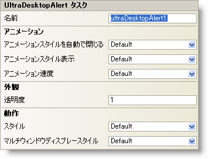

////

|metadata|
{
    "name": "windesktopalert-smart-tag",
    "controlName": ["WinDesktopAlert"],
    "tags": ["API","Design Environment"],
    "guid": "{A962EFEC-1690-4F2F-BB6C-F7047FD563DE}",  
    "buildFlags": [],
    "createdOn": "0001-01-01T00:00:00Z"
}
|metadata|
////

= WinDesktopAlert スマート タグ

Visual Studio 2005（.NET Framework 2.0）では、それぞれの {ProductName} コントロール/コンポーネントが固有のスマート タグを備えています。 コントロール/コンポーネントを単に選択すると、Smart Tag のアンカーが表示されます。このアンカーをクリックするとポップアップ パネルが表示され、そこからコントロール/コンポーネントの最もよく使用するプロパティや設定にすばやく簡単にアクセスできます。

WinDesktopAlert スマート タグには、以下のセクションと共にコントロールの名前が含まれます。

* アニメーション -- コンポーネントの移動を操作するプロパティへのアクセスを提供します。
* 外観 -- コンポーネントの外観やルック アンド フィールに関連する一般的なタスクがあります。
* 動作 -- フォーム上でのコントロールの動作を制御するプロパティに簡単にアクセスできます。

各セクションの項目（たとえば、フィールド、ドロップダウン リスト、チェックボックス）およびプロパティ グリッドの項目の対応するプロパティの説明については以下を参照してください。

[options="header", cols="a,a,a"]
|====
|Animation|説明|対応するプロパティ

|AnimationSpeed
|デスクトップ アラート ウィンドウがフェードまたはスクロールイン/スクロールアウトする速度を決定します。
| link:{ApiPlatform}win.misc{ApiVersion}~infragistics.win.misc.ultradesktopalert~animationspeed.html[AnimationSpeed]

|AnimationStyleAutoClose
|AutoClose プロパティが True（デフォルト）に設定されている場合、デスクトップ アラート ウィンドウは、このプロパティで記述されているようにフェード、スクロール、またはその両方で自動的に閉じます。
| link:{ApiPlatform}win.misc{ApiVersion}~infragistics.win.misc.ultradesktopalert~animationstyleautoclose.html[AnimationStyleAutoClose]

|AnimationStyleShow
|デスクトップ アラート ウィンドウが表示されると、フェードイン、スクロールイン、または両方の組み合わせを行うことができます。
| link:{ApiPlatform}win.misc{ApiVersion}~infragistics.win.misc.ultradesktopalert~animationstyleshow.html[AnimationStyleShow]

|====

[options="header", cols="a,a,a"]
|====
|外観|説明|対応するプロパティ

|Opacity
|このプロパティはデスクトップ アラート ウィンドウの透過度を決定します。Opacity プロパティを 0 に設定すると完全に透過（ウィンドウは表示されない）になり、1 に設定すると完全に不透明（ウィンドウの背後には何も見えない）になります。
| link:{ApiPlatform}win.misc{ApiVersion}~infragistics.win.misc.ultradesktopalert~opacity.html[Opacity]

|====

[options="header", cols="a,a,a"]
|====
|動作|説明|対応するプロパティ

|MultipleWindowDisplayStyle
|エンド ユーザーが同時に複数のデスクトップ アラート ウィンドウを表示する場合、このプロパティがウィンドウのタイルまたはオーバーラップを管理します。このプロパティを None に設定すると複数のデスクトップ アラート ウィンドウは許可されません。
| link:{ApiPlatform}win.misc{ApiVersion}~infragistics.win.misc.ultradesktopalert~multiplewindowdisplaystyle.html[MultipleWindowDisplayStyle]

|Style
|Office 2007（デフォルト）から Windows Live Messenger のデスクトップ アラート ウィンドウのルックアンドフィール全体を変更します。
| link:{ApiPlatform}win.misc{ApiVersion}~infragistics.win.misc.ultradesktopalert~style.html[Style]

|====