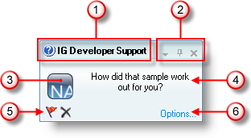

////

|metadata|
{
    "name": "windesktopalert-the-look-and-feel-of-windesktopalert",
    "controlName": ["WinDesktopAlert"],
    "tags": ["Styling"],
    "guid": "{EB3844FF-EADF-44BA-B06B-08BE8BD9F167}",  
    "buildFlags": [],
    "createdOn": "0001-01-01T00:00:00Z"
}
|metadata|
////

= WinDesktopAlert のルック アンド フィール

WinDesktopAlert™ のデスクトップ アラート ウィンドウは 2 つの特徴があります。

== Office2007

image::images/WinDesktopAlert_The_Look_and_Feel_of_WinDesktopAlert_01.png[]

== WindowsLiveMessenger

両方のスタイルはルックと機能において非常に似ていますが、非常に異なる目的のために設計されています。Office2007 スタイルは、Microsoft® Outlook® の新しいメールのデスクトップ警告に似ています。電子メール プログラムとデスクトップ アラート を併用したり、 link:windesktopalert-creating-a-desktop-alert-reminder-for-winschedule.html[デスクトップ アラート リマインダ] として WinCalendarInfo™ コンポーネントを併せて使用することもできます。

WindowsLiveMessenger スタイルは、Windows Live Messenger インスタント メッセージング アプリケーションに似ています。インスタント メッセージャ クライアントでデスクトップ アラートのこのスタイルを使用したり、重要なシステム イベントについてのクイック アップデートをエンド ユーザーに通知します。もちろん、 link:win-presentation-layer-framework-plf.html[Presentation Layer Framework]™ (PLF) および link:win-appearance-objects.html[Appearance] オブジェクトのヘルプで両方のデスクトップ アラート ウィンドウのルック全体を変更することができます。 link:{ApiPlatform}win{ApiVersion}~infragistics.win.office2007colortable.html[Office2007ColorTable] を変更し、 link:win-blend-a-custom-color-with-office-2007-style-color-schemes.html[カスタムのカラー ブレンド]を追加することでデスクトップ アラート ウィンドウのルックを素早く変更することもできます。

以下は、デスクトップ アラート ウィンドウの 2 つのスタイルの特徴と相違に特化したリストです。リストの番号は、上記のスクリーンショットの吹き出しテキストに対応します。

[start=1]
. *キャプション領域* – キャプション領域には、Office2007 スタイルよりも少し多い WindowsLiveMessenger スタイルが含まれます。WindowsLiveMessenger スタイルには、 link:{ApiPlatform}win.misc{ApiVersion}~infragistics.win.misc.ultradesktopalert~captionareaappearance.html[CaptionAreaAppearance] オブジェクトが含まれ、これによって上記の 2 番目のスクリーンショットで示すように画像を設定できます。両方のスタイルでキャプション領域のテキストは同じです。 link:{ApiPlatform}win.misc{ApiVersion}~infragistics.win.misc.ultradesktopalertshowwindowinfo~caption.html[Caption] プロパティを設定して、デスクトップ アラート ウィンドウにキャプションを追加します。
[start=2]
. *[ドロップダウン]、[ピン]、[閉じる] ボタン* – この領域は両方のスタイルで同じです。[閉じる] ボタンは常に表示されますが、[ドロップダウン] ボタンと [ピン] ボタンはデフォルトでは非表示です。それらを表示するには、 link:{ApiPlatform}win.misc{ApiVersion}~infragistics.win.misc.ultradesktopalert~dropdownbuttonvisible.html[DropDownButtonVisible] および link:{ApiPlatform}win.misc{ApiVersion}~infragistics.win.misc.ultradesktopalertshowwindowinfo~pinbuttonvisible.html[PinButtonVisible] プロパティを DefaultableBoolean.True および True にそれぞれ設定する必要があります。
[start=3]
. *画像* – デフォルトでは、WinDesktopAlert は、デスクトップ アラート ウィンドウの両方のスタイルの link:{ApiPlatform}win.misc{ApiVersion}~infragistics.win.misc.ultradesktopalertshowwindowinfo~image.html[Image] プロパティで個別の画像を表示します。また、 link:{ApiPlatform}win.misc{ApiVersion}~infragistics.win.misc.ultradesktopalert~mainimageareabordercolor.html[MainImageAreaBorderColor] プロパティを使用して画像領域の周囲の境界の色を変更できます。WindowsLiveMessenger スタイルでは、この境界は青白い色にデフォルト設定され、Office2007 スタイルでは、境界は Color.Transparent にデフォルト設定されます。MainImageAreaBorderColor プロパティを Transparent に設定して境界を削除するか、他の色を境界に追加します。
[start=4]
. *テキスト領域* – この領域は、 link:{ApiPlatform}win.misc{ApiVersion}~infragistics.win.misc.ultradesktopalertshowwindowinfo~text.html[Text] プロパティの値で占有されます。このテキスト領域は link:winformattedlinklabel-formatting-text-and-hyperlinks.html[フォーマットされたテキスト]が可能です。
[start=5]
. *[アラート] ボタン* – [アラート] ボタンのコレクションを表示します。 link:{ApiPlatform}win.misc{ApiVersion}~infragistics.win.misc.ultradesktopalertbutton.html[UltraDesktopAlertButtons] は link:{ApiPlatform}win.misc{ApiVersion}~infragistics.win.misc.desktopalertbuttonscollection.html[DesktopAlertButtonsCollection] に追加されます。コレクションが空でない限り、ボタンは常にデスクトップ アラート ウィンドウの左下角に表示されます。空の場合、ボタンは表示されません。
[start=6]
. *フッタ テキスト* – link:{ApiPlatform}win.misc{ApiVersion}~infragistics.win.misc.ultradesktopalertshowwindowinfo~footertext.html[FooterText] はデスクトップ アラート ウィンドウの右下角に常に表示されます。エンド ユーザーが FooterText をクリックする場合、DesktopAlertLinkClicked イベントを処理し、特定の link:{ApiPlatform}win.misc{ApiVersion}~infragistics.win.misc.desktopalertlinktype.html[リンク タイプ]がクリックされた時にどのアクションが実行されるかを指定してアクションを実行できます。 