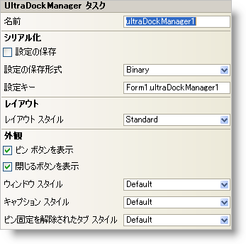

////

|metadata|
{
    "name": "windockmanager-smart-tag",
    "controlName": ["WinDockManager"],
    "tags": ["Editing"],
    "guid": "{6DB12FB4-C883-46EC-9CFB-F33860EBCA24}",  
    "buildFlags": [],
    "createdOn": "0001-01-01T00:00:00Z"
}
|metadata|
////

= WinDockManager スマート タグ

Visual Studio 2005（.NET Framework 2.0）では、{ProductName} コントロール/コンポーネントがそれぞれ固有のスマート タグを備えています。コントロールやコンポーネントを選択するだけで、スマート タグのアンカーが表示されます。このアンカーをクリックするとポップアップ パネルが表示され、そこからコントロール/コンポーネントの最もよく使用するプロパティや設定にすばやく簡単にアクセスできます。

WinDockManager スマート タグには、コンポーネントの名前と次のセクションがあります。

* 外観 -- WinDockManager コンポーネントの外観やルック アンド フィールに関連する一般的なタスクがあります。
* レイアウト -- ドッキング可能ペインのレイアウトを決定するプロパティがあります。
* シリアル化 -- Visual Studio 2005 で新しく追加された IPersistComponentSettings インタフェースで使用されるプロパティにすばやくアクセスできます。

各セクションの項目（たとえば、フィールド、ドロップダウン リスト、チェックボックス）およびプロパティ グリッドの項目の対応するプロパティの説明については以下を参照してください。

[options="header", cols="a,a,a"]
|====
|外観|説明|対応するプロパティ

|閉じるボタンを表示
|このチェックボックスを選択すると、ペインのキャプションに閉じるボタンが表示されます。
| link:{ApiPlatform}win.ultrawindock{ApiVersion}~infragistics.win.ultrawindock.ultradockmanager~showclosebutton.html[ShowCloseButton]

|ピン ボタンを表示
|このチェックボックスを選択すると、ペインのキャプションにピン ボタンが表示されます。
| link:{ApiPlatform}win.ultrawindock{ApiVersion}~infragistics.win.ultrawindock.ultradockmanager~showpinbutton.html[ShowPinButton]

|キャプション スタイル
|ペインのキャプションのスタイルを、Visual Studio .NET、Windows、Visual C++ 6、Office 2003、Visual Studio 2005、および Office 2007 の中から選択できます。
| link:{ApiPlatform}win.ultrawindock{ApiVersion}~infragistics.win.ultrawindock.ultradockmanager~captionstyle.html[CaptionStyle]

|ピン固定を解除されたタブ スタイル
|ピンが解除されているペインのスタイルをドロップ ダウンから選択します。
| link:{ApiPlatform}win.ultrawindock{ApiVersion}~infragistics.win.ultrawindock.ultradockmanager~unpinnedtabstyle.html[UnpinnedTabStyle]

|ウィンドウ スタイル
|ドッキング可能ペインに適用する全体的なウィンドウ スタイル（VSNET、Office2003、VisualStudio2005、Office 2007 など）をドロップダウン メニューから選択します。
| link:{ApiPlatform}win.ultrawindock{ApiVersion}~infragistics.win.ultrawindock.ultradockmanager~windowstyle.html[WindowStyle]

|====

[options="header", cols="a,a,a"]
|====
|レイアウト|説明|対応するプロパティ

|レイアウト スタイル
|ドッキング可能ペインの配置方法をドロップダウンから選択します。"Standard" または "FillContainer" のどちらかを選択できます。
| link:{ApiPlatform}win.ultrawindock{ApiVersion}~infragistics.win.ultrawindock.ultradockmanager~layoutstyle.html[LayoutStyle]

|====

[options="header", cols="a,a,a"]
|====
|シリアル化|説明|対応するプロパティ

|設定の保存
|このチェックボックスを選択すると、コンポーネントのプロパティ設定がアプリケーションの設定と共に自動的にロード/保存されます。
| link:{ApiPlatform}win.ultrawindock{ApiVersion}~infragistics.win.ultrawindock.ultradockmanager~savesettings.html[SaveSettings]

|設定の保存形式
|コンポーネントの設定をバイナリ形式と XML 形式のどちらで保存するかを選択します。
| link:{ApiPlatform}win.ultrawindock{ApiVersion}~infragistics.win.ultrawindock.ultradockmanager~savesettingsformat.html[SaveSettingsFormat]

|設定キー
|ロード/保存する設定値を一意に識別するための設定キーを指定できます。デフォルトで Visual Studio 2005 は、格納側のフォーム/コントロールの名前とコンポーネントの名前に基づいて設定キーの値が設定されます。
| link:{ApiPlatform}win.ultrawindock{ApiVersion}~infragistics.win.ultrawindock.ultradockmanager~settingskey.html[SettingsKey]

|====