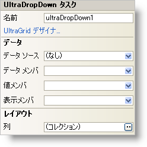

////

|metadata|
{
    "name": "windropdown-smart-tag",
    "controlName": ["WinDropDown"],
    "tags": ["Getting Started"],
    "guid": "{9711FBD9-9616-48A9-AD72-B8E47790752B}",  
    "buildFlags": [],
    "createdOn": "2005-11-11T00:00:00Z"
}
|metadata|
////

= WinDropDown スマート タグ

Visual Studio 2005（.NET Framework 2.0）では、それぞれの {ProductName} コントロール/コンポーネントが固有のスマート タグを備えています。 コントロール/コンポーネントを単に選択すると、Smart Tag のアンカーが表示されます。このアンカーをクリックするとポップアップ パネルが表示され、そこからコントロール/コンポーネントの最もよく使用するプロパティや設定にすばやく簡単にアクセスできます。

WinDropDown スマート タグには、以下のセクションと共にコントロールの名前が含まれます。

* データ -- コントロールが使用している基になるデータ（データ ソースやデータ メンバなど）を参照します。
* レイアウト -- コントロールをフォームのどこに、どのように配置するかを指定するプロパティがあります。

各セクションの項目（たとえば、フィールド、ドロップダウン リスト、チェックボックス）およびプロパティ グリッドの項目の対応するプロパティの説明については以下を参照してください。

[options="header", cols="a,a,a"]
|====
|データ|説明|対応するプロパティ

|データ メンバ
|有効なデータ ソースを選択した後、このドロップダウンから使用可能なすべてのデータ メンバを選択できます。
| link:{ApiPlatform}win.ultrawingrid{ApiVersion}~infragistics.win.ultrawingrid.ultragridbase~datamember.html[DataMember]

|データ ソース
|ドロップダウンをクリックすると、プロジェクトで使用可能なすべてのデータ ソースが表示されます。データ ソースがまだ設定されていない場合は、[プロジェクト データ ソースの追加...] を選択してデータ ソースを作成できます。
| link:{ApiPlatform}win.ultrawingrid{ApiVersion}~infragistics.win.ultrawingrid.ultragridbase~datasource.html[DataSource]

|表示メンバ
|表示メンバは、編集領域に表示するデータ ソースからのフィールドです。
| link:{ApiPlatform}win.ultrawingrid{ApiVersion}~infragistics.win.ultrawingrid.ultradropdownbase~displaymember.html[DisplayMember]

|値メンバ
|値メンバは、データに実際にバインドされるデータ ソースからのフィールドです。
| link:{ApiPlatform}win.ultrawingrid{ApiVersion}~infragistics.win.ultrawingrid.ultradropdownbase~valuemember.html[ValueMember]

|====

[options="header", cols="a,a,a"]
|====
|レイアウト|説明|対応するプロパティ

|列
|WinDropDown のドロップダウンには複数の列を表示できます。ここでは Columns コレクションを編集できます。Columns コレクションの編集はプロパティ グリッドでも可能です。 link:{ApiPlatform}win.ultrawingrid{ApiVersion}~infragistics.win.ultrawingrid.ultragriddisplaylayout.html[DisplayLayout] を展開し、 link:{ApiPlatform}win.ultrawingrid{ApiVersion}~infragistics.win.ultrawingrid.ultragridlayout~bands.html[Bands] を展開して、Band 0 を展開します（これは "0 - _tablename_ " としてグリッドに表示されます）。Band 0 の下で、Columns 列で省略記号（...）をクリックして、Columns コレクションを開きます。
|なし

|====