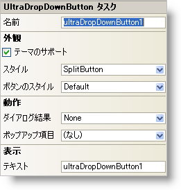

////

|metadata|
{
    "name": "windropdownbutton-smart-tag",
    "controlName": ["WinDropDownButton"],
    "tags": ["API","Design Environment"],
    "guid": "{EFA2CE01-17E9-4F1B-B85E-F65C757A824F}",  
    "buildFlags": [],
    "createdOn": "2005-07-11T00:00:00Z"
}
|metadata|
////

= WinDropDownButton スマート タグ

Visual Studio 2005（.NET Framework 2.0）では、それぞれの {ProductName} コントロール/コンポーネントが固有のスマート タグを備えています。 コントロール/コンポーネントを単に選択すると、Smart Tag のアンカーが表示されます。このアンカーをクリックするとポップアップ パネルが表示され、そこからコントロール/コンポーネントの最もよく使用するプロパティや設定にすばやく簡単にアクセスできます。

WinDropDownButton スマート タグには、以下のセクションと共にコントロールの名前が含まれます。

* 外観 -- コントロールの外観やルック アンド フィールに関連する一般的なタスクがあります。
* 動作 -- フォーム上でのコントロールの動作を制御するプロパティに簡単にアクセスできます。

各セクションの項目（たとえば、フィールド、ドロップダウン リスト、チェックボックス）およびプロパティ グリッドの項目の対応するプロパティの説明については以下を参照してください。

[options="header", cols="a,a,a"]
|====
|外観|説明|対応するプロパティ

|テーマのサポート
|このチェックボックスを選択すると、Microsoft の基本的な OS テーマ（Windows クラシック テーマまたは Windows XP テーマ）がサポートされます。
| link:{ApiPlatform}win{ApiVersion}~infragistics.win.ultracontrolbase~supportthemes.html[SupportThemes]

|ボタンのスタイル
|このドロップダウン リストには、WinButton の各種外観が含まれます。ただし、[SupportThemes] チェックボックスを選択した場合、WinButton は現在の Windows テーマを使用するので、変更は分かりません。
| link:{ApiPlatform}win.misc{ApiVersion}~infragistics.win.misc.ultrabuttonbase~buttonstyle.html[ButtonStyle]

|スタイル
|個別のドロップダウン ボタンの場合には SplitButton を、単一のドロップダウン ボタンの場合は DropDownButtonOnly を選択します。
| link:{ApiPlatform}win.misc{ApiVersion}~infragistics.win.misc.ultradropdownbutton~style.html[Style]

|テキスト
|ボタンに表示するテキストを入力します。
| link:{ApiPlatform}win.misc{ApiVersion}~infragistics.win.misc.controlbase~text.html[Text]

|====

[options="header", cols="a,a,a"]
|====
|動作|説明|対応するプロパティ

|ダイアログ結果
|ボタンがクリックされたときに親フォームの対応する DialogResult プロパティに返す値（OK、キャンセル、中止など）をドロップダウン リストから選択します。
| link:{ApiPlatform}win.misc{ApiVersion}~infragistics.win.misc.ultrabuttonbase~dialogresult.html[DialogResult]

|ポップアップ項目
|ドロップダウン リストから、エンド ユーザーがボタンをクリックしたときに表示されるドロップダウン リストを選択できます。これには、任意の PopupItem の実装（WinPopupControlContainer を含む）、および UltraToolbarsManager の PopupToolBase 派生ツール（PopupColorPickerTool、PopupMenuTool、PopupControlContainer を含む）を指定できます。
| link:{ApiPlatform}win.misc{ApiVersion}~infragistics.win.misc.ultradropdownbutton~popupitem.html[PopupItem]

|====