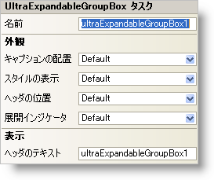

////

|metadata|
{
    "name": "winexpandablegroupbox-smart-tag",
    "controlName": [],
    "tags": ["Design Environment"],
    "guid": "{90FDC2F5-0104-40A1-95C1-EB36A084316E}",  
    "buildFlags": [],
    "createdOn": "2005-07-11T00:00:00Z"
}
|metadata|
////

= WinExpandableGroupBox スマート タグ

Visual Studio 2005（.NET Framework 2.0）では、それぞれの {ProductName} コントロール/コンポーネントが固有のスマート タグを備えています。 コントロール/コンポーネントを単に選択すると、Smart Tag のアンカーが表示されます。このアンカーをクリックするとポップアップ パネルが表示され、そこからコントロール/コンポーネントの最もよく使用するプロパティや設定にすばやく簡単にアクセスできます。

WinExpandableGroupBox スマート タグには、以下のセクションと共にコントロールの名前が含まれます。

* 外観 -- コントロールの外観やルック アンド フィールに関連する一般的なタスクがあります。

各セクションの項目（たとえば、フィールド、ドロップダウン リスト、チェックボックス）およびプロパティ グリッドの項目の対応するプロパティの説明については以下を参照してください。

[options="header", cols="a,a,a"]
|====
|外観|説明|対応するプロパティ

|キャプションの配置
|コントロールのキャプション ヘッダ内でテキストをどのように配置するのか（近い、中央、遠い）を選択できます。キャプション テキストの配置はキャプション ヘッダの配置（水平か垂直か）によって異なります。ドロップダウン リストから "近い" を選択すると、先頭の文字がキャプション ヘッダの端に近くなるようにテキストが配置されます。[中央] を選択すると、キャプション ヘッダ内で中央にテキストが配置されます。[遠い] を選択すると、最後の文字がキャプション ヘッダの端に近くなるようにテキストが配置されます。
| link:{ApiPlatform}win.misc{ApiVersion}~infragistics.win.misc.ultragroupbox~captionalignment.html[CaptionAlignment]

|展開インジケータ
|展開インジケータとは、ヘッダにあるプラス（+）またはマイナス（-）のボックスのことです。ドロップダウン リストを使用して、展開インジケータの位置（近いまたは遠い）を指定できます。この位置はヘッダが水平であるか垂直であるかによって異なります。たとえば、ヘッダが水平の場合に [遠い] を選択すると、コントロールの右側に展開インジケータが配置されます。ヘッダが垂直の場合に [遠い] を選択すると、コントロールの下部の近くに展開インジケータが配置されます。展開インジケータを非表示にする場合は [なし] を選択します。
| link:{ApiPlatform}win.misc{ApiVersion}~infragistics.win.misc.ultraexpandablegroupbox~expansionindicator.html[ExpansionIndicator]

|ヘッダの位置
|ヘッダの位置を WinExpandableGroupBox の上下左右いずれかの境界線上、境界線の内側、または境界線の外側から選択します。
| link:{ApiPlatform}win.misc{ApiVersion}~infragistics.win.misc.ultragroupbox~headerposition.html[HeaderPosition]

|スタイルの表示
|WinExpandableGroupBox のスタイルを、Windows XP、Office 2000、Office 2003、または Visual Studio 2005、Office 2007 に似たスタイルに変更します。
| link:{ApiPlatform}win.misc{ApiVersion}~infragistics.win.misc.ultraexpandablegroupbox~viewstyle.html[ViewStyle]

|ヘッダのテキスト
|これはヘッダに表示するテキストです。
| link:{ApiPlatform}win.misc{ApiVersion}~infragistics.win.misc.controlbase~text.html[Text]

|====