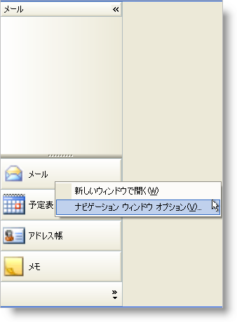

////

|metadata|
{
    "name": "winexplorerbar-hide-the-navigation-pane-context-menu-for-a-particular-group",
    "controlName": ["WinExplorerBar"],
    "tags": ["How Do I","Tips and Tricks"],
    "guid": "{1F0FD427-E81A-4D79-9870-C58BE81E61EE}",  
    "buildFlags": [],
    "createdOn": "0001-01-01T00:00:00Z"
}
|metadata|
////

= 特別なグループのナビゲーション ペイン コンテキスト メニューを非表示にする

各グループは、グループ ヘッダを右クリックすることで固有のコンテキスト メニューを表示できます。このコンテキスト メニューによって、エンド ユーザーは WinExplorerBar コントロールをカスタマイズすることができます。右クリックでグループのコンテキスト メニューを表示したくない場合、pick:[win-forms="link:{ApiPlatform}win.ultrawinexplorerbar{ApiVersion}~infragistics.win.ultrawinexplorerbar.ultraexplorerbar~navigationcontextmenuinitializing_ev.html[NavigationContextMenuInitializing]"]  イベントからコンテキスト メニューをキャンセルする必要があります。このイベントに渡される引数の 2 つは、Group と Cancel です。Group プロパティによって、エンド ユーザーが右クリックしたグループを判断でき、Cancel プロパティによって、コンテキスト メニューが表示されるのを停止することができます。

以下のコードは、エンド ユーザーが 4 番目のグループを右クリックした場合に限ってコンテキスト メニューが表示されるのを停止します。

*Visual Basic の場合：*

----
Private Sub ultraExplorerBar1_NavigationContextMenuInitializing(sender As Object,_
  e As Infragistics.Win.UltraWinExplorerBar.CancelableNavigationContextMenuInitializingEventArgs)
   If e.Group = Me.ultraExplorerBar1.Groups(3) Then
      e.Cancel = True
   End If
End Sub 'ultraExplorerBar1_NavigationContextMenuInitializing
----

*C# の場合：*

----
private void ultraExplorerBar1_NavigationContextMenuInitializing(object sender,
  Infragistics.Win.UltraWinExplorerBar.CancelableNavigationContextMenuInitializingEventArgs e)
{
	if(e.Group == this.ultraExplorerBar1.Groups[3]) e.Cancel = true;
}
----