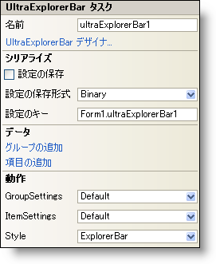

////

|metadata|
{
    "name": "winexplorerbar-smart-tag",
    "controlName": ["WinExplorerBar"],
    "tags": ["Getting Started"],
    "guid": "{40778E2B-2B25-4A1D-8C2E-0358D8007258}",  
    "buildFlags": [],
    "createdOn": "2005-11-11T00:00:00Z"
}
|metadata|
////

= WinExplorerBar スマート タグ

Visual Studio 2005（.NET Framework 2.0）では、それぞれの {ProductName} コントロール/コンポーネントが固有のスマート タグを備えています。 コントロール/コンポーネントを単に選択すると、Smart Tag のアンカーが表示されます。このアンカーをクリックするとポップアップ パネルが表示され、そこからコントロール/コンポーネントの最もよく使用するプロパティや設定にすばやく簡単にアクセスできます。

WinExplorerBar スマート タグには、以下のセクションと共にコントロールの名前が含まれます。

* 動作 -- フォーム上でのコントロールの動作を制御するプロパティに簡単にアクセスできます。
* データ -- コントロールが使用している基になるデータ（データ ソースやデータ メンバなど）を参照します。
* シリアル化 -- IPersistComponentSettings インタフェースで使用されるプロパティにすばやくアクセスできます。

各セクションの項目（たとえば、フィールド、ドロップダウン リスト、チェックボックス）およびプロパティ グリッドの項目の対応するプロパティの説明については以下を参照してください。

[options="header", cols="a,a,a"]
|====
|動作|説明|対応するプロパティ

|コントロールのスタイル
|WinExplorerBar のスタイルを、OutlookNavigationPane や VisualStudio2005Toolbox などのなじみのあるスタイルの中から選択します。プロパティ グリッドで Style プロパティを設定してコントロールのスタイルを変更することもできます。
| link:{ApiPlatform}win.ultrawinexplorerbar{ApiVersion}~infragistics.win.ultrawinexplorerbar.ultraexplorerbar~style.html[Style]

|グループのスタイル
|グループ項目はテキスト付きまたはテキストなしの小さい画像または大きい画像にすることができます。グループはコントロールのコンテナでもあります。WinExplorerBar を右クリックし、[UltraExplorerBar デザイナ] を選択して、この作業を実行することも可能です。グループをクリックして link:{ApiPlatform}win.ultrawinexplorerbar{ApiVersion}~infragistics.win.ultrawinexplorerbar.ultraexplorerbargroupsettings.html[Settings] オブジェクトを展開し、Style プロパティを設定します。
| link:{ApiPlatform}win.ultrawinexplorerbar{ApiVersion}~infragistics.win.ultrawinexplorerbar.ultraexplorerbargroupsettings~style.html[Style]

|項目のスタイル
|項目は、ボタン、状態ボタン、ラベル、セパレータのいずれかにすることができます。WinExplorerBar を右クリックして [UltraExplorerBar デザイナ] を選択して、項目のスタイルを変更することもできます。グループを展開して項目をクリックします。 link:{ApiPlatform}win.ultrawinexplorerbar{ApiVersion}~infragistics.win.ultrawinexplorerbar.ultraexplorerbaritemsettings.html[Settings] オブジェクトを展開して Style プロパティを設定します。
| link:{ApiPlatform}win.ultrawinexplorerbar{ApiVersion}~infragistics.win.ultrawinexplorerbar.ultraexplorerbaritemsettings~style.html[Style]

|====

[options="header", cols="a,a,a"]
|====
|データ|説明|対応するプロパティ

|グループの追加
|WinExplorerBar にグループを追加します。WinExplorerBar を右クリックして [グループの追加] を選択することでグループを追加することもできます。さらに、WinExplorerBar を右クリックして UltraExplorerBar デザイナを選択するという方法もあります。Groups と Items タブの下にある [グループの追加] をクリックします。
|なし

|項目の追加
|WinExplorerBar のグループに項目を追加します。WinExplorerBar を右クリックして [項目の追加] を選択することによって項目を追加することもできます。さらに、WinExplorerBar を右クリックして UltraExplorerBar デザイナを選択するという方法もあります。Groups と Items タブの下にある [グループ] を選択し、[グループの追加] をクリックします。
|n/a

|====

[options="header", cols="a,a,a"]
|====
|シリアル化|説明|対応するプロパティ

|設定の保存
|このチェックボックスを選択すると、コンポーネントのプロパティ設定がアプリケーションの設定と共に自動的にロード/保存されます。
| link:{ApiPlatform}win.ultrawinexplorerbar{ApiVersion}~infragistics.win.ultrawinexplorerbar.ultraexplorerbar~savesettings.html[SaveSettings]

|設定の保存形式
|コンポーネントの設定をバイナリ形式と XML 形式のどちらで保存するかを選択します。
| link:{ApiPlatform}win.ultrawinexplorerbar{ApiVersion}~infragistics.win.ultrawinexplorerbar.ultraexplorerbar~savesettingsformat.html[SaveSettingsFormat]

|設定キー
|ロード/保存する設定値を一意に識別するための設定キーを指定できます。デフォルトで Visual Studio 2005 は、格納側のフォーム/コントロールの名前とコンポーネントの名前に基づいて設定キーの値が設定されます。
| link:{ApiPlatform}win.ultrawinexplorerbar{ApiVersion}~infragistics.win.ultrawinexplorerbar.ultraexplorerbar~settingskey.html[SettingsKey]

|====