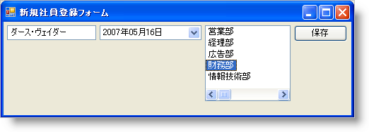
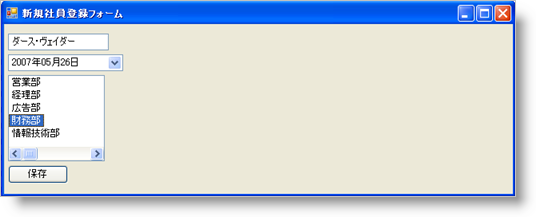

////

|metadata|
{
    "name": "winflowlayoutmanager-aligning-controls-with-winflowlayoutmanager",
    "controlName": [],
    "tags": ["Layouts","Styling"],
    "guid": "{1EB715DE-CEE6-449A-8716-561C0AB3C456}",  
    "buildFlags": [],
    "createdOn": "0001-01-01T00:00:00Z"
}
|metadata|
////

= WinFlowLayoutManager でコントロールを配置

使用可能なパターンで異なるコントロールを表示することは、困難な作業である場合があります。ほとんどの場合、コントロールは左から右、または上から下のパターンで表示されます。これらのコントロールに位置を設定することは良いことですが、ユーザーがフォームのサイズを変更する場合、コントロールは希望の場所に収まらない場合があります。この場合、WinFlowLayoutManager が役に立ちます。WinFlowLayoutManager がフォーム上でコントロールのレイアウトを管理できるようにすることによって、複雑なサイズ変更計算が不要になります。

WinFlowLayoutManager は、pick:[win-forms="link:{ApiPlatform}win.misc{ApiVersion}~infragistics.win.misc.controllayoutmanagerbase~containercontrol.html[ControlContainer]"]  でコントロールが水平または垂直にフローを管理するかどうかを決定する pick:[win-forms="link:{ApiPlatform}win.misc{ApiVersion}~infragistics.win.misc.ultraflowlayoutmanager~orientation.html[Orientation]"]  プロパティを公開します。ControlContainer およびコントロール自体に関してコントロールをどのように配置するのかをさらに制御することができる pick:[win-forms="link:{ApiPlatform}win.misc{ApiVersion}~infragistics.win.misc.ultraflowlayoutmanager~horizontalalignment.html[HorizontalAlignment]"]  および pick:[win-forms="link:{ApiPlatform}win.misc{ApiVersion}~infragistics.win.misc.ultraflowlayoutmanager~verticalalignment.html[VerticalAlignment]"]  プロパティもあります。たとえば、Orientation プロパティを Horizontal（デフォルト設定）に設定すると、コントロールは ControlContainer を左から右にフローし、必要に応じて以下のように行に折り返します（pick:[win-forms="link:{ApiPlatform}win.misc{ApiVersion}~infragistics.win.misc.ultraflowlayoutmanager~wrapitems.html[WrapItems]"]  プロパティが True に設定されている場合に限って）。HorizontalAlignment プロパティの設定は、ControlContainer に関するコントロールの配置を判断します。Near 値はコントロールを左揃えにし、Far 値はコントロールを右揃えにします。VerticalAlignment プロパティは、それぞれに関するコントロールを配置します。Near 値は互いにコントロールの上を揃え、Far 値はコントロールの下を揃えます。

Orientation プロパティによって、HorizontalAlignment および VerticalAlignment プロパティは若干異なって機能します。Orientation プロパティが Horizontal に設定されている場合、HorizontalAlignment は ControlContainer に関するコントロールを揃えます。Orientation プロパティが Vertical に設定されている場合、VerticalAlignment は ControlContainer に関するコントロールを揃えます。

これらの配置プロパティをさらに理解するには、実際の動作を確認するのが最適です。以下のコードは上記のプロパティの 3 つすべてを設定しています。このコードは、フォームに WinTextEditor、WinDateTimeEditor、WinListView、および WinButton があることを前提としています。WinFlowLayoutManager は、メインのフォームですべてのコントロールを管理します。Orientation プロパティを Horizontal、HorizontalAlignment を Near、VerticalAlignment プロパティを Near に設定すると同様に表示されます。

*Visual Basic の場合：*

----
Imports Infragistics.Win
Imports Infragistics.Win.Layout
...
Me.UltraFlowLayoutManager1.Orientation = Orientation.Horizontal
Me.UltraFlowLayoutManager1.HorizontalAlignment = DefaultableFlowLayoutAlignment.Near
Me.UltraFlowLayoutManager1.VerticalAlignment = DefaultableFlowLayoutAlignment.Near
----

*C# の場合：*

----
using Infragistics.Win;
using Infragistics.Win.Layout;
...
this.ultraFlowLayoutManager1.Orientation = Orientation.Horizontal;
this.ultraFlowLayoutManager1.HorizontalAlignment = DefaultableFlowLayoutAlignment.Near;
this.ultraFlowLayoutManager1.VerticalAlignment = DefaultableFlowLayoutAlignment.Near;
----

 

2 つの配置プロパティを反対に変更する場合、両方を Far に設定すると、Form は次のようになります。

image::images/WinFlowLayoutManager_Aligning_Controls_with_WinFlowLayoutManager_02.png[]

Orientation プロパティを Vertical に変更するとレイアウトに大きな変化が生じます。コントロールはフォームを垂直方向にフローダウンします。HorizontalAlignment の設定は、互いにコントロールの配置を維持し、VerticalAlignment はフォーム全体に関してコントロールの配置を維持します。Orientation を Vertical、HorizontalAlignment を Near、そして VerticalAlignment を Near に設定するとレイアウトが同様に表示されます。

HorizontalAlignment および VerticalAlignment プロパティの両方を Far に変更すると、同じようなレイアウトになります。

image::images/WinFlowLayoutManager_Aligning_Controls_with_WinFlowLayoutManager_04.png[]