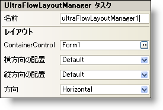

////

|metadata|
{
    "name": "winflowlayoutmanager-smart-tag",
    "controlName": [],
    "tags": ["Getting Started","Layouts"],
    "guid": "{7DA287E3-3047-4A34-A668-FC8B517B4B61}",  
    "buildFlags": [],
    "createdOn": "2005-07-11T00:00:00Z"
}
|metadata|
////

= WinFlowLayoutManager スマート タグ

Visual Studio 2005（.NET Framework 2.0）では、それぞれの {ProductName} コントロール/コンポーネントが固有のスマート タグを備えています。 コントロール/コンポーネントを単に選択すると、Smart Tag のアンカーが表示されます。このアンカーをクリックするとポップアップ パネルが表示され、そこからコントロール/コンポーネントの最もよく使用するプロパティや設定にすばやく簡単にアクセスできます。

WinFlowLayoutManager スマート タグには、コンポーネントの名前と次のセクションがあります。

* レイアウト -- WinFlowLayoutManager コンポーネントによって管理されるフォーム上のコントロールをどのように配置および整列するかを指定するプロパティがあります。

各セクションの項目（たとえば、フィールド、ドロップダウン リスト、チェックボックス）およびプロパティ グリッドの項目の対応するプロパティの説明については以下を参照してください。

[options="header", cols="a,a,a"]
|====
|レイアウト|説明|対応するプロパティ

|コンテナ コントロール
|たとえば WinGroupBox または WinExpandableGroupBox を使用している場合、WinFlowLayoutManager はコンテナ コントロールの内部にあるすべての子コントロールのレイアウトを制御します。たとえば、コンテナ コントロールを "ultraGroupBox1" に設定すると（これはプロパティ グリッドの ContainerControl プロパティでも設定できます）、"ultraGroupBox1" の内部にあるコントロールのレイアウトが WinFlowLayoutManager によって制御されます。
| link:{ApiPlatform}win.misc{ApiVersion}~infragistics.win.misc.controllayoutmanagerbase~containercontrol.html[ContainerControl]

|横方向の配置
|Orientation プロパティが Horizontal に設定されている場合、このプロパティは ControlContainer に基づいてマネージド コントロールを配置します。Orientation プロパティが Vertical に設定されている場合、このプロパティは相互に基づいてマネージド コントロールを配置します。
| link:{ApiPlatform}win.misc{ApiVersion}~infragistics.win.misc.ultraflowlayoutmanager~horizontalalignment.html[HorizontalAlignment]

|方向
|コンテナ内部のコントロールの方向を水平または垂直のどちらかに設定します。
| link:{ApiPlatform}win.misc{ApiVersion}~infragistics.win.misc.ultraflowlayoutmanager~orientation.html[Orientation]

|縦方向の配置
|Orientation プロパティが Horizontal に設定されている場合、このプロパティは相互に基づいてマネージド コントロールを配置します。Orientation プロパティが Vertical に設定されている場合、このプロパティは ControlContainer に基づいてマネージド コントロールを配置します。
| link:{ApiPlatform}win.misc{ApiVersion}~infragistics.win.misc.ultraflowlayoutmanager~verticalalignment.html[VerticalAlignment]

|====