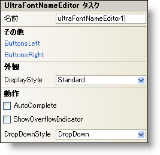

////

|metadata|
{
    "name": "winfontnameeditor-smart-tag",
    "controlName": ["WinFontNameEditor"],
    "tags": ["API","Design Environment"],
    "guid": "{69D3ED59-C115-46D5-8EE6-A56A7F3E4CC9}",  
    "buildFlags": [],
    "createdOn": "2005-09-11T00:00:00Z"
}
|metadata|
////

= WinFontNameEditor スマート タグ

Visual Studio 2005（.NET Framework 2.0）では、それぞれの {ProductName} コントロール/コンポーネントが固有のスマート タグを備えています。 コントロール/コンポーネントを単に選択すると、Smart Tag のアンカーが表示されます。このアンカーをクリックするとポップアップ パネルが表示され、そこからコントロール/コンポーネントの最もよく使用するプロパティや設定にすばやく簡単にアクセスできます。

WinFontNameEditor スマート タグには、以下のセクションと共にコントロールの名前が含まれます。

* 外観 -- コントロールの外観やルック アンド フィールに関連する一般的なタスクがあります。
* 動作 -- フォーム上でのコントロールの動作を制御するプロパティに簡単にアクセスできます。
* その他 -- コントロールの全体的な外観やパフォーマンスを拡張する各種オプションがあります。

各セクションの項目（たとえば、フィールド、ドロップダウン リスト、チェックボックス）およびプロパティ グリッドの項目の対応するプロパティの説明については以下を参照してください。

[options="header", cols="a,a,a"]
|====
|外観|説明|対応するプロパティ

|表示スタイル
|WinFontNameEditor のスタイルを、Office 2000、Office XP、Office 2003、Visual Studio 2005、Office 2007 に似たスタイルに変更します。
| link:{ApiPlatform}win.ultrawineditors{ApiVersion}~infragistics.win.ultrawineditors.texteditorcontrolbase~displaystyle.html[DisplayStyle]

|====

[options="header", cols="a,a,a"]
|====
|動作|説明|対応するプロパティ

|AutoComplete
|このチェックボックスを選択すると、入力した文字がリストの項目と一致したときにエディタが自動的に更新されます。
| link:{ApiPlatform}win.ultrawineditors{ApiVersion}~infragistics.win.ultrawineditors.ultracomboeditor~autocompletemode.html[AutoCompleteMode]

|オーバーフロー インジケータの表示
|Text プロパティが長すぎてエディタに収まらないときに、テキストの続きがあることを示す 2 つの右矢印の付いた小さなボックスが表示されます。
| link:{ApiPlatform}win.ultrawineditors{ApiVersion}~infragistics.win.ultrawineditors.texteditorcontrolbase~showoverflowindicator.html[ShowOverflowIndicator]

|ドロップダウン スタイル
|WinFontNameEditor を編集できないようにする場合はドロップダウンから DropDownList を選択します。
| link:{ApiPlatform}win.ultrawineditors{ApiVersion}~infragistics.win.ultrawineditors.ultracomboeditor~dropdownstyle.html[DropDownStyle]

|====

[options="header", cols="a,a,a"]
|====
|その他|説明|対応するプロパティ

|左ボタン
|省略（...）ボタンをクリックすると、ButtonsLeft コレクションが開きます。これはエディタの左側に配置できるカスタム ボタンのコレクションです。
| link:{ApiPlatform}win{ApiVersion}~infragistics.win.ultrawineditors.editorbuttoncontrolbase~buttonsleft.html[ButtonsLeft]

|右ボタン
|省略（...）ボタンをクリックすると、ButtonsRight コレクションが開きます。これはエディタの右側に配置できるカスタム ボタンのコレクションです。
| link:{ApiPlatform}win{ApiVersion}~infragistics.win.ultrawineditors.editorbuttoncontrolbase~buttonsright.html[ButtonsRight]

|====