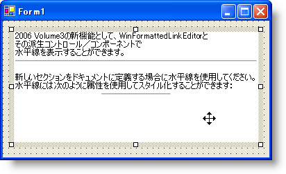

////

|metadata|
{
    "name": "winformattedlinklabel-new-horizontal-rule-tag-whats-new-20063",
    "controlName": [],
    "tags": [],
    "guid": "{1C735E8E-B107-4657-BE6C-92CDA577F118}",  
    "buildFlags": [],
    "createdOn": "0001-01-01T00:00:00Z"
}
|metadata|
////

= 新しい水平線タグ

WinFormattedLinkLabel コントロールは、本リリースで新しいグラフィカル エレメントに適合しました。このエレメントの HR タグは、テキストと画像のセクションを分離するために使用できます。HR タグの使用は簡単です。デフォルト機能のために実行すべきことは、水平線が欲しい場所に 
 を追加するだけです。幅、色、3D の外観、および多くの他のオプションを設定することで、水平線をカスタマイズするためのオプションがあります。

== 関連トピック

link:winformattedlinklabel-formatting-text-and-hyperlinks.html[テキストとハイパーリンクのフォーマッティング]