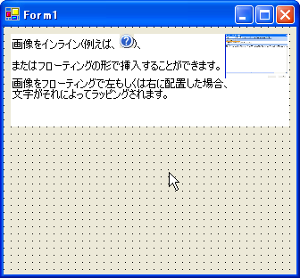

////

|metadata|
{
    "name": "winformattedlinklabel-new-image-tag-whats-new-20063",
    "controlName": [],
    "tags": [],
    "guid": "{065CFDBF-388A-4592-B1D7-CCFABC27E28F}",  
    "buildFlags": [],
    "createdOn": "0001-01-01T00:00:00Z"
}
|metadata|
////

= 新しい画像タグ

新しい画像タグで、WinFormattedLinkLabel に画像を挿入できます。HTML に似ている SRC 属性で画像を挿入するか、DATA 属性で XML 値に画像を埋め込みます。すべての画像はデフォルトでテキスト付きインラインでレンダリングされます。ただし、画像の周囲にテキストを折り返す必要がある場合、ALIGN 属性を使用して画像をフロートします。

画像タグは、WinFormattedLinkEditor、WinFormattedLinkLabel、WinFormattedTextEditor 、および ToolTipTextFormatted プロパティが使用される ToolTip で使用できます。

== 関連トピック

link:winformattedlinklabel-formatting-text-and-hyperlinks.html[テキストとハイパーリンクのフォーマッティング]

link:winformattedtexteditor-style-attribute.html[Style 属性]