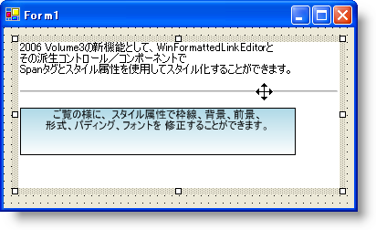

////

|metadata|
{
    "name": "winformattedlinklabel-new-span-tag-and-style-attribute-whats-new-20063",
    "controlName": [],
    "tags": [],
    "guid": "{C9D4B11A-01BA-4DE9-B99D-EB9728088B00}",  
    "buildFlags": [],
    "createdOn": "0001-01-01T00:00:00Z"
}
|metadata|
////

= 新しいスパン タグと Style 属性

WinFormattedLinkLabel に追加された優れた機能のひとつが STYLE 属性です。この属性を使用すれば、前景色へのパディングから境界線スタイルまでスタイルを設定できます。STYLE 属性は、既存の 
 タグ、そして新しい 、
、および  タグで使用できます。

 タグはインライン スタイルを表示するために特に作成されました。 タグはそれ自体では何も行いません。ただし、 タグにスタイル属性を追加し、多くのことを実行できます。背景色を変更、背景グラデーションを使用、境界線の色やスタイルを変更、 タグのようにフォント スタイルを編集、セクションの高さと幅を変更、余分なパディングとマージンを適用などを行うことができます。 タグで使用できるスタイルの完全なリストは、「Style 属性の使用」を参照してください。

== 関連トピック

link:winformattedlinklabel-formatting-text-and-hyperlinks.html[テキストとハイパーリンクのフォーマッティング]

link:winformattedtexteditor-style-attribute.html[Style 属性]