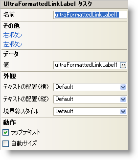

////

|metadata|
{
    "name": "winformattedlinklabel-smart-tag",
    "controlName": ["WinFormattedLinkLabel"],
    "tags": ["Extending"],
    "guid": "{7C47A751-10FB-4BD9-A9F0-7DC55565A6DC}",  
    "buildFlags": [],
    "createdOn": "0001-01-01T00:00:00Z"
}
|metadata|
////

= WinFormattedLinkLabel スマート タグ

Visual Studio® 2005（.NET Framework 2.0）では、それぞれの {ProductName} コントロール/コンポーネントがスマート タグを備えています。コントロール/コンポーネントを選択するだけで、スマート タグのアンカーが表示されます。このアンカーをクリックするとポップアップ パネルが表示され、そこからコントロール/コンポーネントの最もよく使用するプロパティや設定にすばやく簡単にアクセスできます。

WinFormattedLinkLabel スマート タグには、以下のセクションと共にコントロールの名前が含まれます。

* 外観 -- コントロールの外観やルック アンド フィールに関連する一般的なタスクがあります。
* 動作 -- フォーム上でのコントロールの動作を制御するプロパティに簡単にアクセスできます。
* Data -- FormattedLinkEditor クラスがフォーマットされたテキストのレンダリングに使用する XML ドキュメントを参照します。
* その他 -- コントロールの全体的な外観やパフォーマンスを拡張する各種オプションがあります。

各セクションの項目（たとえば、フィールド、ドロップダウン リスト、チェックボックス）およびプロパティ グリッドの項目の対応するプロパティの説明については以下を参照してください。

[options="header", cols="a,a,a"]
|====
|外観|説明|対応するプロパティ

|境界線スタイル
|このプロパティは、ひとつのリンクやテキストの 1 行だけではなく、コントロール全体の周囲に境界線を引きます。実線、点線、浮き出しなどいくつかのスタイルを選択できます。また、境界線なしを選択すると、デフォルトの設定と同じになります。
| link:{ApiPlatform}win.misc{ApiVersion}~infragistics.win.formattedlinklabel.ultraformattedtexteditorbase~borderstyle.html[BorderStyle]

|テキストの配置（横）
|コントロール内のテキストを "Left"、"Center"、"Right" のいずれかに揃えます。デフォルトの設定は、Left と同じです。
| link:{ApiPlatform}win{ApiVersion}~infragistics.win.appearance~texthalign.html[TextHAlign]

|テキストの配置（縦）
|コントロール内のテキストを "Top"、"Middle"、"Bottom" のいずれかに揃えます。デフォルトの設定は、Top と同じです。
| link:{ApiPlatform}win{ApiVersion}~infragistics.win.appearance~textvalign.html[TextVAlign]

|====

[options="header", cols="a,a,a"]
|====
|動作|説明|対応するプロパティ

|AutoSize
|このチェックボックスを選択すると、コントロールのサイズが自動的に内容に合わせて変更されます。デフォルトで AutoSize は False に設定されます。
| link:{ApiPlatform}win.misc{ApiVersion}~infragistics.win.formattedlinklabel.ultraformattedtexteditorbase~autosize.html[AutoSize]

|WrapText
|このチェックボックスを選択すると、コントロールで 1 行に収まらないテキストが折り返されます。デフォルトで WrapText は False に設定されます。
| link:{ApiPlatform}win.misc{ApiVersion}~infragistics.win.formattedlinklabel.ultraformattedtexteditorbase~wraptext.html[WrapText]

|====

[options="header", cols="a,a,a"]
|====
|データ|説明|対応するプロパティ

|値
|右エディタボタンをクリックすると、WinFormattedLinkLabel 値エディタで Value を編集できます。値エディタでは、実際に値を設定する前に、フォーマットされたテキストがどのように表示されるかを確認することができます。または、基本的な HTML タグの取り扱いに慣れているのであれば、スマート タグのテキスト ボックスに値を入力することもできます。WinFormattedLinkLabel コントロールでサポートされている個々のタグについての詳細は、 link:winformattedlinklabel-formatting-text-and-hyperlinks.html[「テキストとハイパーリンクのフォーマット」]を参照してください。
| link:{ApiPlatform}win.misc{ApiVersion}~infragistics.win.formattedlinklabel.ultraformattedtexteditorbase~value.html[Value]

|====

[options="header", cols="a,a,a"]
|====
|その他|説明|対応するプロパティ

|左ボタン
|省略（...）ボタンをクリックすると、ButtonsLeft コレクションが開きます。これはエディタの左側に配置できるカスタム ボタンのコレクションです。
|ButtonsLeft

|右ボタン
|省略（...）ボタンをクリックすると、ButtonsRight コレクションが開きます。これはエディタの右側に配置できるカスタム ボタンのコレクションです。
|ButtonsRight

|====