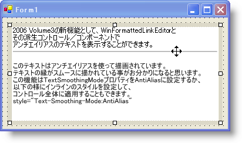

////

|metadata|
{
    "name": "winformattedlinklabel-you-can-now-smooth-text-with-anti-aliasing-whats-new-20063",
    "controlName": [],
    "tags": [],
    "guid": "{8D964A01-50CF-45E3-B83B-03A08D5035F6}",  
    "buildFlags": [],
    "createdOn": "0001-01-01T00:00:00Z"
}
|metadata|
////

= アンチエイリアスでテキストを滑らかにする

場合によっては、単純なプロパティを True に設定すると大きな差が生じます。これは pick:[win-forms="link:{ApiPlatform}win.misc{ApiVersion}~infragistics.win.formattedlinklabel.ultraformattedtexteditorbase~textsmoothingmode.html[TextSmoothingMode]"]  プロパティの背後にある理論です。True に設定すると、WinFormattedLinkLabel がアンチエイリアスでテキストすべてをレンダリングします。アンチエイリアスは滑らかにする特殊技術で、3D コンピュータ グラフィックスやゲーム業界で多用されています。低解像度では、3 次元オブジェクトのエッジがぎざぎざになる場合があります。この技術はぎざぎざのエッジを滑らかにして、視覚的に優れ、よりリアルな表現にします。同じ概念が WinFormattedLinkLabel のテキストにも適用されます。ClearType とはまったく同じではありませんが、視覚的な拡張によって読み取る時に目に優しくなります。

== 関連トピック

link:winformattedtexteditor-smooth-formatted-text.html[テキストを滑らかにフォーマットする方法]