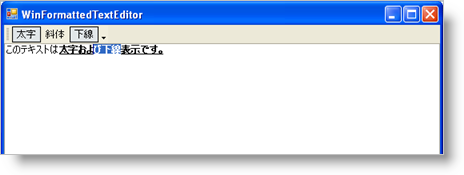

////

|metadata|
{
    "name": "winformattedtexteditor-determining-if-text-is-in-a-specific-format",
    "controlName": [],
    "tags": ["How Do I"],
    "guid": "{B31E95E9-2B58-4528-8472-4C3FBE4AF787}",  
    "buildFlags": [],
    "createdOn": "2006-12-09T13:41:05Z"
}
|metadata|
////

= テキストが特定のフォーマットであるかどうかを判断

== 始める前に

フル機能のワープロはエンド ユーザーにカーソルが置かれているテキストがどのようなフォーマッティングを使用しているのかを示します。テキストは太字や左揃えが可能で、指定の色で表示できます。ツールバーの状態ボタンを使用して、テキストが特定の状態であることを示すことができます。カーソルが位置を変更した時を認識するための方法をアプリケーションは必要とするので、現在のテキストをテストして、どのフォーマッティングが適用されているかを確認してください。WinFormattedTextEditor には、これを行うイベントがあります。pick:[win-forms="link:{ApiPlatform}win.misc{ApiVersion}~infragistics.win.formattedlinklabel.ultraformattedtexteditor~editstatechanged_ev.html[EditStateChanged]"]  イベントは、エディタの状態が変更されると必ず発生します。つまり、カーソルが移動したり、テキストが編集されたり、スタイルが適用または削除されると、イベントが発生します。

EditStateChanged イベントの内部で、カーソルのテキストが一定の状態にあるかどうかを確認するためにテストを実行できます。テキストが特定のフォーマットであることを判断するには、pick:[win-forms="link:{ApiPlatform}win{ApiVersion}~infragistics.win.formattedlinklabel.formattedtexteditinfo.html[EditInfo]"]  オブジェクトの pick:[win-forms="link:{ApiPlatform}win{ApiVersion}~infragistics.win.formattedlinklabel.formattedtexteditinfo~getcurrentstyle.html[GetCurrentStyle]"]  メソッドを使用できます。このメソッドは、カーソルの位置のテキストに現在適用されているすべてのスタイルの文字列を返します。EditStateChanged イベントに関連して使用すると、カーソル位置を変更するたびに、GetCurrentStyle メソッドを起動して、その場所のテキストのフォーマットを判断できます。スタイルの文字列を取得すれば、特定のサブ文字列を検索する必要があります。

[NOTE]
====
*注：* WinFormattedTextEditor の Style 属性に不慣れな場合は、サポートされているスタイルの包括的なリストの link:winformattedtexteditor-style-attribute.html[Style 属性]を参照してください。この詳細なガイドを理解するには、WinFormattedTextEditor がサポートするスタイルを良く理解する必要があります。
====

ボタンの Click イベントを設定せずに StateButton の状態を変更するには、WinToolbarsManager の pick:[win-forms="link:{ApiPlatform}win.ultrawintoolbars{ApiVersion}~infragistics.win.ultrawintoolbars.ultratoolbarsmanager~eventmanager.html[EventManager]"]  で ToolClick イベントをオフにする必要があります。イベントのオン/オフは非常にシンプルですが、非常に重要です。状態を設定中に ToolClick イベントをオフにしなければ、ツールはクリックされ、EditStateChanged イベントがオフに設定され、ボタンの状態が再び変更され、EditStateChanged イベントが発生し、無限ループとなってしまいます。

== 達成すること

* EditStateChanged イベントを作成します。これは、GetCurrentStyle メソッドを使用してカーソルのテキストが太字、斜体、または下線であるかどうかを判断します。
* WinToolbarsManager の EventManager を使用してボタンの状態を変更する前に ToolClick イベントをオフにし、ボタンの状態を変更後に再びオンに戻します。
* System.String オブジェクトの IndexOf メソッドを使用して、特定のサブ文字列のスタイルの文字列を検索することもできます。

== 次の手順を実行します

[start=1]
. *ツールバー、3 つの状態ボタン、そして WinFormattedTextEditor コントロールをフォームに追加します。*

.. ツールボックスで UltraToolbarsManager をダブルクリックし、ダイアログ ボックスで [はい] をクリックします。
.. フォームの上で [新しいツールバー] をクリックし、ダイアログ ボックスで [OK] をクリックしてフォームにツールバーを追加します。
.. 新しいツールバーで [新しいツールを挿入] をクリックします。[新しいツール] ダイアログ ボックスで、[ツール タイプ] を [状態ボタン] に変更します。[追加] を 3 度クリックし、3 つの状態ボタンを追加します。[閉じる] をクリックして [新しいツール] ダイアログ ボックスを閉じます。
.. ツールボックスで UltraFormattedTextEditor コントロールをダブルクリックし、フォームに追加します。プロパティ ウィンドウで Dock プロパティを検索し、Fill に設定します。

フォームは次のようになります。

image::images/WinFormattedTextEditor_Determining_if_Text_is_in_a_Specific_Format_01.png[]

[start=2]
. コードの記述を開始する前にコードビハインドにいくつかの使用/インポート ディレクティブを配置します。そうすれば、メンバーの完全に記述した名前を常にタイプする必要がなくなります。

*Visual Basic の場合：*

----
Imports Infragistics.Win
Imports Infragistics.Win.UltraWinToolbars
Imports Infragistics.Win.FormattedLinkLabel
----

*C# の場合：*

----
using Infragistics.Win;
using Infragistics.Win.UltraWinToolbars;
using Infragistics.Win.FormattedLinkLabel;
----

[start=3]
. *FormLoad イベントを追加します。*

デザイン ビューのフォームのタイトル バーでダブルクリックして FormLoad イベントを追加します。状態ボタンに複数のプロパティを設定したり、ツールバーの ToolClick イベントのイベント ハンドラや WinFormattedTextEditor の EditStateChanged イベントを作成します。ツールから画像を削除したり一部の説明テキストを削除する必要があります。

*Visual Basic の場合：*

----
Private Sub Form1_Load(ByVal sender As System.Object, ByVal e As System.EventArgs)_
  Handles MyBase.Load
' StateButtons が常にテキストを表示するようにします。
        Me.UltraToolbarsManager1.Toolbars(0).Tools(0).InstanceProps.DisplayStyle =_
          ToolDisplayStyle.TextOnlyAlways
        Me.UltraToolbarsManager1.Toolbars(0).Tools(1).InstanceProps.DisplayStyle =_
          ToolDisplayStyle.TextOnlyAlways
        Me.UltraToolbarsManager1.Toolbars(0).Tools(2).InstanceProps.DisplayStyle =_
          ToolDisplayStyle.TextOnlyAlways
' StateButtons のキャプションを 'Bold'、
' 'Italic'、および 'Underline' にそれぞれ変更します。
        Me.UltraToolbarsManager1.Toolbars(0).Tools(0).SharedProps.Caption = "Bold"
        Me.UltraToolbarsManager1.Toolbars(0).Tools(1).SharedProps.Caption = "Italics"
        Me.UltraToolbarsManager1.Toolbars(0).Tools(2).SharedProps.Caption = "Underline"
    End Sub
----

*C# の場合：*

----
private void Form1_Load(object sender, System.EventArgs e)
{
	// StateButtons が常にテキストを表示するようにします。
	this.ultraToolbarsManager1.Toolbars[0].Tools[0].InstanceProps.DisplayStyle =
	  ToolDisplayStyle.TextOnlyAlways;
	this.ultraToolbarsManager1.Toolbars[0].Tools[1].InstanceProps.DisplayStyle =
	  ToolDisplayStyle.TextOnlyAlways;
	this.ultraToolbarsManager1.Toolbars[0].Tools[2].InstanceProps.DisplayStyle =
	  ToolDisplayStyle.TextOnlyAlways;
	// StateButtons のキャプションを 'Bold'、
	// 'Italic'、および 'Underline' にそれぞれ変更します。
	this.ultraToolbarsManager1.Toolbars[0].Tools[0].SharedProps.Caption = "Bold";
	this.ultraToolbarsManager1.Toolbars[0].Tools[1].SharedProps.Caption = "Italic";
	this.ultraToolbarsManager1.Toolbars[0].Tools[2].SharedProps.Caption = "Underline";
	// ultraToolbarsManager1 の ToolClick を作成します。
	this.ultraToolbarsManager1.ToolClick +=
	  new ToolClickEventHandler(this.ultraToolbarsManager1_ToolClick);
	// UltraFormattedTextEditor1 の EditStateChanged イベントを作成します。
	this.ultraFormattedTextEditor1.EditStateChanged +=
	  new EditStateChangedEventHandler(this.ultraFormattedTextEditor1_EditStateChanged);
}
----

[start=4]
. *ToolClick イベントを追加します。*

各ツールの個別イベントを作成するのではなく、ツールバーのすべてのツールに WinToolbarManager の ToolClick イベントを使用することができます。 'e' の Key プロパティから各ツールにアクセスできます。各ツールは、WinFormattedTextEditor コントロールから切り替えメソッドを使用して、太字、斜体、および下線フォーマッティングを切り替えます。FormLoad イベントの後に次のコードを追加します。

*Visual Basic の場合：*

----
Private Sub UltraToolbarsManager1_ToolClick(ByVal sender As Object,_
  ByVal e As Infragistics.Win.UltraWinToolbars.ToolClickEventArgs)_
  Handles UltraToolbarsManager1.ToolClick
        Select Case (e.Tool.Key)
            Case "StateButtonTool1" ' ボールド ツール
                Me.UltraFormattedTextEditor1.EditInfo.PerformAction(FormattedLinkEditorAction.ToggleBold)
            Case "StateButtonTool2" ' イタリック ツール
                Me.UltraFormattedTextEditor1.EditInfo.PerformAction(FormattedLinkEditorAction.ToggleItalics)
            Case "StateButtonTool3" ' 下線ツール
                Me.UltraFormattedTextEditor1.EditInfo.PerformAction(FormattedLinkEditorAction.ToggleUnderline)
        End Select
    End Sub
----

*C# の場合：*

----
private void ultraToolbarsManager1_ToolClick(object sender, ToolClickEventArgs e)
{
	switch(e.Tool.Key)
	{
		case "StateButtonTool1":// ボールド ツール
			this.ultraFormattedTextEditor1.EditInfo.PerformAction(
			  FormattedLinkEditorAction.ToggleBold);
			break;
		case "StateButtonTool2":// イタリック ツール
			this.ultraFormattedTextEditor1.EditInfo.PerformAction(
			  FormattedLinkEditorAction.ToggleItalics);
			break;
		case "StateButtonTool3":// 下線ツール
			this.ultraFormattedTextEditor1.EditInfo.PerformAction(
			  FormattedLinkEditorAction.ToggleUnderline);
			break;
	}
}
----

[start=5]
. *EditStateChanged イベントを追加します。*

EditStateChanged イベントでは、以下の 2 つを行います。特定のスタイルがテキストに適用されるかどうかを識別する整数を作成し、整数の値に基づいて状態ボタンのチェックされた状態を切り替えるための手段を作成します。最初に、以前の ToolClick イベントの後に EditStateChanged イベントを追加します。

*Visual Basic の場合：*

----
Private Sub UltraFormattedTextEditor1_EditStateChanged(ByVal sender As Object,_
  ByVal e As Infragistics.Win.FormattedLinkLabel.EditStateChangedEventArgs)_
  Handles UltraFormattedTextEditor1.EditStateChanged
End Sub
----

*C# の場合：*

----
private void ultraFormattedTextEditor1_EditStateChanged(object sender,
  EditStateChangedEventArgs e)
{
}
----

System.String オブジェクトの IndexOf メソッドを使用すれば、特定のサブ文字列が文字列に含まれているかどうかを識別できます。サブ文字列が存在すれば、サブ文字列のインデックスが返されます。サブ文字列が存在しなければ、メソッドは -1 を返します。EditStateChanged イベントに以下のコードを挿入してください。

*Visual Basic の場合：*

----
' 指定したサブ文字列が存在する場所を検索するために
' System.String オブジェクトの IndexOf メソッドを使用します。
' サブ文字列が存在しなければ、-1 が返されます。
Dim boldIndex As Integer = Me.UltraFormattedTextEditor1.EditInfo.GetCurrentStyle().ToString().IndexOf(_
  "font-weight:bold", 0, Me.UltraFormattedTextEditor1.EditInfo.GetCurrentStyle().ToString().Length)
Dim italicIndex As Integer = Me.UltraFormattedTextEditor1.EditInfo.GetCurrentStyle().ToString().IndexOf(_
  "font-style:italic", 0, Me.UltraFormattedTextEditor1.EditInfo.GetCurrentStyle().ToString().Length)
Dim underlineIndex As Integer = Me.UltraFormattedTextEditor1.EditInfo.GetCurrentStyle().ToString().IndexOf(_
  "text-decoration:underline", 0, Me.UltraFormattedTextEditor1.EditInfo.GetCurrentStyle().ToString().Length)
----

*C# の場合：*

----
// 指定したサブ文字列が存在する場所を検索するために
// System.String オブジェクトの IndexOf メソッドを使用します。
// サブ文字列が存在しなければ、-1 が返されます。
int boldIndex =
  this.ultraFormattedTextEditor1.EditInfo.GetCurrentStyle().ToString().IndexOf("font-weight:bold", 0,
  this.ultraFormattedTextEditor1.EditInfo.GetCurrentStyle().ToString().Length);
int italicIndex =
  this.ultraFormattedTextEditor1.EditInfo.GetCurrentStyle().ToString().IndexOf("font-style:italic", 0,
  this.ultraFormattedTextEditor1.EditInfo.GetCurrentStyle().ToString().Length);
int underlineIndex =
  this.ultraFormattedTextEditor1.EditInfo.GetCurrentStyle().ToString().IndexOf("text-decoration:underline", 0,
  this.ultraFormattedTextEditor1.EditInfo.GetCurrentStyle().ToString().Length);
----

IF/ELSE 文を作成して、整数をテストし、StateButtons を切り替えます。以前の整数宣言の後に以下のコードを追加します。

*Visual Basic の場合：*

----
If boldIndex <> -1 Then  ' boldIndex が -1 でない場合、スタイルが存在します。
	' ToolClick イベントをオフにすれば
	' 状態ボタンのチェックされた状態を変更する時に起動しません。
	Me.UltraToolbarsManager1.EventManager.SetEnabled(ToolbarEventIds.ToolClick, False)
	' 現時点では、WinToolbarsManager は、このツールが StateButton であることを
	' 認識していないので、これをキャストする必要があります。
	' キャストされれば、Checked プロパティを True に設定することができ
	' テキストは太字に指定されます。
	CType(Me.UltraToolbarsManager1.Toolbars(0).Tools(0), StateButtonTool).Checked = True
	' ToolClick イベントをオンにすると、エンド ユーザーが状態ボタンを
	' クリックすると起動します。
	Me.UltraToolbarsManager1.EventManager.SetEnabled(ToolbarEventIds.ToolClick, True)
Else ' boldIndex が -1 の場合、スタイルは存在しません。
	' ToolClick イベントをオフにします。
	Me.UltraToolbarsManager1.EventManager.SetEnabled(ToolbarEventIds.ToolClick, False)
	' StateButton のチェックされた状態を false に設定すると
	' テキストは太字でないことを通知します。
	CType(Me.UltraToolbarsManager1.Toolbars(0).Tools(0), StateButtonTool).Checked = False
	' ToolClick イベントをオンに戻します。
	Me.UltraToolbarsManager1.EventManager.SetEnabled(ToolbarEventIds.ToolClick, True)
End If
If italicIndex <> -1 Then  ' イタリック ボタンを除いて、上記と同じことを行います。
	Me.UltraToolbarsManager1.EventManager.SetEnabled(ToolbarEventIds.ToolClick, False)
	CType(Me.UltraToolbarsManager1.Toolbars(0).Tools(1), StateButtonTool).Checked = True
	Me.UltraToolbarsManager1.EventManager.SetEnabled(ToolbarEventIds.ToolClick, True)
Else
	Me.UltraToolbarsManager1.EventManager.SetEnabled(ToolbarEventIds.ToolClick, False)
	CType(Me.UltraToolbarsManager1.Toolbars(0).Tools(1), StateButtonTool).Checked = False
	Me.UltraToolbarsManager1.EventManager.SetEnabled(ToolbarEventIds.ToolClick, True)
End If
If underlineIndex <> -1 Then  ' 下線ボタンを除いて、上記と同じことを行います。
	Me.UltraToolbarsManager1.EventManager.SetEnabled(ToolbarEventIds.ToolClick, False)
	CType(Me.UltraToolbarsManager1.Toolbars(0).Tools(2), StateButtonTool).Checked = True
	Me.UltraToolbarsManager1.EventManager.SetEnabled(ToolbarEventIds.ToolClick, True)
Else
	Me.UltraToolbarsManager1.EventManager.SetEnabled(ToolbarEventIds.ToolClick, False)
	CType(Me.UltraToolbarsManager1.Toolbars(0).Tools(2), StateButtonTool).Checked = False
	Me.UltraToolbarsManager1.EventManager.SetEnabled(ToolbarEventIds.ToolClick, True)
End If
----

*C# の場合：*

----
if(boldIndex != -1) { // boldIndex が -1 でない場合、スタイルが存在します。
	// ToolClick イベントをオフにすれば
	// 状態ボタンのチェックされた状態を変更する時に起動しません。
	this.ultraToolbarsManager1.EventManager.SetEnabled(ToolbarEventIds.ToolClick, false); 
	// 現時点では、WinToolbarsManager は、このツールが StateButton であることを
	// 認識していないので、これをキャストする必要があります。
	// キャストされれば、Checked プロパティを True に設定することができ
	// テキストは太字に指定されます。
	((StateButtonTool)this.ultraToolbarsManager1.Toolbars[0].Tools[0]).Checked = true;
	// ToolClick イベントをオンにすると、エンド ユーザーが状態ボタンを
	// クリックすると起動されます。
	this.ultraToolbarsManager1.EventManager.SetEnabled(ToolbarEventIds.ToolClick, true);
}
else { // boldIndex が -1 の場合、スタイルは存在しません。
	// ToolClick イベントをオフにします。
	this.ultraToolbarsManager1.EventManager.SetEnabled(ToolbarEventIds.ToolClick, false);
	// StateButton のチェックされた状態を false に設定すると
	// テキストは太字にされないことを指定されます。
	((StateButtonTool)this.ultraToolbarsManager1.Toolbars[0].Tools[0]).Checked = false;
	// ToolClick イベントをオンに戻します。
	this.ultraToolbarsManager1.EventManager.SetEnabled(ToolbarEventIds.ToolClick, true);
}
if(italicIndex != -1) { // イタリック ボタンを除いて、上記と同じことを行います。
	this.ultraToolbarsManager1.EventManager.SetEnabled(ToolbarEventIds.ToolClick, false); 
	((StateButtonTool)this.ultraToolbarsManager1.Toolbars[0].Tools[1]).Checked = true;
	this.ultraToolbarsManager1.EventManager.SetEnabled(ToolbarEventIds.ToolClick, true);
}
else {
	this.ultraToolbarsManager1.EventManager.SetEnabled(ToolbarEventIds.ToolClick, false);
	((StateButtonTool)this.ultraToolbarsManager1.Toolbars[0].Tools[1]).Checked = false;
	this.ultraToolbarsManager1.EventManager.SetEnabled(ToolbarEventIds.ToolClick, true);
}
if(underlineIndex != -1) { // 下線ボタンを除いて、上記と同じことを行います。
	this.ultraToolbarsManager1.EventManager.SetEnabled(ToolbarEventIds.ToolClick, false); 
	((StateButtonTool)this.ultraToolbarsManager1.Toolbars[0].Tools[2]).Checked = true;
	this.ultraToolbarsManager1.EventManager.SetEnabled(ToolbarEventIds.ToolClick, true);
}
else {
	this.ultraToolbarsManager1.EventManager.SetEnabled(ToolbarEventIds.ToolClick, false);
	((StateButtonTool)this.ultraToolbarsManager1.Toolbars[0].Tools[2]).Checked = false;
	this.ultraToolbarsManager1.EventManager.SetEnabled(ToolbarEventIds.ToolClick, true);
}
----

[start=6]
. *アプリケーションを実行します。*

テキストを WinFormattedTextEditor に入力します。一部のテキストを強調表示して [太字] ボタンをクリックします。他のワードにも同じことを行いますが、[斜体] および [下線] ボタンを使用します。太字、斜体、下線をミックスした後に、異なるワードをクリックします。スタイルが適用され、状態ボタンが反映されることに注意してください。

