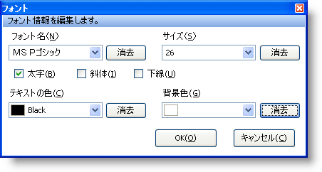

////

|metadata|
{
    "name": "winformattedtexteditor-font-dialog-box",
    "controlName": [],
    "tags": ["Styling"],
    "guid": "{E82892E2-7B9E-41B9-89CC-41F180393EC6}",  
    "buildFlags": [],
    "createdOn": "2006-12-09T12:13:39Z"
}
|metadata|
////

= フォント ダイアログ ボックス

WinFormattedTextEditor には、エンド ユーザーによるテキストのフォーマットを支援する 3 つのダイアログ ボックスが含まれます。これらのダイアログ ボックスは、カスタム コンテキスト メニューまたはそれらを表示するために設計されたメソッドからアクセスできます。pick:[win-forms="link:{ApiPlatform}win{ApiVersion}~infragistics.win.formattedlinklabel.formattedtexteditinfo.html[EditInfo]"]  オブジェクトの pick:[win-forms="link:{ApiPlatform}win{ApiVersion}~infragistics.win.formattedlinklabel.formattedtexteditinfo~showfontdialog.html[ShowFontDialog]"]  メソッドを起動して、[フォント] ダイアログ ボックスを表示できます。このメソッドは、WinFormattedTextEditor コントロールで行われた選択がある場合に限って機能します。

[フォント] ダイアログ ボックスによって、エンド ユーザーは、フォーマットされたテキストのフォント ファミリー、サイズ、色などのスタイルを変更できます。以下は、各オプションの説明付きの [フォント] ダイアログ ボックスのスクリーンショットです。

* *フォント名* – 選択したテキストにどのフォントを適用するかを指定します。以下のスタイル タグで選択したテキストを囲みます。

----

----

* *サイズ* – 選択したテキストにどのサイズを適用するかを指定します。以下のスタイル タグで選択したテキストを囲みます。

----

----

* *太字、斜体、下線* – 選択したテキストを太字、斜体、または下線にするかどうかを指定します。以下のスタイル タグで選択したテキストを囲みます。

----

----

* *テキストの色* – テキストに適用する色を指定します。以下のスタイル タグで選択したテキストを囲みます。

----

----

* *背景の色* – テキストの背景に適用する色を指定します。以下のスタイル タグで選択したテキストを囲みます。

----

----