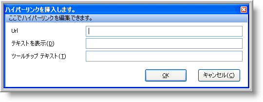

////
|metadata|
{
    "name": "winformattedtexteditor-hyperlink-dialog-box",
    "controlName": [],
    "tags": ["How Do I"],
    "guid": "{072C8167-B372-426F-BEF9-6AFAC60A7023}",
    "buildFlags": [],
    "createdOn": "2006-12-09T12:14:37Z"
}
|metadata|
////

= ハイパーリンク ダイアログ ボックス

WinFormattedTextEditor には、エンド ユーザーによるテキストのフォーマットを支援する 3 つのダイアログ ボックスが含まれます。これらのダイアログ ボックスは、カスタム コンテキスト メニューまたはそれらを表示するために設計されたメソッドからアクセスできます。pick:[win-forms="link:{ApiPlatform}win{ApiVersion}~infragistics.win.formattedlinklabel.formattedtexteditinfo.html[EditInfo]"]  オブジェクトの pick:[win-forms="link:{ApiPlatform}win{ApiVersion}~infragistics.win.formattedlinklabel.formattedtexteditinfo~showlinkdialog.html[ShowLinkDialog]"]  メソッドを起動して、[ハイパーリンク] ダイアログ ボックスを表示できます。

[ハイパーリンク] ダイアログ ボックスでは、テキストが選択されていなければ、現在のカーソル位置でハイパーリンクを挿入します。テキストが選択されると、ハイパーリンクに変換されます。[テキストを表示] テキストボックスは、ダイアログ ボックスが起動される時にテキストが選択されていれば表示されません。以下は、各テキストボックスの説明付きの [ハイパーリンク] ダイアログ ボックスのスクリーンショットです。

* *URL* – リンクをクリックした時に開かれる Web アドレスです。[OK] をクリックすると、選択したテキストが囲まれるか、以下のタグで新しいテキストを作成します。

* *表示テキスト* –- ドキュメントで表示されるテキスト。[OK] をクリックすると、選択したテキストが囲まれるか、以下のタグで新しいテキストを作成します。

<a href=`"http://jp.infragistics.com"`>Infragistics</a>

* *ツールチップ テキスト* –- マウスをリンクの上に重ねると、ツールチップがテキストで表示されます。[OK] をクリックすると、選択したテキストが囲まれるか、以下のタグで新しいテキストを作成します。

<a title=`"Infragistics ウエブサイトへのリンク"` href="http://jp.infragistics.com">表示テキスト</a>