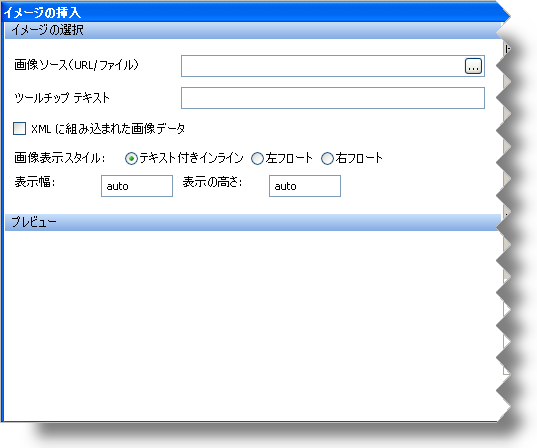

////

|metadata|
{
    "name": "winformattedtexteditor-image-dialog-box",
    "controlName": [],
    "tags": ["How Do I"],
    "guid": "{93E41CCC-B771-4A41-A3AC-F54264697B0C}",  
    "buildFlags": [],
    "createdOn": "2006-12-09T12:14:05Z"
}
|metadata|
////

= 画像ダイアログ ボックス

WinFormattedTextEditor には、エンド ユーザーによるテキストのフォーマットを支援する 3 つのダイアログ ボックスが含まれます。これらのダイアログ ボックスは、カスタム コンテキスト メニューまたはそれらを表示するために設計されたメソッドからアクセスできます。pick:[win-forms="link:{ApiPlatform}win{ApiVersion}~infragistics.win.formattedlinklabel.formattedtexteditinfo.html[EditInfo]"]  オブジェクトの pick:[win-forms="link:{ApiPlatform}win{ApiVersion}~infragistics.win.formattedlinklabel.formattedtexteditinfo~showimagedialog.html[ShowImageDialog]"]  メソッドを起動して、[画像] ダイアログ ボックスを表示できます。

[画像] ダイアログ ボックスは、テキストが選択されているかどうかに関係なく、現在のカーソル位置に画像を挿入します。以下は、各オプションの説明付きの [画像] ダイアログ ボックスのスクリーンショットです。

* *画像ソース* – 省略記号 (…) をクリックすると、[ファイルを開く] ダイアログ ボックスが表示されます。このダイアログ ボックスから、エンド ユーザーはドキュメントに挿入するためのファイルを選択できます。以下の属性で画像タグを挿入します。

----

----

* *ツールチップ テキスト* – マウスを画像の上に重ねると、このテキストがツールチップに表示されます。

----

----

* *XML で画像データを組み込む* – ソースをポイントするのではなく画像データを組み込むためにチェックボックスを選択します。このオプションは、ラン タイムに実際の画像ファイルを所有する必要がない場合に便利です。

----

----

* *画像表示スタイル* – デフォルトでは、画像がテキストとともにインラインで表示され、テキストの折り返しは実行されません。[左フロート] または [右フロート] を選択すると、コンテナに沿って画像が左または右に揃います。テキストは画像の周囲で折り返されます。

----
 
----

* *表示の幅と高さ* – デフォルトでは、画像の高さと幅は自動的に設定されます。ただし、これらのオプションは変更でき、画像は拡大または縮小できます。

----

----