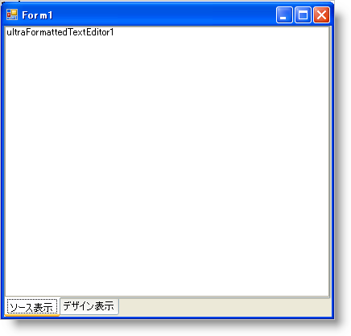
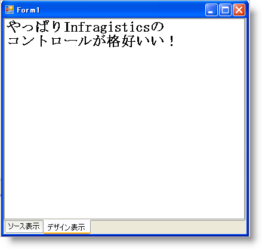

////

|metadata|
{
    "name": "winformattedtexteditor-switching-between-design-view-and-code-view",
    "controlName": [],
    "tags": ["How Do I"],
    "guid": "{413779BD-8B57-4D39-88C0-6673295D6463}",  
    "buildFlags": [],
    "createdOn": "2006-12-09T13:42:01Z"
}
|metadata|
////

= デザイン ビューとコード ビューの切り替え

== 始める前に

WinFormattedTextEditor コントロールが使用する XML タグは、HTML タグと非常に似ています。したがって、HTML エディタのひとつのタイプとして WinFormattedTextEditor を実際に使用できます。HTML エディタに含まれるひとつの機能には、デザイン ビューとコード ビューがあります。この種類の機能は、WinFormattedTextEditor から得ることができます。そうすることで、ドキュメントのコンテンツを変更するためにグラフィカルおよびスクリプティングの 2 つの異なる方法をエンド ユーザーに提供します。デザイン ビューからのドキュメントのフォーマッティングでエンド ユーザーを支援できるユーザー インターフェイスを作成したり、エンド ユーザーがコード表示からタグを追加できます。

== 達成すること

2 つのタブを含むタグ付けされたインタフェースを作成します。これらのタブのひとつには、WinFormattedTextEditor コントロールが含まれ、他のタブには インボックスの RichTextBox コントロールが含まれます。これらの 2 つのコントロールは同じデータを含みますが、フォーマットは異なります。WinFormattedTextEditor コントロールはフォーマットされたテキストを含み、RichTextBox は raw テキストを含みます（タグを含む）。エンド ユーザーがタグを変更すると、エディタは他のエディタのコンテンツで更新されます。

== 次の手順を実行します

[start=1]
. *WinTabControl、WinFormattedTextEditor、および RichTextBox コントロールをフォームに追加します。*

.. ツールボックスから UltraTabControl をダブルクリックし、Dock プロパティを Fill に設定します。[プロパティ] ウィンドウの pick:[win-forms="link:{ApiPlatform}win.ultrawintabcontrol{ApiVersion}~infragistics.win.ultrawintabcontrol.ultratabscollection.html[Tabs]"]  コレクションを検索し、省略記号 (…) をクリックします。[追加] をクリックしてタブを追加します。タブの pick:[win-forms="link:{ApiPlatform}win.ultrawintabcontrol{ApiVersion}~infragistics.win.ultrawintabcontrol.ultratab~text.html[Text]"]  プロパティを [デザイン ビュー] に変更します。[追加] をクリックして他のタブを追加します。Text プロパティを [コード ビュー] に変更します。[OK] をクリックし、[UltraTab コレクション エディタ] ダイアログ ボックスを閉じます。[プロパティ] ウィンドウで pick:[win-forms="link:{ApiPlatform}win.ultrawintabcontrol{ApiVersion}~infragistics.win.ultrawintabcontrol.ultratabcontrolbase~taborientation.html[TabOrientation]"]  プロパティを検索し、BottomLeft に変更します。
.. [デザイン ビュー] タブを選択します。ツールボックスから [デザイン ビュー] タブ ページに UltraFormattedTextEditor をクリック アンド ドラッグします。ultraFormattedTextEditor1 の Dock プロパティを Fill に設定します。
.. [コード ビュー] タブを選択します。ツールボックスから [コード ビュー] タブに RichTextBox をクリック アンド ドラッグします。richTextBox1 の Dock プロパティを Fill に設定します。

この時点で、フォームは次のようになります。

[start=2]
. *SelectedTabChanged イベントでコードビハインドを作成します。*

[デザイン ビュー] または [コード ビュー] タブをダブルクリックして pick:[win-forms="link:{ApiPlatform}win.ultrawintabcontrol{ApiVersion}~infragistics.win.ultrawintabcontrol.ultratabcontrolbase~selectedtabchanged_ev.html[SelectedTabChanged]"]  イベントを作成します。if/else 文を使用して、エンド ユーザーが [デザイン ビュー] または [コード ビュー] を切り替わるかどうかをテストします。エンド ユーザーがデザイン ビューに切り替えると、WinFormattedTextEditor の値は RichTextBox コントロールからのテキストで更新される必要があります。エンド ユーザーがコード ビューに切り替えると、WinFormattedTextEditor の Value プロパティの raw テキストで更新される必要があります。Value プロパティの ToStrng メソッドを使用して raw テキストを取得できます。

[NOTE]
====
*注：* アプリケーションで WinFormattedTextEditor の pick:[win-forms="link:{ApiPlatform}win.misc{ApiVersion}~infragistics.win.formattedlinklabel.ultraformattedtexteditor~editstatechanged_ev.html[EditStateChanged]"]  イベントを使用している場合、異なる表示に切り替えるたびにこれを無効にする必要がある場合があります。WinFormattedTextEditor の EventManager オブジェクトの AllEventsEnabled プロパティを False に設定することで、すべてのイベントをオフにすることができます。EditStateChanged イベントのコードによって、これを無効にしなければ以下のコードで予期しない結果になる場合があります。
====

次のコードを SelectedTabChanged イベント内に配置します。

*Visual Basic の場合：*

----
If e.Tab.Text Is "Design View" Then
	Me.UltraFormattedTextEditor1.Value = Me.RichTextBox1.Text
End If
If e.Tab.Text Is "Code View" Then
	Me.RichTextBox1.Text = Me.UltraFormattedTextEditor1.Value.ToString()
End If
----

*C# の場合：*

----
if(e.Tab.Text == "Design View") // エンド ユーザーがデザイン ビューに切り替える場合、
{
	// WinFormattedTextEditor の値を RichTextBox 
	// コントロールのテキストに設定します。
	this.ultraFormattedTextEditor1.Value = this.richTextBox1.Text;
}
else  // エンド ユーザーがコード ビューに切り替える場合、
{
	// RichTextBox コントロールのテキストを WinFormattedTextEditor 
	// の値に設定します。
	this.richTextBox1.Text = this.ultraFormattedTextEditor1.Value.ToString();
}
----

[start=3]
. *アプリケーションを実行します。*

アプリケーションのコード ビューを切り替え、以下のテキストを貼り付けます。

I get so much more control from Code View!

デザイン ビューに切り替えると以下が表示されます。

WinFormattedTextEditor コントロールで使用できる異なるスタイルを検討してください。スタイルの完全なリストについては、 link:winformattedtexteditor-style-attribute.html[「Style 属性」]を参照してください。サポートされているすべてのタグのリストは、 link:winformattedlinklabel-formatting-text-and-hyperlinks.html[「テキストとハイパーリンクのフォーマット」]を参照してください。