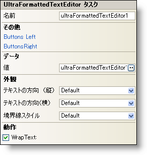

////

|metadata|
{
    "name": "winformattedtexteditor-the-winformattedtexteditor-smart-tag",
    "controlName": [],
    "tags": ["Getting Started"],
    "guid": "{D4594C3B-42B4-4B64-96A4-E81C66465FEC}",  
    "buildFlags": [],
    "createdOn": "2007-05-02T15:36:52Z"
}
|metadata|
////

= WinFormattedTextEditor スマート タグ

Visual Studio® 2005（.NET Framework 2.0）では、それぞれの {ProductName} コントロール/コンポーネントがスマート タグを備えています。コントロール/コンポーネントを選択するだけで、スマート タグのアンカーが表示されます。このアンカーをクリックするとポップアップ パネルが表示され、そこからコントロール/コンポーネントの最もよく使用するプロパティや設定にすばやく簡単にアクセスできます。

WinFormattedTextEditor スマート タグには、以下のセクションと共にコントロールの名前が含まれます。

* Appearance -- コントロールの外観やルック アンド フィールに関連する一般的なタスクがあります。
* Behavior -- フォーム上でのコントロールの動作を制御するプロパティに簡単にアクセスできます。
* Data -- FormattedLinkEditor クラスがフォーマットされたテキストのレンダリングに使用する XML ドキュメントを参照します。
* その他 -- コントロールの全体的な外観やパフォーマンスを拡張する各種オプションがあります。

各セクションの項目（たとえば、フィールド、ドロップダウン リスト、チェック ボックス）およびプロパティ グリッドの項目の対応するプロパティの説明については以下を参照してください。

[options="header", cols="a,a,a"]
|====
|外観|説明|対応するプロパティ

|Border Style
|このプロパティは、1 つのリンクやテキストの 1 行だけではなく、コントロール全体の周囲に境界線を引きます。実線、点線、浮き出しなどいくつかのスタイルを選択できます。また、境界線なしを選択すると、デフォルトの設定と同じになります。
| link:{ApiPlatform}win.misc{ApiVersion}~infragistics.win.formattedlinklabel.ultraformattedtexteditorbase~borderstyle.html[BorderStyle]

|Text Alignment（横）
|コントロール内のテキストを "Left"、"Center"、"Right" のいずれかに揃えます。デフォルトの設定は、Left と同じです。
| link:{ApiPlatform}win{ApiVersion}~infragistics.win.appearance~texthalign.html[TextHAlign]

|Text Alignment（縦）
|コントロール内のテキストを "Top"、"Middle"、"Bottom" のいずれかに揃えます。デフォルトの設定は、Top と同じです。
| link:{ApiPlatform}win{ApiVersion}~infragistics.win.appearance~textvalign.html[TextVAlign]

|====

[options="header", cols="a,a,a"]
|====
|動作|説明|対応するプロパティ

|WrapText
|このチェックボックスを選択すると、コントロールで 1 行に収まらないテキストが折り返されます。デフォルトで WrapText は False に設定されます。
| link:{ApiPlatform}win.misc{ApiVersion}~infragistics.win.formattedlinklabel.ultraformattedtexteditorbase~wraptext.html[WrapText]

|====

[options="header", cols="a,a,a"]
|====
|データ|説明|対応するプロパティ

|Value
|右エディタ ボタンをクリックすると、WinFormattedTextEditor 値エディタで Value を編集できます。値エディタでは、実際に値を設定する前に、フォーマットされたテキストがどのように表示されるかを確認することができます。または、基本的な HTML タグの取り扱いに慣れているのであれば、スマート タグのテキスト ボックスに値を入力することもできます。WinFormattedTextEditor コントロールでサポートされている個々のタグについての詳しい説明は、 link:winformattedlinklabel-formatting-text-and-hyperlinks.html[「テキストとハイパーリンクのフォーマット」]を参照してください。
| link:{ApiPlatform}win.misc{ApiVersion}~infragistics.win.formattedlinklabel.ultraformattedtexteditorbase~value.html[Value]

|====

[options="header", cols="a,a,a"]
|====
|その他|説明|対応するプロパティ

|Buttons Left
|省略（...）ボタンをクリックすると、ButtonsLeft コレクションが開きます。これはエディタの左側に配置できるカスタム ボタンのコレクションです。
|ButtonsLeft

|ButtonsRight
|省略（...）ボタンをクリックすると、ButtonsRight コレクションが開きます。これはエディタの右側に配置できるカスタム ボタンのコレクションです。
|ButtonsRight

|====