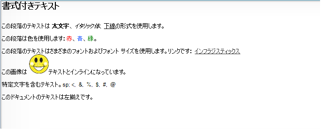

////

|metadata|
{
    "name": "winformattedtextwordwriter-export-formattedtexteditor-text-to-word",
    "controlName": ["WinFormattedTextWordWriter"],
    "tags": ["Exporting","How Do I"],
    "guid": "99689e4b-e319-44b1-805b-a9a0b9829e9f",  
    "buildFlags": [],
    "createdOn": "2011-03-15T14:51:43.7994688Z"
}
|metadata|
////

= FormattedTextEditor テキストを Word にエクスポート

WinFormattedTextWordWriter™ コンポーネントによって、WinFormattedTextEditor™ または WinFormattedLinkLabel™ から新しい Word ドキュメントに書式設定されたテキストをエクスポートすることが可能となります。WinFormattedTextWordWriter は link:{ApiPlatform}documents.io{ApiVersion}~infragistics.documents.word.worddocumentwriter.html[WordDocumentWriter] オブジェクトを使用してデータをエクスポートします。これを完了するには、UltraFormattedTextWordWriter オブジェクトの Export メソッドのひとつを呼び出すだけです。 link:{ApiPlatform}win.ultrawinformattedtext.wordwriter{ApiVersion}~infragistics.win.ultrawinformattedtext.wordwriter.ultraformattedtextwordwriter~export.html[Export] メソッドには、ユーザーのニーズごとに動作する異なる引数セットを取得するいくつかのオーバーロードがあります。

以下のコードは、UltraFormattedTextEditor コントロールと WordDocumentWriter オブジェクトをパラメーターとして取得する Export メソッドを使用して、UltraFormattedTextEditor コントロールの書式設定されたテキストを Word ドキュメントにエクスポートします。またこのコードは、Word ドキュメントに “FormattedTextInWord.docx" という名前を指定し、“C:\ WordDocuments”フォルダーに配置します。

開始するには、UltraFormattedTextWordWriter コンポーネントと UltraFormattedTextEditor コントロールをフォームにドラッグ アンド ドロップして、UltraFormattedTextEditor コントロールの Value プロパティを書式設定されたテキストに設定します。

[NOTE]
====
*注:* Infragistics3.Documents.IO アセンブリへの参照が以下のコードに必要とされます。
====

*C# の場合:*

----
using Infragistics.Documents.Word;
// 静的な 'Create' メソッドを使用して、WordDocumentWriter クラスの
// 新しいインスタンスを作成します
// コンテンツを書いた後は、このインスタンスを閉じる必要があります
WordDocumentWriter wordWriter = WordDocumentWriter.Create("C:\\WordDocuments\\FormattedTextInWord.docx");
wordWriter.StartDocument();
// 書式設定されたテキストを Word にエクスポートします
this.ultraFormattedTextWordWriter1.Export(this.ultraFormattedTextEditor1, wordWriter);
wordWriter.EndDocument();
// ライターを閉じます
wordWriter.Close();
----

*Visual Basic の場合:*

----
Imports Infragistics.Documents.Word
' 静的な 'Create' メソッドを使用して、WordDocumentWriter クラスの
' 新しいインスタンスを作成します
' コンテンツを書いた後は、このインスタンスを閉じる必要があります
Dim wordWriter As WordDocumentWriter = WordDocumentWriter.Create("C:\WordDocuments\FormattedTextInWord.docx")
wordWriter.StartDocument()
' 書式設定されたテキストを Word にエクスポートします
Me.ultraFormattedTextWordWriter1.Export(Me.ultraFormattedTextEditor1, wordWriter)
wordWriter.EndDocument()
' ライターを閉じます
wordWriter.Close()
----

以下のコードで、Export メソッドは生の書式設定した文字列テキストとファイル名をパラメーターとして受け付けます。

[NOTE]
====
*注:* 環境に適合するように画像のソース URL を修正する必要があります。
====

*C# の場合:*

----
using Infragistics.Documents.Word;
this.ultraFormattedTextWordWriter1.Export("
Formatted Text Exported to Word Document   This paragraph has text with Bold, Italics, Underline formatting.  This paragraph has text with different colors: Red Text, Blue Text, Green Text.  This paragraph has text with different font type and font size. Arial Black- Default Font Size,&edsp;&edsp;Times New Roman - Font Size 10,&edsp;&edsp;Comic Sans MS - Font Size 12  Text with BackGround Color.  Paragraph with Hyperlink. This is a link: <a title="infragistics" href="www.infragistics.com">Infragistics</a>  The image is inline with the text.  Text with special characters.&edsp;&edsp;<,&edsp;&edsp;&,&edsp;&edsp;%,&edsp;&edsp;$,&edsp;&edsp;#,&edsp;&edsp;@  The entire text in this document is left aligned.   
", "C:\\WordDocuments\\FormattedTextInWord.docx");
----

*Visual Basic の場合:*

----
Imports Infragistics.Documents.Word
Me.ultraFormattedTextWordWriter1.Export("
Formatted Text Exported to Word Document   This paragraph has text with Bold, Italics, Underline formatting.  This paragraph has text with different colors: Red Text, Blue Text, Green Text.  This paragraph has text with different font type and font size. Arial Black- Default Font Size,&edsp;&edsp;Times New Roman - Font Size 10,&edsp;&edsp;Comic Sans MS - Font Size 12  Text with BackGround Color.  Paragraph with Hyperlink. This is a link: <a title="infragistics" href="www.infragistics.com">Infragistics</a>  The image is inline with the text.  Text with special characters.&edsp;&edsp;<,&edsp;&edsp;&,&edsp;&edsp;%,&edsp;&edsp;$,&edsp;&edsp;#,&edsp;&edsp;@  The entire text in this document is left aligned.   
", "C:\WordDocuments\FormattedTextInWord.docx")
----

以下のスクリーンショットは、書式設定されたテキストをエクスポートした Word ドキュメントを表示します。

== 関連トピック

* link:winformattedtextwordwriter-about-winformattedtextwordwriter.html[WinFormattedTextWordWriter について]