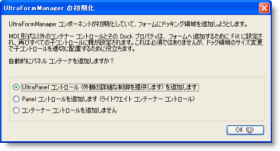

////

|metadata|
{
    "name": "winformmanager-customize-a-form-with-winformmanager",
    "controlName": ["WinFormManager"],
    "tags": ["How Do I","Styling"],
    "guid": "77a20dcc-2ee4-41ee-ac7c-e95c8147a9ec",  
    "buildFlags": [],
    "createdOn": "2010-06-03T22:04:44.4030067Z"
}
|metadata|
////

= WinFormManager でフォームをカスタマイズ

このトピックは、WinFormManager™ コンポーネントでフォームを設定し、キャプション領域、フォーム境界線などのフレームの異なる領域と閉じる、元のサイズに戻す、最大化、最小化、コンテキスト ヘルプ ボタンをスタイルするためにカスタマイズする方法について説明します。

以下の手順に従って、UltraFormManager でフォームを設定します。

1. デザイン タイムに、Toolbox からフォームに UltraFormManager コンポーネントをドラッグ アンド ドロップします。コンポーネントをフォームに追加するとすぐに、以下のダイアログが表示します。

[NOTE]
====
*注：* フォームが MDI 親フォームになるように設定される場合には、このダイアログは表示されません。また Dock プロパティが Fill に設定されているコントロールがフオームに既に含まれている場合には、以下のダイアログは表示されなくなります。
====

このダイアログはオプションを選択するようにプロンプトします。UltraPanel または Panel コントロールを追加するように選択する場合、ドッキング領域がフォームに作成され、パネルがクライアント領域を埋めます。標準的な Panel コントロールでフォームを埋めるのか、それともより多くのスタイリング サポートを提供する UltraPanel コントロールでフォームを埋めるのかを選択できます。

2. [OK] をクリックしてコンポーネントを自動的にコンテナー コントロールに追加します。コンテナー コントロールがフォームに追加されたら、コンテナー内にコントロールを配置できます。

コンポーネント トレイで UltraFormManager コンポーネントを選択し、フォームをスタイルするためにすべてのスタイル設定を提供するプロパティ ウィンドウを表示します。デフォルトで、 link:{ApiPlatform}win{ApiVersion}~infragistics.win.ultrawinform.ultraformmanager~formstylesettings.html[FormStyleSeetings] オブジェクトの link:{ApiPlatform}win{ApiVersion}~infragistics.win.ultrawinform.formstylesettings~formdisplaystyle.html[FormDisplayStyle] プロパティは RoundedSizable に解決され、 link:{ApiPlatform}win{ApiVersion}~infragistics.win.ultrawinform.formstylesettings~isglasssupported.html[IsGlassSupported] プロパティは False に設定されます。

スタイル設定を適用します。

*Visual Basic の場合：*

----
' キャプション領域にフォーマットされたテキストを設定します。
Me.ultraFormManager1.FormStyleSettings.Caption = "Formatted Caption" 
' フォームの表示スタイルを設定します。
Me.ultraFormManager1.FormStyleSettings.FormDisplayStyle = Infragistics.Win.UltraWinToolbars.FormDisplayStyle.RoundedSizable 
' フォームの特定のスタイルを設定します。
Me.ultraFormManager1.FormStyleSettings.Style = Infragistics.Win.UltraWinForm.UltraFormStyle.Office2007 
' フォームの境界線の背景色を設定します。
Me.ultraFormManager1.FormStyleSettings.FormBorderAppearance.BackColor = Color.Red 
' キャプション領域の背景色を設定します。
Me.ultraFormManager1.FormStyleSettings.CaptionAreaAppearance.BackColor = Color.Gray 
' ホット トラッキング時に最大のキャプション ボタンの背景色を設定します。
Me.ultraFormManager1.FormStyleSettings.CaptionButtonsAppearances.MaximizeButtonAppearances.HotTrackAppearance.BackColor = Color.Red 
' ボタンが押されている時に閉じるボタンのデフォルトの背景色を設定します。 
Me.ultraFormManager1.FormStyleSettings.DefaultCaptionButtonsAppearances.CloseButtonAppearances.PressedAppearance.BackColor = Color.Blue
----

*C# の場合：*

----
// キャプション領域にフォーマットされたテキストを設定します。
this.ultraFormManager1.FormStyleSettings.Caption = "Formatted Caption";
// フォームの表示スタイルを設定します。
this.ultraFormManager1.FormStyleSettings.FormDisplayStyle = Infragistics.Win.UltraWinToolbars.FormDisplayStyle.RoundedSizable;
// フォームの特定のスタイルを設定します。
this.ultraFormManager1.FormStyleSettings.Style = Infragistics.Win.UltraWinForm.UltraFormStyle.Office2007;
// フォームの境界線の背景色を設定します。
this.ultraFormManager1.FormStyleSettings.FormBorderAppearance.BackColor = Color.Red;
// キャプション領域の背景色を設定します。
this.ultraFormManager1.FormStyleSettings.CaptionAreaAppearance.BackColor = Color.Gray;
// ホット トラッキング時に最大のキャプション ボタンの背景色を設定します。
this.ultraFormManager1.FormStyleSettings.CaptionButtonsAppearances.MaximizeButtonAppearances.HotTrackAppearance.BackColor = Color.Red;
// ボタンが押されている時に閉じるボタンのデフォルトの背景色を設定します。
this.ultraFormManager1.FormStyleSettings.DefaultCaptionButtonsAppearances.CloseButtonAppearances.PressedAppearance.BackColor = Color.Blue;
----

image::images/WinFormManager_Customize_a_Form_with_WinFormManager_02.png[]