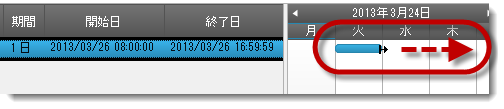
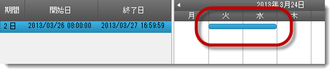
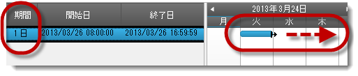
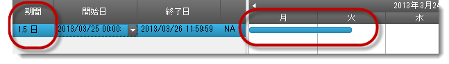
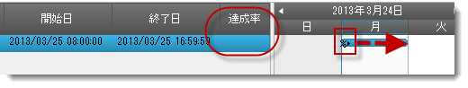
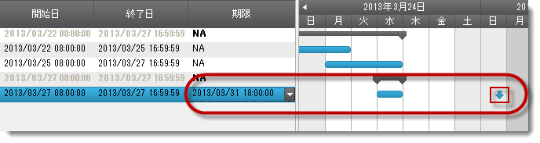
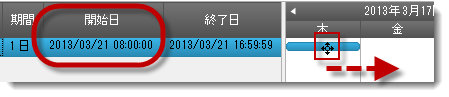
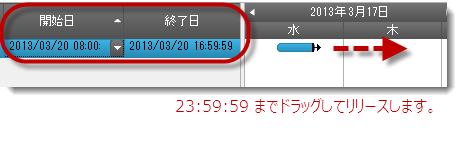
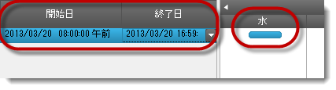

////

|metadata|
{
    "name": "winganttview-timeline-task-positioning",
    "controlName": ["WinGanttView"],
    "tags": ["How Do I","Scheduling"],
    "guid": "7fc04236-5adc-48af-9a24-f4b2b6d63b6a",  
    "buildFlags": [],
    "createdOn": "2013-01-23T14:13:34.7168845Z"
}
|metadata|
////

= タイムラインのタスク配置

== トピックの概要

=== 目的

このトピックは、 _WinGanttView_™ コントロールのタスクの配置、サイズ、およびタイムラインを構成する方法の概要を提供します。

=== 前提条件

このトピックを理解するためには、以下のトピックを理解しておく必要があります。

[options="header", cols="a,a"]
|====
|トピック|目的

| link:winganttview-understanding-winganttview.html[WinGanttView の理解]
|_WinGanttView_  コントロールおよびその主要な特性と機能について解説しています。

| link:winganttview-using-winganttview.html[WinGanttView の使用]
|このセクションでは、 _WinGanttView_ コントロールに関連する特定のタスクを実行する方法を簡潔に説明するタスク ベースのトピックを紹介します。

|====

=== このトピックの内容

このトピックは、以下のセクションで構成されます。

* <<_Ref341350040,はじめに>>
* <<_Ref341350050,タイムライン プロパティ リファレンス>>
* <<_Ref341350059,新しい機能の動作と構成>>
* <<_Ref341350073,稼働時間の AutoAdjust モードでタイムラインの配置の構成>>
* <<_Ref341350089,稼働時間の Manual モードでタイムラインの配置の構成>>
* <<_Ref341350100,パーセンテージ要素のタスク配置の構成>>
* <<_Ref341350109,タスク期限の配置の構成>>
* <<_Ref341350120,タスク開始日の配置の構成>>
* <<_Ref341704481,タスクの稼働時間の動作>>
* <<_Ref341350139,関連コンテンツ>>

[[_Ref341350040]]
== はじめに

=== WinGanttView の概要

_WinGanttView™_   の 13.1 リリースで期間に比較してタスクの配置およびサイズを構成するプロパティを追加しました。構成時にタイムスロットの幅に対するタイムラインの配置の精度を確認してください。

タスクに関連するインターフェイス パラメーターをカスタマイズできます。配置変更およびサイズ変更の制限はありません。マウスの左ボタンを使用してドラッグ操作でプロジェクトのタスク インターフェイスをカスタマイズできます。

[[_Ref341350050]]
== タイムライン プロパティ リファレンス

=== はじめに

以下の表は、タイムラインのタスクのサイズ変更および配置変更機能をサポートするために link:{ApiPlatform}win.ultrawinganttview{ApiVersion}~infragistics.win.ultrawinganttview.timeline_members.html[Timeline] クラスに追加されたプロパティをリストします。

=== タイムライン プロパティ リファレンス表

[options="header", cols="a,a,a"]
|====
|プロパティ|説明|デフォルト値

|TaskPositioning
| link:{ApiPlatform}win.ultrawinganttview{ApiVersion}~infragistics.win.ultrawinganttview.uielements.taskuielement_members.html[TaskUIElement] のサイズおよび配置は、タスクの開始日/終了日および交差するタスク要素の link:{ApiPlatform}win.ultrawinschedule{ApiVersion}~infragistics.win.ultrawinschedule.timelineview.timeslotuielement_members.html[TimeSlotUIElement] の開始日/終了日の変更によって調整するかどうかを決定する値を取得または設定します。 *利用可能な値:* 

* _FillTimeSlots_ 

* _Proportional_ 

| _FillTimeSlots_ 

|MinimumTaskWidth
| link:{ApiPlatform}win.ultrawinganttview{ApiVersion}~infragistics.win.ultrawinganttview.uielements.taskuielement_members.html[TaskUIElement] の最小幅 (ピクセル単位) を定義する値を取得または設定します。 

.注: 

[NOTE] 

==== 

このプロパティは、`TaskPositioning` プロパティが _Proportional_ に設定されている場合にのみ影響します。 

====
|10 ピクセル

|TaskDragIncrement
|タスク ドラッグ操作の移動の (日、時、分などの) 増加を定義する値を取得または設定します。 

.注: 

[NOTE] 

==== 

このプロパティは、`TaskPositioning` プロパティが _Proportional_ に設定されている場合にのみ影響します。 

====
|TimeSpan.Zero

|====

[[_Ref341350059]]
== 新しい機能の動作と構成

=== 新機能の概要表

以下の表は、 _WinGanttView_   コントロールの新機能の概要を説明します。その他の詳細情報については、以下の要点チャートの後を参照してください。

[options="header", cols="a,a"]
|====
|機能|説明

|*AutoAdjust* モードのタイムライン配置
|デフォルト設定を使用してタイムライン配置を表示します

|*Manual* モードのタイムライン配置
|ユーザー定義のプロパティ設定を使用してタイムライン配置を表示します

|パーセンテージ要素のタスク配置
|タスクの `PercentComplete` 要素の構成を紹介します

|タスク期限の配置
|タスクの `Deadline` 要素の構成を紹介します

|タスク開始日の配置
|タスクの `StartDateTime` 要素の構成を紹介します

|タスクの稼働時間の配置
|稼働時間範囲のすべてのタスクの稼働時間の構成を紹介します

|====

[[_Ref341350073]]
== 稼働時間の AutoAdjust モードでタイムラインの配置の構成

=== AutoAdjust モードのタイムライン配置

タイムラインのドラッグ操作でカーソルが移動すると、カーソルがタイム スロットの端にない場合もタスクの右端の配置を変更します。 link:{ApiPlatform}win.ultrawinganttview{ApiVersion}~infragistics.win.ultrawinganttview.timeline~taskdragincrement.html[TaskDragIncrement] は 1 日のプライマリ間隔の 1 時に解決するため、 link:{ApiPlatform}win.ultrawinganttview{ApiVersion}~infragistics.win.ultrawinganttview.ultraganttview~taskelementdragging_ev.html[TaskElementDragging] イベントを発生します。カーソルがタイムスロットの幅の 24 分の 1 を移動するときに、タスク要素の幅は変更します。 link:{ApiPlatform}win.ultrawinschedule{ApiVersion}~infragistics.win.ultrawinschedule.task~enddatetime.html[EndDateTime] および link:{ApiPlatform}win.ultrawinschedule{ApiVersion}~infragistics.win.ultrawinschedule.task~duration.html[Duration] プロパティは各のマウス移動で 1 時間変更します。

=== プロパティ設定

`TaskWorkingHourMode = AutoAdjust`

`TaskPositioning = FillTimeSlots`

`TaskDragIncrement = 2h` (2 時間)

`PrimaryInterval = Days`

.注:
[NOTE]
====
TaskDragIncrement のデフォルト値は `PrimaryInterval` に基づいて設定されます。
====

以下の表は対応する `PrimaryInterval` タイプの `TaskDragIncrement` 値をリストします。

[options="header", cols="a,a"]
|====
|間隔|ドラッグ増分

|年
|7 日間

|月/週
|1 日

|1 日
|1 時間

|時
|15 分

|10 分以上
|タイム スロットの範囲の 4 分の 1

|10 分より小さい
|1 分間

|====

=== コード

コードのプロパティ設定。

*C# の場合:*

[source,csharp]
----ultraCalendarInfo1.TaskWorkingHourMode = TaskWorkingHourMode.AutoAdjust;
ultraGanttView1.TimelineSettings.TaskPositioning = TimelineTaskPositioning.FillTimeSlots;
ultraGanttView1.TimelineSettings.PrimaryInterval = new DateInterval(1, DateIntervalUnits.Days);
ultraGanttView1.TimelineSettings.TaskDragIncrement = TimeSpan.FromHours(2);
----

*Visual Basic の場合:*

[source,vb]
----ultraCalendarInfo1.TaskWorkingHourMode = TaskWorkingHourMode.AutoAdjust
ultraGanttView1.TimelineSettings.TaskPositioning = TimelineTaskPositioning.FillTimeSlots
ultraGanttView1.TimelineSettings.PrimaryInterval = New DateInterval(1, DateIntervalUnits.Days)
ultraGanttView1.TimelineSettings.TaskDragIncrement = TimeSpan.FromHours(2)
----

=== 手順

タイムラインをドラッグする *前* の画像。

1.タスクの右側を 1 つ以上のタイム スロットにドラッグします。

タイムラインをドラッグした *後* の画像。

[[_Ref341350089]]
== 稼働時間の Manual モードでタイムラインの配置の構成

=== Manual モードのタイムライン配置

タイムラインのドラッグ操作でカーソルが移動すると、カーソルがタイム スロットの端になくてもタスクの右側が配置を変更します。 link:{ApiPlatform}win.ultrawinganttview{ApiVersion}~infragistics.win.ultrawinganttview.timeline~taskdragincrement.html[TaskDragIncrement] が明示的に 4 時間に設定されるため、 link:{ApiPlatform}win.ultrawinganttview{ApiVersion}~infragistics.win.ultrawinganttview.ultraganttview~taskelementdragging_ev.html[TaskElementDragging] イベントが発生されます。カーソルがタイムスロットの幅を 6 分の 1 移動するときに、タスク要素の幅が変更します。 link:{ApiPlatform}win.ultrawinschedule{ApiVersion}~infragistics.win.ultrawinschedule.task~enddatetime.html[EndDateTime] および link:{ApiPlatform}win.ultrawinschedule{ApiVersion}~infragistics.win.ultrawinschedule.task~duration.html[Duration] プロパティは各のマウス移動で 4 時間変更します。

=== プロパティ設定

`TaskWorkingHourMode = Manual`

`TaskPositioning = Proportional`

`TaskDragIncrement = 4h (4 時間)`

`PrimaryInterval = Days`

=== コード

コードのプロパティ設定

*C# の場合:*

[source,csharp]
----ultraCalendarInfo1.TaskWorkingHourMode = TaskWorkingHourMode.Manual;
ultraGanttView1.TimelineSettings.TaskPositioning = TimelineTaskPositioning.Proportional;
ultraGanttView1.TimelineSettings.PrimaryInterval = new DateInterval(1, DateIntervalUnits.Days);
ultraGanttView1.TimelineSettings.TaskDragIncrement = TimeSpan.FromHours(4);
----

*Visual Basic の場合:*

[source,vb]
----ultraCalendarInfo1.TaskWorkingHourMode = TaskWorkingHourMode.Manual
ultraGanttView1.TimelineSettings.TaskPositioning = TimelineTaskPositioning.Proportional
ultraGanttView1.TimelineSettings.PrimaryInterval = New DateInterval(1, DateIntervalUnits.Days)
ultraGanttView1.TimelineSettings.TaskDragIncrement = TimeSpan.FromHours(4)
----

=== 手順

タイムラインをドラッグする *前* の画像

1.タスクの右側を 1 つ以上のタイム スロットにドラッグします。

タイムラインをドラッグした *後* の画像

[[_Ref341350100]]
== パーセンテージ要素のタスク配置の構成

=== パーセンテージ要素のタスク配置

このセクションはパーセンテージ要素の動作と構成を紹介します。

カーソルが移動すると、達成率バーの幅が大きくなります。カーソルの位置まで描画されます。カーソルがタイムスロットの幅を 12 分の 1 移動するときに、 link:{ApiPlatform}win.ultrawinganttview{ApiVersion}~infragistics.win.ultrawinganttview.ultraganttview~taskelementdragging_ev.html[TaskElementDragging] イベントを発生します。ドラッグ操作では、イベントは 14 回に実行します ( *開始フェーズ* に 1 回、 *移動フェーズ* に 12 回、および *終了フェーズ* に 1 回)。

=== プロパティ設定

パーセンテージ要素のユーザー定義のプロパティ設定は:

`TaskWorkingHourMode = Manual`

`TaskPositioning = Proportional`

`TaskDragIncrement = 2h (2 時間)`

`PrimaryInterval = Days`

タスクは 1 日をまたがります。

=== コード

コードのプロパティ設定

*C# の場合:*

[source,csharp]
----ultraCalendarInfo1.TaskWorkingHourMode = TaskWorkingHourMode.Manual;
ultraGanttView1.TimelineSettings.TaskPositioning = TimelineTaskPositioning.Proportional;
ultraGanttView1.TimelineSettings.PrimaryInterval = new DateInterval(1, DateIntervalUnits.Days);
ultraGanttView1.TimelineSettings.TaskDragIncrement = TimeSpan.FromHours(2);
----

*Visual Basic の場合:*

[source,vb]
----ultraCalendarInfo1.TaskWorkingHourMode = TaskWorkingHourMode.Manual
ultraGanttView1.TimelineSettings.TaskPositioning = TimelineTaskPositioning.Proportional
ultraGanttView1.TimelineSettings.PrimaryInterval = New DateInterval(1, DateIntervalUnits.Days)
ultraGanttView1.TimelineSettings.TaskDragIncrement = TimeSpan.FromHours(2)
----

=== 手順

達成率バーをタイムラインの上にドラッグする *前* の画像

1.達成率のカーソル インジケーターを表示するまでにマウス カーソルをタスク要素の左側の上に移動します。

2.マウスの左ボタンを押して達成率バーを右にドラッグします。

達成率バーをタイムラインの上にドラッグした *後* の画像

[[_Ref341350109]]
== タスク期限の配置の構成

=== タスク期限の配置

このセクションはタスク期限インジケーターの動作と構成を紹介します。

カーソルが移動すると、期限インジケーターは期間および達成率のドラッグ操作と同じように移動します。この場合は、4 つのマウス移動はインジケーターを 1 つのタイム スロットに移動します。

タスクの link:{ApiPlatform}win.ultrawinschedule{ApiVersion}~infragistics.win.ultrawinschedule.task~deadline.html[Deadline] プロパティを使用すると、開始日を設定して、タスクに制限を追加できます。

`[タスク名].Deadline = [タスク名].StartDateTime.AddDays([n 日]);`

=== プロパティ設定

制限インジケーターのユーザー定義のプロパティ設定は:

`TaskWorkingHourMode = Manual`

`TaskPositioning = Proportional`

`TaskDragIncrement = 6h (6 時間)`

`PrimaryInterval = Days`

=== コード

コードのプロパティ設定

*C# の場合:*

[source,csharp]
----ultraCalendarInfo1.TaskWorkingHourMode = TaskWorkingHourMode.Manual;
ultraGanttView1.TimelineSettings.TaskPositioning = TimelineTaskPositioning.Proportional;
ultraGanttView1.TimelineSettings.PrimaryInterval = new DateInterval(1, DateIntervalUnits.Days);
ultraGanttView1.TimelineSettings.TaskDragIncrement = TimeSpan.FromHours(6);
----

*Visual Basic の場合:*

[source,vb]
----ultraCalendarInfo1.TaskWorkingHourMode = TaskWorkingHourMode.Manual
ultraGanttView1.TimelineSettings.TaskPositioning = TimelineTaskPositioning.Proportional
ultraGanttView1.TimelineSettings.PrimaryInterval = New DateInterval(1, DateIntervalUnits.Days)
ultraGanttView1.TimelineSettings.TaskDragIncrement = TimeSpan.FromHours(6)
----

=== 手順

制限インジケーターをドラッグする *前* の画像

image::images/WinGanttView_Task_And_TimeLine_Positioning_7.png[]

1.制限インジケーターにマウスの左ボタンを押します。 

image::images/WinGanttView_Task_And_TimeLine_Positioning_8.png[]右にドラッグします。

制限インジケーターをドラッグした *後* の画像

[[_Ref341350120]]
== タスク開始日の配置の構成

=== タスク開始日の配置

このセクションはタスク開始日の動作と構成を紹介します。

各のマウス移動で、タスクの左端はタイムラインのドラッグ位置と一致するようスナップします。マウス ドラッグ増分によってカーソルが移動すると、 link:{ApiPlatform}win.ultrawinschedule{ApiVersion}~infragistics.win.ultrawinschedule.task~startdatetime.html[StartDateTime] および link:{ApiPlatform}win.ultrawinschedule{ApiVersion}~infragistics.win.ultrawinschedule.task~enddatetime.html[EndDateTime] プロパティ値も変更します。

=== プロパティ設定

タスクの開始日のユーザー定義のプロパティ設定は:

`TaskWorkingHourMode = Manual`

`TaskPositioning = Proportional`

`TaskDragIncrement = 6h (6 時間)`

`PrimaryInterval = Days`

=== コード

コードのプロパティ設定

*C# の場合:*

[source,csharp]
----ultraCalendarInfo1.TaskWorkingHourMode = TaskWorkingHourMode.Manual;
ultraGanttView1.TimelineSettings.TaskPositioning = TimelineTaskPositioning.Proportional;
ultraGanttView1.TimelineSettings.PrimaryInterval = new DateInterval(1, DateIntervalUnits.Days);
ultraGanttView1.TimelineSettings.TaskDragIncrement = TimeSpan.FromHours(6);
----

*Visual Basic の場合:*

[source,vb]
----ultraCalendarInfo1.TaskWorkingHourMode = TaskWorkingHourMode.Manual
ultraGanttView1.TimelineSettings.TaskPositioning = TimelineTaskPositioning.Proportional
ultraGanttView1.TimelineSettings.PrimaryInterval = New DateInterval(1, DateIntervalUnits.Days)
ultraGanttView1.TimelineSettings.TaskDragIncrement = TimeSpan.FromHours(6)
----

=== 手順

タスクの開始日をドラッグする *前* の画像

1.タスク要素の中央にマウスの左ボタンを押して、右にドラッグします。

タスクの開始日をドラッグした *後* の画像

[[_Ref341350129]]
[[_Ref341704481]]
== タスクの稼働時間の動作

=== タスクの稼働時間の配置

このセクションはタスクの稼働時間の動作を紹介します。

link:{ApiPlatform}win.ultrawinschedule{ApiVersion}~infragistics.win.ultrawinschedule.taskworkinghourmode.html[TaskWorkingHourMode] を  _AutoAdjust_   と同じように、タスクの幅はマウスのドラッグ移動に増分します。各ドラッグ移動で、期間は 2 時間づつ増分します。ドラッグ操作は 0:00 に完了しますが、稼働時間を確認するために右端は 17:00 にスナップします。

=== プロパティ設定

タスクの稼働時間のユーザー定義のプロパティ設定は:

`TaskWorkingHourMode = AutoAdjust`

`TaskPositioning = Proportional`

`TaskDragIncrement = 2h (2 時間)`

`PrimaryInterval = Days`

.注:
[NOTE]
====
就業時間 = 08:00 – 17:00。12:00 に開始する 1 時間のランチの予定があります。
====

=== コード

コードのプロパティ設定

*C# の場合:*

[source,csharp]
----ultraCalendarInfo1.TaskWorkingHourMode = TaskWorkingHourMode.AutoAdjust;
ultraGanttView1.TimelineSettings.TaskPositioning = TimelineTaskPositioning.Proportional;
ultraGanttView1.TimelineSettings.PrimaryInterval = new DateInterval(1, DateIntervalUnits.Days);
ultraGanttView1.TimelineSettings.TaskDragIncrement = TimeSpan.FromHours(2);
----

*Visual Basic の場合:*

[source,vb]
----ultraCalendarInfo1.TaskWorkingHourMode = TaskWorkingHourMode.AutoAdjust
ultraGanttView1.TimelineSettings.TaskPositioning = TimelineTaskPositioning.Proportional
ultraGanttView1.TimelineSettings.PrimaryInterval = New DateInterval(1, DateIntervalUnits.Days)
ultraGanttView1.TimelineSettings.TaskDragIncrement = TimeSpan.FromHours(2)
----

=== 手順

タスクの稼働時間を `08:00 – 17:00` に変更する *前* の画像

1.タスク要素の右端 (17:00 に開始) をタイム スロットの右端 (23:59:59) にドラッグして、ドラッグ操作を完了するためにマウスの左ボタンを解放します。

タスクの稼働時間の変更は `16:59` に変更した *後* の画像稼働時間以外にドラッグしても、タスクは稼働時間の終了にまたがります。

[[_Ref341350139]]
== 関連コンテンツ

=== トピック

以下のトピックでは、このトピックに関連する追加情報を提供しています。

[options="header", cols="a,a"]
|====
|トピック|目的

| link:winganttview.html[WinGanttView]
|このセクションは、コントロールについての概要からアプリケーションで使用する理由、コントロールを使用して共通タスクを達成するための方法の手順などの _WinGanttView_ についての有益な情報を含んでいます。

|====