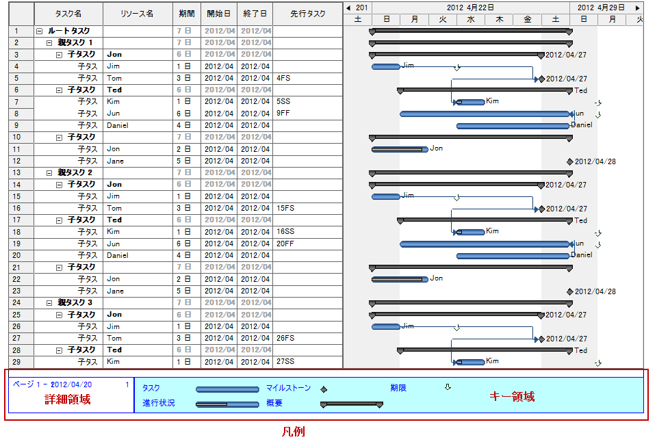

////

|metadata|
{
    "name": "winganttviewprintdocument-configuring-the-legend",
    "controlName": ["WinGanttView"],
    "tags": ["How Do I","Layouts"],
    "guid": "c5092c01-f834-44a4-a9b9-a452066901ea",  
    "buildFlags": [],
    "createdOn": "2012-03-09T18:26:23.8467219Z"
}
|metadata|
////

= 凡例の構成

== トピックの概要

=== 目的

WinGanttViewPrintDocument™ コンポーネントの凡例機能をご紹介します。

=== 必要な背景

以下の表に、このトピックを理解するための前提条件として求められるトピックをリストします。

[options="header", cols="a,a"]
|====
|トピック|目的

| link:winganttviewprintdocument-winganttviewprintdocument-features.html[WinGanttViewPrintDocument 機能]
|WinGanttViewPrintDocument™ コンポーネントの機能を紹介します。

|====

=== 本トピックの内容

このトピックには次のセクションがあります。

* <<_Ref317267478,凡例視覚要素>>

** <<_Ref317267491,概要>>
** <<_Ref317267505,視覚要素概要>>
** <<_Ref317267510,詳細領域>>
** <<_Ref317267514,キー領域>>

* <<_Ref317267525,凡例のカスタマイズ>>
* <<_Ref317267550,凡例のプロパティ参照>>

** <<_Ref317267562,概要>>
** <<_Ref317267865,凡例参照チャート>>

* <<_Setting_Up_a,サンプル凡例の準備 - コード例>>

** <<_Ref317267610,説明>>
** <<_Ref317267616,プレビュー>>
** <<_Ref317267624,コード>>

* <<_Ref317267938,関連コンテンツ>>

[[_Ref317267478]]
== 凡例の構成可能な要素

[[_Ref317267491]]

=== 概要

WinGanttViewPrintDocument™ が印刷版で出す凡例は、2 つの部分からなっています。

* 詳細領域
* キー領域

それぞれについて、後続のテキスト ブロックで説明します。

[[_Ref317267505]]

=== 構成可能な要素概要

以下の表は、凡例の視覚要素についてまとめています。追加の詳細は、以下の概要表の下に提供します。

[options="header", cols="a,a"]
|====
|視覚要素|説明

|詳細領域
|任意のテキストを置くために使います。この領域は、文書特有またはユーザー特有の情報を提供する代替コードにも使用できます

|キー領域
|エンドユーザーが WinGanttView のタイムライン セクション上のバーを確認できるようグラフィカルなキーを表示します。

|====

[[_Ref317267510]]

=== 詳細領域

任意のテキストを置くために詳細領域が使用されます。この領域は、次に挙げるように、文書特有またはユーザー特有の情報を提供する代替コードにも使用できます。

* 印刷操作の開始日
* 印刷操作の開始時間
* 現在のユーザー名
* 現在のページ番号
* ページ総数
* 現在の縦方向ページ番号
* 現在の横方向ページ番号

[[_Ref317267514]]

=== キー領域

キー領域では、エンドユーザーが WinGanttView のタイムライン セクション上のバーを確認できるようグラフィカルなキーを表示します。WinGanttView は以下の機能をサポートします。

* タスク
* 進行状況
* マイルストーン
* 概要
* 期限

[[_Ref317267525]]
== 凡例のカスタマイズ

=== 凡例のカスタマイズの要約

以下の表では、凡例の設定項目を示しています。

[options="header", cols="a,a,a,a"]
|====
|面|構成可能な項目|詳細|プロパティ

|詳細領域
|外観
|詳細領域の外観を設定できます。
|外観

|
|テキスト位置
|詳細領域に表示されるテキストの位置が設定できます。
| link:{ApiPlatform}win.ultrawinganttview{ApiVersion}~infragistics.win.ultrawinganttview.detailsareasettings~textcenter.html[TextCenter] link:{ApiPlatform}win.ultrawinganttview{ApiVersion}~infragistics.win.ultrawinganttview.detailsareasettings~textleft.html[TextLeft] link:{ApiPlatform}win.ultrawinganttview{ApiVersion}~infragistics.win.ultrawinganttview.detailsareasettings~textright.html[TextRight]

|
|幅
|詳細領域の幅を設定できます。
| link:{ApiPlatform}win.ultrawinganttview{ApiVersion}~infragistics.win.ultrawinganttview.legendsettings~detailsareawidth.html[DetailsAreaWidth]

|キー領域
|外観
|キー領域を描画するための外観を設定できます。
|外観

|====

[[_Ref317267550]]
== 凡例のプロパティ参照

[[_Ref317267562]]

=== 概要

凡例を管理するメイン プロパティを次に挙げます。それらは link:{ApiPlatform}win.ultrawinganttview{ApiVersion}~infragistics.win.ultrawinganttview.legendsettings_members.html[LegendSettings] オブジェクトに属します。

[[_Ref317267595]]

=== 凡例プロパティ参照チャート

以下の表で、WinGanttViewPrintDocument コンポーネントのプロパティを簡単に説明します。これらのプロパティのいずれも、凡例の表示には必須ではありませんが、いくつかは明示的に指定されない場合に特定のデフォルト値をとります（表に明記）。

[options="header", cols="a,a,a,a"]
|====
|プロパティ名|説明|プロパティ タイプ|デフォルト値

|外観
|凡例を描画する外観の設定。
|AppearanceBase
|設定されていません

| link:{ApiPlatform}win.ultrawinganttview{ApiVersion}~infragistics.win.ultrawinganttview.detailsareasettings_members.html[DetailsAreaSettings]
|外観などの詳細領域特有のプロパティ、詳細領域のテキストを表示する場所など。
|Infragistics.Win.UltraWinGanttView.DetailsAreaSettings
|設定されていません

| link:{ApiPlatform}win.ultrawinganttview{ApiVersion}~infragistics.win.ultrawinganttview.legendsettings~detailsareawidth.html[DetailsAreaWidth]
|凡例の詳細領域の幅を設定します (インチ)。
|float
|2 inches

| link:{ApiPlatform}win.ultrawinganttview{ApiVersion}~infragistics.win.ultrawinganttview.keyareasettings_members.html[KeyAreaSettings]
|外観設定などのキー領域特有のプロパティ。
|Infragistics.Win.UltraWinGanttView.KeyAreaSettings
|設定されていません

| link:{ApiPlatform}win.ultrawinganttview{ApiVersion}~infragistics.win.ultrawinganttview.legendsettings~showlegend.html[ShowLegend]
|印刷文書内の凡例位置を設定（どのページか）。 

有効な設定値は次のいずれかです。 

* `Never` - どのページにも凡例を表示しない。 

* `OnEveryPage` - 凡例を全ページの下部に表示。これがデフォルト設定です。 

* `OnTheLegendPage` - 凡例は、GanttView のすべてが印刷された後に一度だけ個別の専用ページに表示。 

.注： 

[NOTE] 

==== 

Microsoft® Project では、印刷オプションが `OnTheLegendPage` に設定されていても、各印刷ページには凡例用のスペースがとられます。UltraGanttViewでは、ページ全体の高さは GanttView コンポーネントの内容を表示するのに使用されます。 

==== 

* `OnBottomOfLastVerticalPage` - 凡例はページの最後の垂直行の各水平ページにだけ表示されます。 

.注： 

[NOTE] 

==== 

最後のページに内容があり凡例が収まらない場合、凡例は別のページにそれだけで印刷されます。 

====
|Infragistics.Win.UltraWinGanttView.ShowLegend
|OnEveryPage

|====

[[_Setting_Up_a]]
== サンプル凡例の準備 - コード例

[[_Ref317267610]]

=== 説明

次のコードは、次の局面での凡例表題エリアをカスタマイズするものです。

* 凡例は最後の垂直ページの一番下に表示されます。
* 凡例の前景色は青色に設定され、凡例に表示されるテキストと凡例の境界は青色になります。
* 代替コードは、詳細領域の中央と右の位置に表示されます。
* 詳細領域の幅が設定され、残りの領域はキー領域で占められます。
* キー領域の背景色は青色に設定されます。

[[_Ref317267616]]

=== プレビュー

次の絵はサンプルコードでカスタマイズされた凡例を示します。

[[_Ref317267624]]

=== コード

*Visual Basic の場合:*

[source,vb]
----Me.ultraGanttViewPrintDocument1.LegendSettings.ShowLegend = Infragistics.Win.UltraWinGanttView.ShowLegend.OnBottomOfLastVerticalPage
Me.ultraGanttViewPrintDocument1.LegendSettings.Appearance.ForeColor = Color.Blue
Me.ultraGanttViewPrintDocument1.LegendSettings.DetailsAreaSettings.TextCenter = Infragistics.Win.UltraWinGanttView.UltraGanttViewPrintDocument.DatePrintedToken
Me.ultraGanttViewPrintDocument1.LegendSettings.DetailsAreaSettings.TextRight = Infragistics.Win.UltraWinGanttView.UltraGanttViewPrintDocument.TimePrintedToken
Me.ultraGanttViewPrintDocument1.LegendSettings.DetailsAreaWidth = 5
Me.ultraGanttViewPrintDocument1.LegendSettings.KeyAreaSettings.Appearance.BackColor = Color.AliceBlue
----

*C# の場合:*

[source,vb]
----this.ultraGanttViewPrintDocument1.LegendSettings.ShowLegend = Infragistics.Win.UltraWinGanttView.ShowLegend.OnBottomOfLastVerticalPage;
this.ultraGanttViewPrintDocument1.LegendSettings.Appearance.ForeColor = Color.Blue;
this.ultraGanttViewPrintDocument1.LegendSettings.DetailsAreaSettings.TextCenter = Infragistics.Win.UltraWinGanttView.UltraGanttViewPrintDocument.DatePrintedToken;
this.ultraGanttViewPrintDocument1.LegendSettings.DetailsAreaSettings.TextRight = Infragistics.Win.UltraWinGanttView.UltraGanttViewPrintDocument.TimePrintedToken;
this.ultraGanttViewPrintDocument1.LegendSettings.DetailsAreaWidth = 5;
this.ultraGanttViewPrintDocument1.LegendSettings.KeyAreaSettings.Appearance.BackColor = Color.AliceBlue;
----

[[_Ref317267938]]
== 関連コンテンツ

=== トピック

以下のトピックでは、このトピックに関連する情報を提供しています。

[options="header", cols="a,a"]
|====
|トピック|目的

| link:winganttviewprintdocument-winganttviewprintdocument-features.html[WinGanttViewPrintDocument 機能]
|WinGanttViewPrintDocument™ コンポーネントの機能を紹介します。

| link:winganttviewprintdocument-print-preview-with-winganttviewprintdocument.html[WinGanttViewPrintDocument を使用した印刷プレビュー]
|このトピックは WinGanttViewPrintDocument™ の印刷プレビュー機能の使用方法を説明します。このトピックでは具体的な例として、WinGanttViewPrintDocument™ と WinPrintPreviewDialog™ を使用して WinGanttView™ コントロールの印刷プレビューを行います。

| link:winganttviewprintdocument-customizing-the-print-version-of-the-winganttview-control.html[WinGanttView コントロールの印刷版をカスタマイズする]
|このトピックでは link:{ApiPlatform}win.ultrawinganttview{ApiVersion}~infragistics.win.ultrawinganttview.ultraganttviewprintdocument~initializeganttview_ev.html[InitializeGanttView] イベントを使用して WinGanttView コントロールの印刷版をカスタマイズする方法についてコード例を用いて説明します。

|====