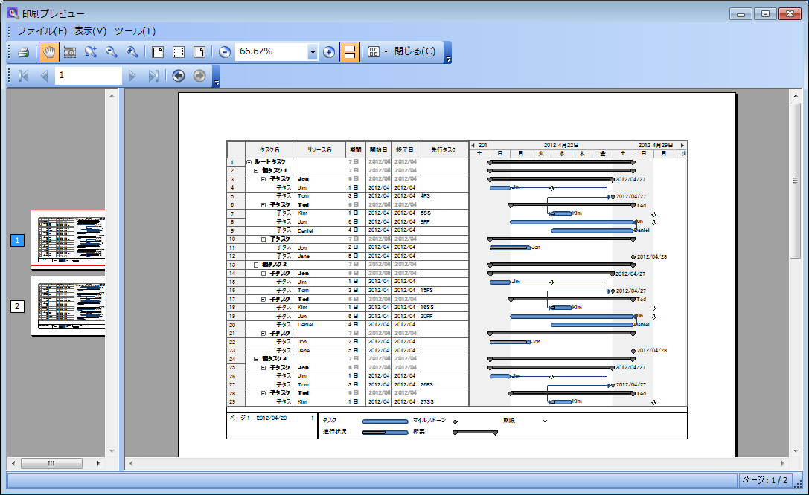

////

|metadata|
{
    "name": "winganttviewprintdocument-winganttviewprintdocument-features",
    "controlName": ["WinGanttView"],
    "tags": ["Layouts","Printing"],
    "guid": "fe8424e7-6457-4e11-95c4-7140335884bb",  
    "buildFlags": [],
    "createdOn": "2012-03-09T19:29:25.6215742Z"
}
|metadata|
////

= WinGanttViewPrintDocument 機能

== トピックの概要

=== 目的

WinGanttViewPrintDocument™ コンポーネントの機能を紹介します。

=== 必要な背景

以下の表に、このトピックを理解するための前提条件として求められるトピックをリストします。

[options="header", cols="a,a"]
|====
|トピック|目的

| link:winprintdocument.html[WinPrintDocument]
|WinGanttViewPrintDocument コンポーネントのベースである WinPrintDocument™ コンポーネントを紹介します。

|====

=== 本トピックの内容

このトピックには次のセクションがあります。

* <<_Features_Overview,機能の概要>>
** <<_Features_summary,機能概要>>
** <<_Print_Preview,印刷プレビュー>>
** <<_Print,印刷>>
** <<_Legend,凡例>>

* <<_Related_content,関連コンテンツ>>

[[_Features_Overview]]
== *機能の概要*

[[_Features_summary]]

=== 機能概要

以下の表は、WinGanttViewPrintDocument コンポーネントの機能を説明しています。いくつかの機能については、表の後で詳しく説明します。

[options="header", cols="a,a"]
|====
|機能|説明

|印刷プレビュー
|WinGanttView コントロールの内容の印刷プレビューを表示します。

|印刷
|UltraGanttViewPrintDocument コンポーネントの `Print` メソッドを呼び出すことにより、印刷プレビューを表示せずに直接印刷を開始します。

|凡例
|凡例を印刷します。

|====

[[_Print_Preview]]

=== 印刷プレビュー

WinGanttViewPrintDocument の印刷プレビュー機能を使用することにより、印刷前に WinGanttView コントロールの内容をプレビュー表示します。印刷プレビュー表示には、以下のコントロールのいずれかを WinGanttViewPrintDocument コンポーネントと組み合わせて使用してください。

* Infragistics® WinPrintPreviewDialog™ コンポーネント
* Infragistics® WinPrintPreview™ コントロール
* Microsoft® PrintPreviewControl
* Microsoft® PrintPreviewDialog

印刷プレビューを使用すると、以下のような印刷プレビュー画面が開き、WinGanttView コントロールの内容が表示されます。

==== 関連トピック:

link:winganttviewprintdocument-print-preview-with-winganttviewprintdocument.html[WinGanttViewPrintDocument を使用した印刷プレビュー]

[[_Print]]

=== 印刷

この印刷機能は、UltraGanttViewPrintDocument コンポーネントの `Print` メソッドを呼び出すことにより、印刷プレビューを表示せずに直接印刷ができます。

*Visual Basic の場合:*

[source,vb]
----
Me.ultraGanttViewPrintDocument1.Print()
----

*C# の場合:*

[source,csharp]
----
this.ultraGanttViewPrintDocument1.Print();
----

[[_Legend]]

=== 凡例

WinGanttViewPrintDocument コンポーネントは、WinGanttView コントロール内に表示されるプロジェクトの凡例を印刷する機能を提供します。凡例は２つの基本部分で構成されます。

* 詳細領域 - この領域は任意のテキストをもてます。さらに、現在日、ユーザー名、ページ番号などの文書特有またはユーザー特有の情報を提供する特定の代替コードも可能です。
* キー領域 - ユーザーが UltraGanttView のタイムライン セクション上のバーを確認できるようグラフィカルなキーを表示します。

image::images/WinGanttViewPrintDocument_Features_2.png[]

== 関連トピック
:

* link:winganttviewprintdocument-configuring-the-legend.html[凡例の構成]

[[_Related_Content]]
== 関連コンテンツ

=== トピック

以下のトピックでは、このトピックに関連する情報を提供しています。

[options="header", cols="a,a"]
|====
|トピック|目的

| link:winganttviewprintdocument-print-preview-with-winganttviewprintdocument.html[WinGanttViewPrintDocument を使用した印刷プレビュー]
|このトピックでは theWinGanttViewPrintDocument™ の印刷プレビュー機能の使用方法を説明します。このトピックでは具体的な例として、WinGanttViewPrintDocument™ と WinPrintPreviewDialog™ を使用して WinGanttView™ コントロールの印刷プレビューを行います。

| link:winganttviewprintdocument-configuring-the-legend.html[凡例の構成]
|WinGanttViewPrintDocument コンポーネントの凡例機能を紹介します。

| link:winganttviewprintdocument-customizing-the-print-version-of-the-winganttview-control.html[WinGanttView コントロールの印刷版をカスタマイズする]
|このトピックでは link:{ApiPlatform}win.ultrawinganttview{ApiVersion}~infragistics.win.ultrawinganttview.ultraganttviewprintdocument~initializeganttview_ev.html[InitializeGanttView] イベントを使用して WinGanttView コントロールの印刷版をカスタマイズする方法についてコード例を用いて説明します。

|====