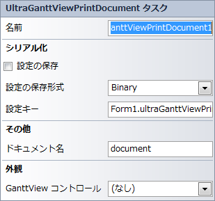

////

|metadata|
{
    "name": "winganttviewprintdocument-winganttviewprintdocument-smart-tag",
    "controlName": ["WinGanttView"],
    "tags": ["Design Environment"],
    "guid": "08a75fff-af73-4c0e-bd81-262c7c66ea33",  
    "buildFlags": [],
    "createdOn": "2012-02-08T22:16:05.2071496Z"
}
|metadata|
////

= WinGanttViewPrintDocument スマート タグ

Visual Studio では、インフラジスティックス Windows Forms コントロール/コンポーネントがそれぞれ固有のスマート タグを備えています。コントロールやコンポーネントを選択するだけで、スマートタグのアンカーが表示されます。このアンカーをクリックするとポップアップパネルが表示され、そこからコントロール/コンポーネントの最もよく使うプロパティや設定にすばやく簡単にアクセスできます。

WinGanttViewPrintDocument™ スマート タグには、コンポーネントの名前と以下のセクションが含まれます。

外観 -- コントロールの外観やルック アンド フィールに関連する一般的なタスクがあります。

その他 -- コントロールの全体的な外観やパフォーマンスを拡張する各種オプションがあります。

シリアル化 -- IPersistComponentSettings インターフェイスで使用されるプロパティにすばやくアクセスできます。

図 1: WinGanttViewPrintDocument スマート タグ

各セクションの項目（フィールド、ドロップダウン リスト、チェックボックスなど）の説明と、各項目が対応するプロパティ グリッドのプロパティについては、以下の表を参照してください。

[options="header", cols="a,a,a"]
|====
|外観|説明|対応するプロパティ

|GanttView コントロール
|ドロップダウンをクリックすると、フォーム上で使用できる UltraGanttView コントロールが表示されます。
| link:{ApiPlatform}win.ultrawinganttview{ApiVersion}~infragistics.win.ultrawinganttview.printing.ganttviewcontrolplaceholderuielement~ganttview.html[GanttView]

|====

[options="header", cols="a,a,a"]
|====
|その他|説明|対応するプロパティ

|ドキュメント名
|ユーザーに表示されるドキュメントの名前を入力します。
| link:{ApiPlatform}win.ultrawingrid{ApiVersion}~infragistics.win.ultrawingrid.cancelablelogicalprintpageeventargs~documentname.html[DocumentName]

|====

[options="header", cols="a,a,a"]
|====
|シリアル化|説明|対応するプロパティ

|設定の保存
|ドロップダウンから True を選択すると、アプリケーションの設定プロパティが自動的に保存されます。
| link:{ApiPlatform}win{ApiVersion}~infragistics.win.printing.ultraprintdocument~savesettings.html[SaveSettings]

|設定の保存形式
|コントロールの設定をバイナリ ファイルと XML ファイルのいずれに保存するかを選択できます。
| link:{ApiPlatform}win{ApiVersion}~infragistics.win.printing.ultraprintdocument~savesettingsformat.html[SaveSettingsFormat]

|設定キー
|コントロールの現在のインスタンスの設定キーを設定できます。
| link:{ApiPlatform}win{ApiVersion}~infragistics.win.printing.ultraprintdocument~settingskey.html[SettingsKey]

|====