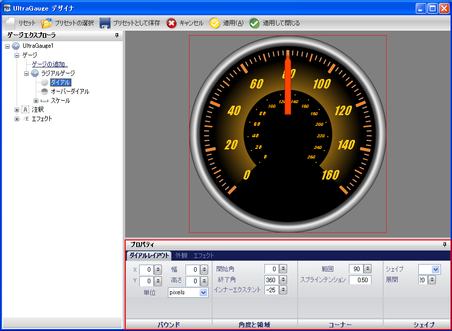

////

|metadata|
{
    "name": "wingauge-about-properties-panel",
    "controlName": ["WinGauge"],
    "tags": ["Charting","Design Environment"],
    "guid": "{C1256BC0-C99C-499A-ADAD-7DA2C4B5529D}",  
    "buildFlags": [],
    "createdOn": "0001-01-01T00:00:00Z"
}
|metadata|
////

= プロパティ パネルについて

ゲージ エクスプローラまたはインタラクティブなプレビュー領域のいずれかから異なるゲージまたはゲージのプロパティを選択すると、[プロパティ] パネルはそのコンテンツを変更します。

[プロパティ] パネルを使用すると、ゲージのプロパティを編集してインタラクティブなプレビュー領域で変更を即座に確認することができ、編集プロセスを簡略化します。たとえば、事前に定義したゲージと異なる多くのプロパティを持つ複雑なゲージを選択した場合、[プロパティ] パネルから pick:[win-forms="link:{ApiPlatform}win.ultrawingauge{ApiVersion}~infragistics.ultragauge.resources.radialgaugescale~labels.html[Label]"]  値を簡単に変更できます。

以下のスクリーンショットは [プロパティ] パネルに表示されるラジアル ゲージのプロパティの例を示しています。

