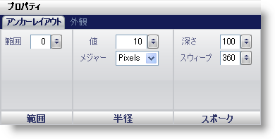

////

|metadata|
{
    "name": "wingauge-anchor-layout-tab",
    "controlName": ["WinGauge"],
    "tags": ["Charting"],
    "guid": "{609F0651-8B6B-434D-A59F-4F16B6BED692}",  
    "buildFlags": [],
    "createdOn": "0001-01-01T00:00:00Z"
}
|metadata|
////

= アンカー レイアウト タブ

Gauge コントロールの pick:[win-forms="link:{ApiPlatform}win.ultrawingauge{ApiVersion}~infragistics.ultragauge.resources.radialgaugeneedle~anchor.html[Anchor]"]  プロパティは、Needle pick:[win-forms="link:{ApiPlatform}win.ultrawingauge{ApiVersion}~infragistics.ultragauge.resources.radialgaugescale~markers.html[Marker]"]  プロパティと関連して使用されます。アンカーを針マーカーの回転点として使用することができるように、アンカーはラジアル ゲージの中央に配置されます。

[プロパティ] パネルの [アンカー レイアウト] タブを使用して、ゲージ上のアンカーをスタイルできます。ゲージ エクスプローラでアンカーをクリックする（[ラジアル ゲージ] > [スケール] > [マーカー] > [針] > [アンカー]）、またはインタラクティブなプレビュー領域でラジアル ゲージのアンカーをクリックするのいずれかによって、このタブにアクセスできます。

タブは以下の 3 つのペインに分割されています。

* link:wingauge-extent-pane.html[範囲]
* link:wingauge-radius-pane.html[半径]
* link:wingauge-spoke-pane.html[スポーク]

以下のスクリーンショットは、上記のスクリーンショットで指定されたレイアウト設定に基づいて作成されたアンカーを示しています。

image::images/Anchor_Layout_Tab_02.png[]