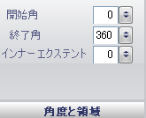

////

|metadata|
{
    "name": "wingauge-angle-and-extents-pane",
    "controlName": ["WinGauge"],
    "tags": ["Charting"],
    "guid": "{41D56A15-267A-4A3E-8B32-E35C279CA551}",  
    "buildFlags": [],
    "createdOn": "0001-01-01T00:00:00Z"
}
|metadata|
////

= 角度と範囲ペイン

[角度と範囲] ペインは、ラジアル ゲージの *Dial* プロパティの形状を決定します。円形の目盛盤は開始角度 0、終了角度 360 です。

pick:[win-forms="link:{ApiPlatform}win.ultrawingauge{ApiVersion}~infragistics.ultragauge.resources.dialappearance~startangle.html[開始角度]"]  -- この値を 0 から 360 の整数に設定します。開始角度は目盛盤の開始点で時計回りに回転します。

pick:[win-forms="link:{ApiPlatform}win.ultrawingauge{ApiVersion}~infragistics.ultragauge.resources.dialappearance~endangle.html[終了角度]"]  -- この値を 0 から 360 の整数に設定します。終了角度は目盛盤の終了点で 360 から反時計回りに回転します。

pick:[win-forms="link:{ApiPlatform}win.ultrawingauge{ApiVersion}~infragistics.ultragauge.resources.dialappearance~innerextent.html[内側の範囲]"]  -- -360 から 360 に値を設定します。正の値は内側の目盛盤を表示します。負の値は、終了角度が 360 よりも小さい場合に限り表示できる外側の目盛盤を表示します。

== 関連トピック

link:wingauge-dial-layout-tab.html[目盛盤レイアウト タブ]