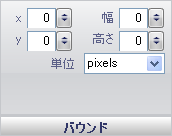

////

|metadata|
{
    "name": "wingauge-annotations-bounds-pane",
    "controlName": ["WinGauge"],
    "tags": [],
    "guid": "{ACCF75F6-BDF9-48C7-8718-42782FDFEF90}",  
    "buildFlags": [],
    "createdOn": "0001-01-01T00:00:00Z"
}
|metadata|
////

= 境界ペイン

[境界] ペインは、ゲージ上の注釈のサイズと位置を決定します。

pick:[win-forms="link:{ApiPlatform}win.ultrawingauge{ApiVersion}~infragistics.ultragauge.resources.boundedannotation~bounds.html[X]"]  -- この値は、Gauge コントロールの左から注釈までの距離を決定します。0 から 100 までのに設定することができます。x 値を 0 未満または 100 より大きく設定すると、注釈はゲージに表示されません。

pick:[win-forms="link:{ApiPlatform}win.ultrawingauge{ApiVersion}~infragistics.ultragauge.resources.boundedannotation~bounds.html[Y]"]  -- この値は、Gauge コントロールの上から注釈までの距離を決定します。0 から 100 までのに設定することができます。y 値を 0 未満または 100 より大きく設定すると、注釈はゲージに表示されません。

pick:[win-forms="link:{ApiPlatform}win.ultrawingauge{ApiVersion}~infragistics.ultragauge.resources.boundedannotation~bounds.html[幅]"]  -- 幅の値は 0 から 100 に設定できます。この値は注釈の幅を決定します。

pick:[win-forms="link:{ApiPlatform}win.ultrawingauge{ApiVersion}~infragistics.ultragauge.resources.boundedannotation~bounds.html[高さ]"]  -- 高さの値は 0 から 100 に設定できます。この値は注釈の高さを決定します。

pick:[win-forms="link:{ApiPlatform}win.ultrawingauge{ApiVersion}~infragistics.ultragauge.resources.boundedannotation~boundsmeasure.html[単位]"]  -- この値は、注釈の測定の単位を指定します。注釈は、ピクセルまたは Gauge コントロールのパーセントで測定できます。

== 関連トピック

link:wingauge-annotations-tab.html[注釈タブ]