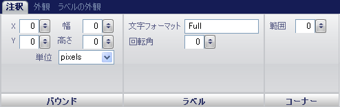

////

|metadata|
{
    "name": "wingauge-annotations-tab",
    "controlName": ["WinGauge"],
    "tags": ["Charting"],
    "guid": "{3731D027-1A8E-4023-B3A1-C40B59E58C7E}",  
    "buildFlags": [],
    "createdOn": "0001-01-01T00:00:00Z"
}
|metadata|
////

= 注釈タブ

Gauge コントロールの pick:[win-forms="link:{ApiPlatform}win.ultrawingauge{ApiVersion}~infragistics.ultragauge.resources.gaugeannotation.html[Annotations]"]  プロパティは、追加情報を追加する、またはゲージに視覚的な手がかりを提供するために使用されます。

[プロパティ] パネルの [注釈] タブを使用して、注釈をスタイルすることができます。ゲージ エクスプローラで [注釈] をクリックする、またはインタラクティブなプレビュー領域でゲージ上の注釈をクリックすることによって、このタブにアクセスできます。

タブは以下の 3 つのペインに分割されています。

* link:wingauge-bounds-pane.html[境界]
* link:wingauge-labels-pane.html[ラベル]
* link:wingauge-corners-pane.html[角]

以下のスクリーンショットは、上記のスクリーンショットで指定されたレイアウト設定に基づいて作成された注釈を示しています。

image::images/Annotations_Tab_02.png[]