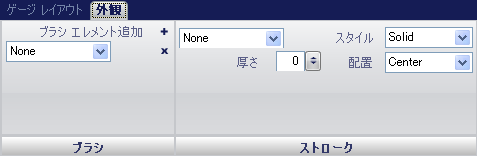

////

|metadata|
{
    "name": "wingauge-appearance-tab",
    "controlName": ["WinGauge"],
    "tags": [],
    "guid": "{B02422EF-BD19-425D-BC35-1AE72B92183A}",  
    "buildFlags": [],
    "createdOn": "0001-01-01T00:00:00Z"
}
|metadata|
////

= 外観タブ

[外観] タブによって、各プロパティの外観をカスタマイズすることができます。ゲージ エクスプローラで任意の項目をクリックする、またはインタラクティブなプレビュー領域でゲージ上の任意の項目をクリックすることによって、このタブにアクセスできます。

タブは以下の 2 つのペインに分割されています。

* link:wingauge-brush-pane.html[ブラシ]
* link:wingauge-stroke-pane.html[ストローク]

以下のスクリーンショットは、上記のスクリーンショットで指定された外観設定に基づいて作成されたリニア ゲージを示しています。

image::images/Appearance_Tab_02.png[]