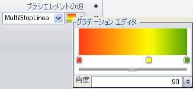

////

|metadata|
{
    "name": "wingauge-apply-the-multi-stop-linear-gradient-brush-element-using-the-gauge-designer",
    "controlName": ["WinGauge"],
    "tags": ["Charting","Design Environment"],
    "guid": "{D5A8AAB8-6F35-41D7-B402-3463D3C9BD86}",  
    "buildFlags": [],
    "createdOn": "0001-01-01T00:00:00Z"
}
|metadata|
////

= ゲージ デザイナを使用してマルチストップ線形グラデーション ブラシ エレメントを適用

ゲージのプロパティの 3 色以上を線形に相互に混ぜたい場合には、マルチストップ線形グラデーション ブラシ エレメントをプロパティに適用します。

*ゲージ デザイナを使用してマルチストップ線形グラデーション ブラシ エレメントをプロパティに適用するには、次の手順に従ってください。*

[start=1]
. ゲージ エクスプローラまたはインタラクティブなプレビュー領域で、マルチストップ線形グラデーション ブラシ エレメントを適用したいプロパティを選択します。
[start=2]
. [プロパティ] パネルの [外観] タブで、[タイプ] ドロップダウン リストから [MultiStopLinearGradient] を選択します。
[start=3]
. [詳細] ドロップダウン矢印をクリックします。
[start=4]
. グラデーション エディタで、カラー スケールの下をクリックして新しいカラー ストップを追加します。
[start=5]
. カラー ストップを右クリックして、色を変更します。
[start=6]
. カラー ストップをドラッグして、オフセットを変更します。
[start=7]
. 以下の手順によって、より正確に値を編集することができます。
[start=8]
. 水平バーにある小さい矢印をクリックして、以下のプロパティを設定します。

** 開始色 - 最初の行の最初のセルをクリックします。テキスト ボックスに 254, 42, 0 という値を入力します。
** 開始色オフセット - 最初の行の 2 番目のセルをクリックします。テキスト ボックスに 0 という値を入力します。
** カラー ストップ - 2 番目の行の最初のセルをクリックします。テキスト ボックスに 212, 254, 0 という値を入力します。
** カラー ストップ オフセット - 2 番目の行の 2 番目のセルをクリックします。テキスト ボックスに 0.637 という値を入力します。
** 終了色 - 3 番目の行の最初のセルをクリックします。テキスト ボックスに 0, 118, 0 という値を入力します。
** 終了色オフセット - 3 番目の行の 2 番目のセルをクリックします。テキスト ボックスに 1 という値を入力します。
** 角度 - テキスト ボックスに 90 という値を入力します。

[start=9]
. プロパティの指定が終了したら、[ブラシ] ペインの任意の場所をクリックします。
[start=10]
. インタラクティブなプレビュー領域で、ゲージの選択されたプロパティに適用されたマルチストップ線形グラデーション ブラシ エレメントを確認できます。

== 関連トピック

link:wingauge-multi-stop-linear-gradient-brush-element.html[マルチストップ線形グラデーション ブラシ エレメント]

link:wingauge-apply-the-multi-stop-linear-gradient-brush-element-at-design-time.html[デザインタイムにマルチストップ線形グラデーション ブラシ エレメントを適用]

link:wingauge-apply-the-multi-stop-linear-gradient-brush-element-at-run-time.html[ランタイムにマルチストップ線形グラデーション ブラシ エレメントを適用]